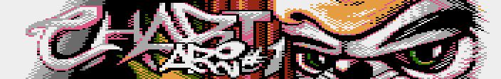

# Chartari

## CHARTS

top new prods
>
| 
Miejsce
 | 
Tytuł
 | 
Grupa
 | 
Punkty
 |
|:------:|:-------------------------:|:----------------:|:------:|
| 01   | Control              | LaResistance | 64   |
| 02   | Silly Things         | Jac!         | 60   |
| --   | Pure                 | LaResistance | 60   |
| 04   | Recall               | Resurrection | 38   |
| 05   | Ilusia               | MadTeam      | 30   |
| 06   | Unfused              | MEC          | 20   |
| 07   | ABBUC Magazin 99     | Jac!         | 12   |
| 08   | Mr6502               | Blowjobb     | 6    |
| 09   | Homecon 5 Invitation | Jac!         | 4    |
| --   | Tricks               | Agenda       | 4    |

 
top new games
>
| 
Miejsce
 | 
Tytuł
 | 
Punkty
 |
|:------:|:-------------------------:|:------:|
01| His Dark Majesty|   58
02| Hobgoblin  |33
03| Bomb Jack   |   28
--| Ocean Detox  |   28
05| Diamondz|   22
06| Dr Mario|   17
07| Knight Lore  |   12
08| Kolony 2106  |9
09| Electro Maniac!|8
--| Ghastly Night |8

 
top demos
>
| 
Miejsce
 | 
Tytuł
 | 
Grupa
 | 
Punkty
 |
|:------:|:-------------------------:|:----------------:|:------:|
01|        Numen|            Taquart   | 64
02|    Forsaken Love|          NG      | 34
03|      The Shrine  |    LaResistance | 30
04|    The Asskicker |       Shadows   | 26
05|        Recall    |    Resurrection | 22
06|       Overmind   |       Slight    | 20
07|     Silly Things |        Jac!     | 16
--|      Vengeance   |      Excellent  | 16
09|     Back 2 Life  |       Taquart   | 12
--|        Ilusia    |       MadTeam   | 12

 
top intros
>
| 
Miejsce
 | 
Tytuł
 | 
Grupa
 | 
Punkty
 |
|:------:|:-------------------------:|:----------------:|:------:|
01|   Drunk Chessboard |    Infinity    | 70
02|         Pure       |  LaResistance  | 34
03|   ABBUC Magazin #99 |      Jac!     | 24
04| Homecon 5 Invitation |     Jac!     | 16
05|        Fafik      |      Taquart    | 14
06|         PLO       |      Taquart    | 10
07|         48h       |   LaResistance  | 8
--|        Edict      |   LaResistance  |  8
--|        More!      |    Bit Busters   | 8
10|      Crossover    |    MaPa/PG/CPU   | 6

 
top games
>
| 
Miejsce
 | 
Tytuł
 | 
Punkty
 |
|:------:|:-------------------------:|:------:|
01|            River Raid             | 38
02|             Crownland             | 34
03|        Rescue on Fractalus        | 32
--|               Robbo               | 32
05|              Yoomp!               | 30
06|         His Dark Majesty          | 28
07|           Boulder Dash            | 25
--|             Draconus              | 25
--|       International Karate        | 25
10|        Montezuma's Revenge        | 23

 
top utilities
>
| 
Miejsce
 | 
Tytuł
 | 
Punkty
 |
|:------:|:-------------------------:|:------:|
01|            Graph2Font             | 63
02|       Raster Music Tracker        | 30
03|               MADS                | 22
04|           Sparta DOS X            | 20
05|             Envision              | 10
--|           MAE Assembler           | 10
--|            Neo Tracker            | 10
08|              Altirra              |  8
--|             Make2ATR              |  8
--|           XL-Paint MAX            |  8

 
top groups
>
| 
Miejsce
 | 
Grupa
 | 
Punkty
 |
|:------:|:-------------------------:|:------:|
01|           LaResistance            | 82
02|              Taquart              | 48
03|              MadTeam              | 32
04|             Blowjobb              | 28
05|     Masters of Electric City      | 24
--|    Computer Platform Unlimited    | 24
07|              Shadows              | 22
08|              Agenda               | 20
09|          New Generation           | 11
10|              Slight               |  8

 
top coders
>
| 
Miejsce
 | 
Pseudonim
 | 
Grupa
 | 
Punkty
 |
|:------:|:-------------------------:|:----------------:|:------:|
01|        pr0be     |    LaResistance  | 76
02|      0xF (Fox)   |       Taquart    | 62
03|         TeBe     |       MadTeam    | 46
--|         Eru      |      Taquart     | 46
05|         Jac!     |                  | 28
06|        Konop     |      AtariBDSM   | 26
07|     KMK (Draco)  |                  | 12
08|         MaPa     |                  | 11
09|         Mono     |                  | 10
10|       Ilmenit    |                  | 9

 
top musicians
>
| 
Miejsce
 | 
Pseudonim
 | 
Grupa
 | 
Punkty
 |
|:------:|:-------------------------:|:----------------:|:------:|
01|        Miker     |      Blowjobb   | 77
02|        X-Ray     |       Taquart   | 50
03|     Jakub Husak  |                 | 39
04|         5O5      |                 | 34
--|         Greg     |       Taquart   | 34
06|        stRing    |    High Voltage | 17
07|          PG      |     Unreal^TKC  | 14
--|        Raster    |         CPU     | 14
09|        Caruso    |                 | 12
10|       Pinokio    |      Tristesse  | 12

 
top graphicians
>
| 
Miejsce
 | 
Pseudonim
 | 
Grupa
 | 
Punkty
 |
|:------:|:-------------------------:|:----------------:|:------:|
01|    Ooz (Powrooz)   |    Agenda^LR  |118
02|        Piesiu      |     Agenda    | 98
03|    Ripek (Replay)  |     Agenda    | 38
04|         Dely       |    Blowjobb   | 31
05|        Irwin       |     Agenda    | 26
06|    Klaus (Insert)  |    AtariBDSM  | 18
--|        Vidol       |               | 18
08|        Dracon      |     Taquart   | 8
09|        Lhuven      |               | 6
--|       Titus        |    Shadows    | 6

 
top organizers/swappers/webmasters
>
| 
Miejsce
 | 
Pseudonim
 | 
Grupa
 | 
Punkty
 |
|:------:|:-------------------------:|:----------------:|:------:|
01|       Pinokio      |    Tristesse  | 60
02|         Kaz        |      Rohar    | 42
03|         Dely       |    Blowjobb   | 29
04|         Grey       |   MysticBytes | 24
--|  Ryszard Mauersberg|               | 24
--|       Grzybson     |       SSG     | 24
07|        Irwin       |     Agenda    | 12
08|        Vasco       |    Tristesse  | 10
09|       Mateoos      |      AIDS     | 8
--|       Slaves       |    Taquart    | 8

 
atari xl/xe demoscene top brands ;D
>
| 
Miejsce
 | 
Grupa
 | 
Status
 | 
Punkty
 |
|:------:|:-------------------------:|:----------------:|:------:|
01|      Ooz/Agenda     |  graphician | 118
02|    Piesiu/Agenda    |  graphician |  98
03|     LaResistance    |    group    | 82
04|    Miker/Blowjobb   |   musician  |  77
05|  pr0be/LaResistance |     coder   |  76
06| Drunk Chessboard/Inf|     intro   |  70
07| Control/LaResistance|   new prods |  64
--|    Numen/Taquart    |     demo    |  64
09|   Graph2Font/TeBe   |     tool    | 63
10|     0xF/Taquart     |     coder   | 62

 

## Charts - komentarz

### ___Komentarz do charts'ów___

Piesiu

Tej nocy mróz ciął nadzwyczaj srogo, na niebie wściekle skrzyły się tysiące gwiazd, a z zamarzniętych bagien dobiegał skowyt wygłodniałego wilkołaka. Tym czasem od południowych wierchów, z wolna nadciągała pielgrzymka wracająca ze świętego miejsca. Prowadził ją znany w całej krainie mag Ordinatorius, tuż za nim kicał przerośnięty zając z rozwichrzoną grzywką, obok w kryształowej kuli toczył się po śniegu trójzębny chomik, a na końcu maszerowało zmutowane rogate kociątko z językiem wyrzuconym poniżej pępka. Nie minął kwadrans kiedy dotarli do zrujnowanego niewielkiego zamku na skraju tysiącletniego boru. U wrót zamku okrakiem na dorodnym wieprzu siedział spasiony, stary rachmistrz o podle zarośniętym obliczu. Jego pusty, łysy czerep zdobiła okazała futrzana czapa, widać i czuć było, iż trzeźwy to on bynajmniej nie jest, jednak okowita nie odebrała mu jeszcze mowy, rzekł więc do przybyszów:

- Witaj szlachetny czarnoksiężniku i wy niezwykłe, twory jego wyobraźni, oczekiwałem was.
- Witaj - odrzekł mag - czy wszyscy nasi już przybyli?
- Skryba Irvi jest tutaj już od wielu dni, godzinami ślęczy nad księgami, niestety Replaius i Gorgohan zaniemogli w drodze i nie zdołają przybyć na czas.
- Biedactwa, a pozostali, co z nimi, doręczyli to co obiecali?
- Tak, bard Fayo-fay już dawno przekazał nam swoją partyturę, Ksink i Muchomorson dostarczyli rękopisy, a Maroki składa właśnie to wszystko w jedną całość.
- A więc dobrze, wejdźmy do środka.

Mag i rachmistrz, wraz z całą menażerią weszli do zamku, rachmistrz zatrzasnął za sobą wrota i powiedział:

- Wybiła północ, dłużej nie możemy czekać.
- Tak, nikt więcej tu nie wejdzie, a właśnie ilu znamienitych mężów przybyło na nasze zaproszenie? - zapytał Ordinatorius.
- Niestety zaledwie garstka - odparł ze smutkiem rachmistrz.
- Garstka!? Ilu więc przystąpiło do głosowania?
- Poza naszą szóstką, głosy oddało siedmiu prawych mężów, oraz dwie zacne niewiasty.
- A gdzież setki pozostałych zaproszonych Atarianów?
- Niestety wygląda na to, iż nasza rasa wymiera.
- To niemożliwe wszak były nas tysiące! - czarnoksiężnik zaszlochał, siadł w kącie i zapytał.
- Wiadomo może chociaż jak głosowali ci nieliczni, którzy przybyli?
- Tak, pokrótce opowiem ci jak rozłożyły się głosy.

---

- produkcje scenowe "trzylatki"

W czołówce mocny ścisk i wyłącznie kapitalne produkcje, pierwsze miejsce zgarnął port amigowego dema Control (LaResistance), o włos za nim wylądowało demo Jac'a pt. Silly Things, oraz intro Pure (LaResistance). Wysoko ocenione zostały również dema Recall (Resurrection), oraz Ilusia (MadTeam), a do pierwszej dziesiątki nie zdołały zakwalifikować się m.in.: Anything (Blowjobb), Crossover (MaPa/ PG/CPU), Tricks (Agenda) i Unexpected (Masters of Electric City).

- gry "trzylatki" -

Ranking najnowszych gier otwiera mój faworyt, gra jakiej jeszcze na Atari nie było, dopracowany pod każdym względem, taktyczny eRPeG, His Dark Majesty. Jak widać po punktacji, głosującym HDM również bardzo przypadł do gustu, drugie miejsce zajęła przeportowana z komputera BBC platformówka Hobgoblin, zaś miejsce trzecie ex aequo zajęła atarowska konwersja klasycznego hitu Bomb Jack, oraz nieskomplikowana, ale bardzo wciągająca strzelanka Ocean Detox. Patrząc na czołową dziesiątkę można zauważyć, że na Atari ciągle dużym powodzeniem cieszą się porty z innych ośmiobitowych platform. Do top10 nie zdołały dostać się takie gry jak: Chopin 2010, Gwobby Strikes Back, Quadrillion, Tempest Xtreem, czy Yie Another Kung Fu.

- dema

W tej kategorii zwyciężyła frakcja konserwatywna, która postawiła na niezatapialnego Numen'a (Taquart), oprócz niego na szczycie zestawienia pojawiły się inne klasyki tj. Forsaken Love (New Generation), czy Asskicker (Shadows). Mnie osobiście cieszy, że do czołowej dziesiątki dostały się także nowsze produkcje: Recall, Silly Things, Ilusia, dziwi brak dema Control, które zostało przecież uznane najlepszą produkcją wśród "trzylatków". W drugiej dziesiątce znalazły się m.in. dema: Anything (Blowjobb), Cogito (AIDZ) i Reditus (Zelax).

- intra

Drunk Chessboard (Infinity) zdominował tę kategorię zdobywając ponad dwukrotnie więcej głosów niż drugi w rankingu Pure autorstwa grupy LaResistance, której to zresztą udało się wprowadzić do pierwszej dziesiątki, aż trzy intra, po dwa intra w top10 umieścił Jac! i grupa Taquart. Tuż za pierwszą dziesiątką znalazły się m.in. intra: Ars Mori, Juzek, Black, oraz aż trzy produkcje duetu MaPa i PG: Balls Forever, New Year's Miracle, Scroll F'ever.

- gry

Nowe gry przypuściły atak na przykurzone klasyki, jednak jeszcze tym razem kultowe tytuły zdołały się obronić, zwyciężył nieśmiertelny River Raid, a drugie miejsce zajął pachnący świeżością, wgniatający w fotel majstersztyk wizualny, platformówka Crownland. Na dalszych miejscach także do ostatnich chwil trwała zacięta rywalizacja starych mistrzów (Rescue on Fractalus, Robbo) i nowej fali (Yoomp!, His Dark Majesty) i tutaj też zwyciężyły legendarne hity, lecz nowości przegrały zaledwie o włos. Pierwszą dziesiątkę zamknęły kolejne klasyki: Boulder Dash, Draconus, International Karate i Montezuma's Revenge.

- użytki

W tej kategorii zazwyczaj każdy z głosujących stawiał na narzędzia najczęściej używane w swojej  scenowej profesji, wyszło na to, że najwięcej głosowało grafików, gdyż z ogromną przewagą zwyciężył nieoceniony Graf2Font (TeBe).

- grupy

LaResistance znokautował konkurencję, kunszt pr0be i Ooz'a, nakręcił grupie nieprawdopodobnie wysoki wynik, kolejne miejsca wypełniła mieszanka grup aktywnych, oraz tych, które od lat nie udzielają się na scenie, tuż za czołową dyszką wylądowały: Tristesse, Ressurection i Excellent.

- koderzy

Ciąg dalszy triumfalnego marszu LaResistance, zwyciężył koder tej grupy, pr0be, oprócz niego na szczycie zestawienia scenowa elita koderska: Fox (Taquart), TeBe (MadTeam) i Eru (Taquart), w dziesiątce znaleźli się również goście zza granicy Jac! i MaPa, a poza dziesiątką: Bloomer, Bober, Dely, Jowisz, Jordan, Lak, Laoo, Marok, Pavros, Raster, SoTe, Święty, Trub, Vega, XXL. Ranking koderów okazał się być najpopularniejszą kategorią, voter'si oddali w nim łącznie 72 głosy.

- muzycy

Wśród demoscenowych muzyków najwięcej punktów zdobył Miker (Blowjobb), który w końcówce głosowania odskoczył konkurencji, choć ta przez dłuższy czas deptała mu po pietach. Kolejne miejsca na podium zajęli X-Ray i Jakub Husak, autor muzyki do tego zina 5o5 wskoczył ex aequo z Greg'iem na czwarte miejsce . Druga piątka była bardzo wyrównana: stRing, PG, Raster, Caruso i Pinokio, poza dziesiątką znaleźli się: Analmux, Born, Cedyn, Dhor, Guma, Josh, Lisu, Seban, Tatqoo, Xlent, Yerzmyey, ZilQ i ZBX Virus.

- graficy

W tej kategorii zwyciężyła aktualnie największa gwiazda małoatarowej demosceny, człowiek który na lata zdominował scenę graficzną i jako jedyny w chartsach zdobył ponad 100 punktów! Tą osobą jest oczywiście Ooz (Agenda^LaRasistance), który nie dość, że rządzi we wszystkich graficznych compotach, to jeszcze swoje świetne grafiki umieszcza w licznych demach i grach. Drugie miejsce przypadło hmm... mnie, trzecie miejsce zajął nasz agendowy kolega Ripek, wyprzedził on grupę pościgową, w której znaleźli się Dely (Blowjobb), Irwin (Agenda), Klaus (AtariBDSM) i Vidol. Pierwszą dziesiątkę zamknęli, starzy wyjadacze Dracon (Taquart) i Titus (Shadows), oraz przedstawiciel nowego nurtu, Lhuven. Poza pierwszą dziesiątką znaleźli się: Anj, Exin, Grass, Innuendo, Kaz, Mazi, Rocky, oraz Yerzmyey.

- swapperzy/organizatorzy/webmasterzy/wodzireje

Bardzo szeroka kategoria, chcieliśmy aby ludzie poświęcający się scenie w inny sposób niż kodowanie/komponowanie/rysowanie, również zostali docenieni i mieli swój własny ranking. Pierwsze miejsce zajął etatowy wodzirej polskich zlotów Pinokio (Tristasse), kolejne miejsca na podium zajęli ojcowie dwóch najpopularniejszych polskich portali poświęconych małemu Atari, Kaz (Rohar - portal AtariOnline) i Dely (Blowjobb - portal AtariArea). Tuż za podium uplasowali się ex aequo organizatorzy trzech obecnie największych rodzimych zlotów atarowskich: Grey (MysticBytes - party Sillyventure), Rysiek Mauersberg (party Głuchołazy) i Grzybson (SSG - Grzybsoniada). Pierwszą dziesiątkę uzupełnili inni znani atarowscy "społecznicy": Irwin (Agenda), Vasco (Tristesse), Mateoos (AIDS) i Slaves (Taquart). Miejsca poza top10 zajęli: Fandal, Nosty, Scalak i ZBX Virus.

- top brands

Na koniec drobna niespodzianka, pomieszane z poplątanym, ułożone na podstawie chartsów zestawienie najbardziej uznanych scenowych "marek". Ranking ten pokazuje z przymrużeniem oka kto, lub co może aktualnie najbardziej kojarzyć się ze sceną małego Atari i jak można zauważyć małoatarowa demoscena to nie tylko Numen, a pierwsze miejsce zajął najlepszy grafik w historii ośmiobitowego Atari i w ogóle jeden z najlepszych grafików na wszelkie retro platformy, Ordinatorius OOZ!!!

---

Z głębi ciemnego korytarza nadszedł skryba Irvi, podał rękę siedzącemu magowi i pomógł mu wstać, po czym zapytał:
- Czy ty również zawiedziony jesteś, brakiem zainteresowania ziomków, naszym przedsięwzięciem?
- Tak mój drogi, może nawet bardziej niż ty - odpowiedział Ordinatorius - obawiam się, że przyjdzie opuścić nam tę zapomnianą przez Boga krainę.
- Wyruszajmy, więc natychmiast! - krzyknął Irvi.

O świcie obaj pożegnali rachmistrza i ruszyli na zachód, po kilku godzinach marszu minęli zmurszałą tablice z napisem "Małoatarowska Demoscena Żegna", Ordinatorius spuścił głowę i zapytał towarzysza wędrówki:
- Myślisz, że jeszcze kiedyś tu wrócimy?
- Kto wie, może za rok, lub dwa, tymczasem nikt nas tu nie chce - odparł skryba.

Rachmistrz Piesiu/Agenda - luty 2011

---

### ___Wstępniak posępniak___

Piesiu

Grupa Agenda ma przyjemność oddać w Wasze ręce pierwszy na scenie ośmiobitowego Atari chart zin.

Prace nad zinem "Chartari" rozpoczęły się ponad pół roku temu, naszym założeniem było stworzenie tworu, który choćby w niewielkim stopniu rozkręcił małoatarową demoscenę. Chcieliśmy, aby scena Atari rosła w siłę, a naszym zdaniem najlepszą ku temu metodą jest rywalizacja pomiędzy scenowiczami, ale nie rywalizacja w tak ostatnio modnym trolowaniu na atarowych forach, lecz zdrowa konkurencja w tworzeniu wirtualnych perełek takich jak: dema, intra, gry, grafiki, utwory muzyczne...  i taką rywalizację miałyby wzmagać, stworzone na podstawie Waszych głosów, rankingi zebrane w zinie Chartari.

Niestety pomysł nie do końca wypalił, co prawda udało nam się zebrać 15 wypełnionych votek, lecz to i tak o wiele za mało, nie licząc współtwórców Chartari zagłosowało zaledwie 9 osób, w tym dwie z zaprzyjaźnionych scen ZX Spectrum i Commodore 64. Każdy głosujący oddał średnio nieco ponad 44 poprawnych głosów (na 70 możliwych), najwięcej głosów złożyli Irwin (70 gł.) i Ooz (69 gł.). Brak zainteresowania głosowaniem ze strony Atarowców, poskutkował niestety sporym rozczarowaniem pośród niektórych autorów, a co w konsekwencji najprawdopodobniej doprowadzi do ich tymczasowego, lub nawet definitywnego odejścia ze sceny. Przyszłość kolejnych numerów magazynu stoi pod wielkim znakiem zapytania i raczej mało prawdopodobne jest, aby powstał kiedykolwiek kolejny numer Chartari.

Niewątpliwie mizeria głosowania podcięła nam skrzydła, chociaż wydaje mi się, że pomimo niskiej frekwencji, rankingi są miarodajne, na szczęście na pewnym etapie produkcji maga, odeszliśmy od koncepcji robienia malutkiego zinka, opartego głównie na chartsach, dzięki czemu z małego chart zina, głównie dzięki ogromnemu zaangażowaniu Irwina, powstał całkiem okazały mag z ponad 190 kB artykułów. Zatem drodzy czytelnicy kiedy znudzi już Was przeglądanie chartsów, zapraszam do lektury artykułów. Mam nadzieję, że każdy znajdzie tu coś dla siebie, mamy więc nieco retro publicystyki, sporo graficznych technikaliów, są też artykuły około scenowe i wywiad z zagranicznym gościem, a na wyluzowanie mój komentarz do chartsów.

Na zakończenie tego arcysmętnego wstępniaka chciałbym w imieniu Agendy bardzo serdecznie podziękować osobom spoza naszej grupy, które przyczyniły się do powstania Chartari. Największe podziękowania kieruje do Maroka, który musiał znosić nasze mamrotanie przez długie miesiące, aby ostatecznie spełnić większość naszych zachcianek i doprowadzić kodowanie zina do szczęśliwego finału. Kolejne podziękowania ślę do naszego niemieckiego kolegi 5O5, który uraczył nas dwoma świetnymi kawałkami muzycznymi (Vielen Dank Nils), dziękuję również Xeen'owi/Atalanta May i Grzybsonowi/SSG za artykuły, oraz Dely'emu/Blowjobb za pomoc w tłumaczeniu wywiadu z Algorithm'em. Dziękujemy także tym, którzy podjęli trud wypełnienia votek, nick'i wszystkich osób, które wzięły udział w głosowaniu umieszczone zostaną w credits'ach.

Życzę przyjemnej lektury.

Piesiu/Agenda - luty 2011

---

### ___Scena Atari___

irwin

 
Koniec roku zbliża się wielkimi krokami, nadchodzi więc czas pewnych podsumowań. Co prawda jeszcze przed nami, miejmy nadzieję, że duże i owocne w stuff party Silly Venture 2010, ale celem tego artykułu nie będzie ocena dokonań sceny Atari w 2010 roku, lecz zwrócenie uwagi na niektóre jej problemy i wskazanie sposobów ich rozwiązania. Wbrew krążącym od lat opiniom scena małego Atari nadal żyje, aczkolwiek w niewielkim stopniu przypomina złote lata 90-te. Najlepiej ów stan obrazuje fakt, iż w ciągu ostatnich dwóch lat, do chwili gdy piszę te słowa, powstały tylko dwa dema: "Ilusia" grupy MadTeam oraz "Anything" Blowjobb.
Dlaczego tak się dzieje? Na szybko można to wytłumaczyć w ten sposób: jest coraz mniej osób chcących działać na scenie Atari a w szczególności doskwiera brak aktywnych koderów. Nie jest to jednak tak oczywiste i proste. Spróbuję tutaj opisać jak ja to widzę, stojąc niejako z boku, wskazać przyczyny takiego stanu rzeczy i sposoby zaradzenia.

Po pierwsze - dema typu "Wild". Produkcje "wild" były, są i zapewne będą częścią sceny. Także i na przestrzeni ostatnich lat tego typu dema pojawiały się - przykład "Jozin z Bazin" grupy GPRS, demo śmieszne choć bazujące na chwilowej modzie. Lecz niestety będąc pod wpływem chwili a i nie rzadko nie tylko chwili... częstokroć bywa tak, iż owe "wild" dema/intra wygrywają z pracami poważnymi, normalnymi. Tak było swego czasu ze znakomitym demem "Recall" grupy Resurrection - które tak na marginesie osobiście uważam za najlepsze demo na małe Atari - , tak było i w tym roku, gdzie na Forever 2010 w kategorii intro1k wygrała właśnie produkcja typu "wild", kosztem naprawdę znakomitego intra "Scroll F'ever". Dobitnie obrazują różnicę jakościową podanych przykładów, oceny, komentarze i zainteresowanie tymi produkcjami na portalu scenowym pouet.net. Inaczej mówiąc dema, intra typu "wild" powinny być wystawiane w osobnej kategorii gdyż tym co przykuwa w nich uwagę, co stanowi o ich sukcesie to nie efekty czysto scenowe, to nie próby przedstawienia czegoś co dotychczas nikt na danym komputerze nie zrobił, nie chęć pokazania użytkownikom innych retrokomputerów, że Atari potrafi - a pomysł, humor, skojarzenia z aktualnymi wydarzeniami itp. Nie liczy się technika, dopracowany kod i mozolnie narysowana grafika - w rzeczy samej, częstokroć demka "wild" są tworzone w basicu, w niewielkiej ilości kolorów. Ale co istotniejsze: prawdziwe, typowe produkcje scenowe zajmujące w tej sytuacji drugie bądź niższe miejsca, nie są w ten sposób właściwie nagradzane i doceniane. Autor takich produkcji może sobie pomyśleć, że on tu starał się wszystkim pokazać coś wyjątkowego lub w takiej formie jakiej nikt nie widział (np. kolorowa plasma we wspomnianym "Recall") a potem okazuje się, że zainteresowanie tym jest znikome. Demko w Basicu, w Atascii wystarcza aby zadowolić partowiczów. Może więc być nawet i tak, iż taki koder, grafik czy ktokolwiek inny uczestniczący przy tworzeniu dema, poświęcający temu wiele czasu i energii, z uwagi na powyższe da sobie "wolne" od takiej sceny. "Recall" to była jak do tej pory ostatnia produkcja znakomitego kodera Lak'a.
Dodać też trzeba, iż czasami jest także to uwłaczające także dla autora zwycięskiej "wild" produkcji. Autor czy autorzy czują się zobowiązani, do tłumaczenia i wręcz przepraszania, że ich demko wygrało. I często to czynią. Jest to całkowicie zbędne i niepotrzebne gdyż akurat ich wina w tym jest żadna. Przyczyną takiego stanu rzeczy jest tylko i wyłącznie regulamin party, który często nie przewiduje takiego podziału. Zwykle mówi się, że i tak jest mało produkcji w związku z tym nie będziemy przesadnie wszystko dzielić. Zgadzam się z tym, ale częściowo - będzie o tym szerzej poniżej - lecz akurat w odniesieniu do produkcji typu "wild" jestem temu absolutnie przeciwny. Muszą być pokazywane osobno. Szkodzi to bowiem całej naszej scenie Atari, zarówno tym którzy chcą tego typu "wild" demka robić jak i tym którzy chcą pisać normalne, pokazujące siłę naszego komputerka. Brawa więc dla organizatorów Silly Venture 2010, dla Grey'a za wyodrębnienie kategorii wild w konkursach. Mam nadzieję, że ten punkt regulaminu będzie ściśle przestrzegany i nie będzie połączenia wszystkich prac do jednego konkursu.

Po drugie - intra. Popatrzmy na tegoroczny Forever 2010. Zero (0) dem, trzy (3) intra, jedno (1) wild. Tegoroczne Głuchołazy 2010: jedno (1) demo, trzy (3) intra, jeden (1) dysk muzyczny, dwa (2) wild. Na atarowskich parties mamy więc sporo konkursów: osobno dema, osobno intra, czytając regulamin na Silly Venture w kategoriach Falcon jest nawet podział na intra4k i intra96k. Jest to niejako tworzenie fikcji bo i tak koniec końców np. w Głuchołazach już drugi rok z rzędu drugie miejsce zajmuje... dysk muzyczny. Nie mówię, że music-disk'i są złe - wręcz przeciwnie, antologia Scorpio jest wysokiego lotu, tak samo jak pokazanie przez Mono i Yerzmeya techniki odtwarzania modułów na maszynach posiadających jedynie 64kb. Lecz tym niemniej trudno uznać powyższe za dema. Dyski muzyczne po prostu nie startują w demokompo. Pomijając więc "wild'y" sytuacja kształtuje się następująco: dema 1:6 intra. Jeśli zaś policzymy i dodamy produkcje wydane bez parties wygląda to jeszcze bardziej jednostronnie: dema 1:11 intra.

Tegoroczne X-Party na C64. Jedno z największych 8bitowych party w historii całej sceny retro. Około 250 osób, w kompo aż 38 grafik, 24 sidów, 15 dem i ... i to już wszystko. Innych kompo nie przewidziano. Intra? brak! Dlaczego? Dlaczego tak duża scena jak C64 na swoim największym party nie przewiduje kategorii intr? W trosce o scenę. Istotą sceny, kwintesencją każdego party, ostatnim punktem programu każdego party jest demokompo. Więc odpowiedź dlaczego brak intr jest prosta - aby cała para, aby cała uwaga, aby wszelkie starania tych, którzy chcą coś pokazać poszło w ową esencje sceny - w dema. U nas często para idzie w gwizdek. Jak widać z przytoczonych przykładów koderów mamy - xxl, Mono, Gorgh, PrObe, MaPa, Jac!, Bob!k itd. Wszyscy oni w tym roku pisali intra. Intra, w szczególności te zajmujące po 1kb z miejsca wykluczają udział grafików a i muzyka w nich z uwagi na minimalną dostępną ilość pamięci raczej nie może być zbyt rozbudowana, a czasami również jej brak. Obecnie na scenie Atari jest dość duża liczba dobrych, bądź też nowych, rokujących grafików - przykład 15-tu osób startujących w GFX kompo w Głuchołazach mówi sam za siebie. Do intra ciężko jest zrobić grafikę. Każdy bajt jest istotny. Intro nie musi też mieć specjalnego designu, z reguły to jeden efekt - bach jest i ok, that's all, folks. Tymczasem gdyby z intr zrezygnować, tworząc - jak na X-Party - jedynie demokompo, zmusiłoby to twórców, koderów do zmiany podejścia.

Korzyści z tego byłyby wg. mnie dość istotne.
Po pierwsze koder musiałby nawiązać kontakt z muzykiem i grafikiem. Tym samym z miejsca mamy więcej osób tworzących na scenie. Więcej tworzących, większe zainteresowanie sceną, i w przyszłości więcej produkcji. Nawiązywanie kontaktów z innymi prowadzi do powstawania grup - w praktyce, dziś aktywne grupy na atarowskiej scenie można policzyć na palcach jednej ręki, reszta to grupy dawno wymarłe. Silne grupy, ich większa ilość to silna scena. Po drugie do intra można zrobić jeden efekt - do dema raczej to za mało. Nie oznacza to też, że trzeba przygotować kilkanaście efektów bo wtedy taki koder może mieć dość, nie mieć na to czasu. Proza życia dopada wszystkich. W rzeczywistości, w obecnej sytuacji sceny wystarczą 2-3 efekty - wspomniane topowe dema typu "Ilusia" czy "Recall" właśnie tyle mają. Do tego jeden czy dwa obrazki, jakiś styl, zgranie z odpowiednią muzyką i ... demo trzeba zrobić zawczasu. Trudno napisać je na dzień czy dwa dni przed, lub wręcz na samym party. A to zdecydowanie przełoży się zarówno na ich jakość jak i scalenie się członków grupy, i znów będzie to z korzyścią dla samej sceny. Każdy w grupie powinien mieć pomysły niezależnie od funkcji. Koderzy nie mają monopolu na design - przeciwnie częstokroć mimo sporych umiejętności koderskich nie potrafią tego pokazać, niejako "sprzedać". A więc mailowa czy też na jakiś prywatnym forum, burza mózgów z pewnością przełoży się na same demo, na daną grupę, i na całą naszą atarowską scenę. Obecnie graficy, muzycy i koderzy działają osobno, jest bardzo wielu niezrzeszonych, bez grup, lub z grupami wymarłymi jeszcze przed bitwą pod Grunwaldem.

Zaraz podniosą się głosy - nie! tak nie można - a jednak, przykład X-Party pokazuje, że można, oni mieli intra gdzieś. Właśnie po to by zachęcić do robienia dem. Nie wszystkie były udane, nie wszystkie były rozbudowane, ale dzięki temu każdy uczestnik grupy mógł się wykazać adekwatnie do swoich umiejętności. Dzięki grupom jest możliwa rywalizacja - kolejny bardzo ważny czynnik o którym więcej za chwilę. Same intra gdzie działa jedynie koder, czasami zaklepując sobie u kogoś muzyczkę czy grafikę stanu naszej sceny nie poprawią, będzie taki jaki jest obecnie.

Po trzecie - 64kb. W mentalności wielu atarowców, także i mojej, co muszę przyznać, przyjęło się, że podstawa to 64kb RAM. Skoro komodziarze mają tyle i im to wystarcza to dlaczego my musimy mieć więcej? Pomijając już większe możliwości graficzne C64 np. - w zakresie duszków, większej ilości znaków w charsecie itd. - warto zauważyć, iż większość dem na c64 to quasi trackma. Oznacza to, że na c64 rzadko kiedy dema zajmują 64kb. Większość z nich zajmuje po 100-170kb a wiele - w tym te uważane za najlepsze - zajmują po dwie strony dyskietki tj. 300kb i więcej. Dodatkowo często zawarte na nich dane są pakowane. Oczywiście same w sobie wymagają jedynie 64kb a dostępne dane po prostu doczytują w trakcie trwania dema. Gdyż możliwości techniczne c64 to umożliwiają. Na Atari jest to piekielnie trudne a czasami wręcz niemożliwe z uwagi na udział układu POKEY do odczytywania danych z dysku. Oznacza to, że albo muzyka podczas ładowania kolejnych części dema będzie wyłączona - co powoduje powrót do lat 80-tych i megadem z wieloma partami, albo jakieś kombinowania z podziałem zadań tj. 2 kanały grają podczas wczytywania. W obu wypadkach, w praktyce oznacza to brak ciągłości dema, gdyż tak ekstremalnie trudne warunki jak 2 kanały muszą powodować zmiany w samym demie. Pozostaje więc trzecia możliwość - dema plikowe, tj. zrezygnowanie z doczytywania i umieszczenie wszystkiego w całości, w jednym pliku. Numen mógłby działać na 64kb lecz właśnie z uwagi na brak możliwości zachowania ciągłości dema wymaga 320kb. Tylko dlatego. Nie dlatego, że efekty wymagają większej ilości pamięci. Nadal zadowoli się 64kb. Tak więc aby konkurować z c64 nie ma co ograniczać się do 64kb czy 128kb. Niektóre dema na c64 mają po 4-5 grafiki pełnoekranowe. Ograniczając się do 64kb nie sposób zrobić coś podobnego. A gdzie inne dane, gdzie muzyka, kod?

Po czwarte - rywalizacja. Istotą sceny jest rywalizacja. Znów weźmy przykład z C64. Od lat siłą napędową ich sceny jest duży portal CSDB, gromadzący nowe i zbierający stare produkcje scenowe. Wystawiając cokolwiek zostaje się ocenionym, pojawią się komentarze: przychylne bądź też nie. To, że scena C64 jest dziś tak liczna, tak prężnie funkcjonująca jest w dużej mierze zasługą tego portalu, ludzi wokół niego skupionych. Bez tego typu portalu śmiem twierdzić, że byłoby niewiele lepiej niż u nas obecnie. To dlatego, mimo że ludzi skupionych wokół c64 jest o cały rząd wielkości więcej, właśnie z uwagi na brak podobnego portalu zajmującego się np. grami, owe gry nie pojawiają się w równie dużej liczbie jak produkcje scenowe. Po prawdzie u nas rokrocznie wychodzi więcej gier. Natomiast takiego typowo scenowego portalu brak. Grafika, muzyka, demo wystawione na jakimkolwiek party powoduje zamieszczenie na CSDB a tym samym zauważenie twórców przez innych. Motywuje to do dalszego działania, nawet jeśli będą to niskie oceny. Aby pokazać, że stać nas na więcej. Aby udowodnić innym, że się mylą. Jest też możliwość zobaczenia kto przy jakiej produkcji brał udział, co zrobił, poznania historii itd. U nas tego typu grafika czy muzyka znika w odmętach forum AA czy AOL. I po kilku tygodniach wszelki ślad po niej ginie, znikając dla przeciętnego użytkownika. Czasami w mailach czytam żale, iż "nikt nie komentuje mojej pracy, nie wiem czy się spodobała, nie wiem czy w ogóle ktokolwiek ją zauważył." To wcale nie zachęca do dalszego działania. Czasami warto skomentować prace gorsze, aby zachęcić ich twórców do dalszego działania, do rozwoju.

Wiem, że prowadzone są prace nad tego typu portalem, życzę twórcom aby w 2011 roku ruszył z kopyta a wtedy jestem przekonany, że to co jest istotą sceny tj. rywalizacja spowoduje wysyp wielu grafik, muzyczek i esencji sceny jakimi są dema. Nie łudźmy się, scenowcy to swego rodzaju artyści. Ich zapłatą za poświęcony czas, pracę jest właśnie ocena i komentarze innych. Bez niej traci się chęć. Nic tak nie szkodzi scenie jak całkowita obojętność.

Kończąc oprócz wypasionych produkcji na Silly Venture życzę sobie i wszystkim atarowcom otwarcia takiego właśnie portalu jak najszybciej.

irwin - listopad 2010

---

## Reboot sceny ?

### ___Reboot sceny Atari? - marzenie ściętej głowy___

Ooz

W świecie mediów takich jak film, czy gry wideo w ostatnim czasie często podejmuje się tematykę odświeżania popularnych sprzed lat tytułów/serii - dochodzi to tzw. reboot'u, i tak np. doczekaliśmy się nowej historii straszącego nas w latach 80 - Freddego Krugera, nowej wizji Batman'a czy też mamy możliwość zagrania w nieznane przygody księcia z Persii. Przykładów jest mnóstwo, efektem takiego zabiegu, oprócz  względów finansowych ma być przyciągnięcie nowej publiczności. Oczywiście cały ten filmowo-growo-biznesowy świat pozostawiamy z boku, chodzi o sam pomysł zamknięcia pewnego etapu i odświeżenia na miarę obecnych czasów właśnie sceny Atari - to jest moje marzenie. Ale czy to przypadkiem nie jest marzenie "ściętej głowy"? Rozwiązanie zagadki na końcu artykułu. Aktywnie udzielam się na scenie od 7 lat, jest to wystarczający czas, aby podsumować swoje dokonania, wysunąć pewne wnioski z obserwacji demosceny i ewentualnie zadecydować o swoim dalszym scenowym losie. Przyznaję, że w pierwszych latach swojej aktywności, z "klapkami na oczach" podekscytowany "robieniem czegokolwiek" na scenie nie zawracałem sobie głowy kondycją naszej demosceny. Sytuacja zmieniła się diametralnie dwa lata temu, kiedy to rozczarowany ilością i jakością produkcji z party w Głuchołazach postanowiłem wyrazić swoje niezadowolenie w bardzo popularnym (co się okazało) wątku na Atari Area - "Quo Vadis scena?". O tym jak zakończył się owy wątek wszyscy wiemy - dla przypomnienia - nie odpowiedzią na zadane pytanie, lecz obnażeniem niektórych słabości naszej sceny. Obecnie sytuacja nie uległa większej poprawie, dlatego zamiast trwać w tej "nieustającej agonii" proponuję aby się nad tym wszystkim zastanowić, pożegnać obecny marazm sceny i wcisnąć przycisk z napisem "reboot".
Prosto napisane, trudne do zrobienia, przede wszystkim aby taki reboot był możliwy należałoby ustrzec się obecnych błędów i spełnić poszczególne warunki. Pierwsze i najważniejsze - ludzie to scena, należy więc zadbać o dobrą atmosferę panującą na scenie (już widzę u niektórych uśmieszek pod nosem). Doskonale wiemy, że co pewien czas (nieważne, na którym) forum  jesteśmy świadkami konfliktów o wymiarze PERSONALNYM, które NIE MAJĄ NIC WSPÓLNEGO z istotą założonych serwisów/czy demosceny. Oczywiście konflikty te z natury są bardzo atrakcyjne (wreszcie coś się dzieję!!) są sposobem na prezentację swojej wyższości oraz dowodem na kolesiostwo. Powtórzę: Czy takie są założenia sceny ?? Chyba tylko PSEUDOSCENY, poza tym to dziecinada. Jest nas zdecydowanie za mało i nie po to łączy nas jedna pasja aby dodatkowo utrudniać  sobie życie podziałami. Szanujmy się!

Drugi aspekt, który należy poruszyć to hermetyczność sceny. Ktoś powie "przecież są zloty, sztaby, dedykowane serwisy - Człowieku, scena na Ciebie tylko czeka". W połowie tutaj się zgodzę, na pewno w kwestii serwisów scenowych - nie jest źle, dostęp do podstawowych informacji jest. Gorzej jest z "otwartością" organizowanych imprez - tutaj w większości uczestnikami są  osoby, które znają się od kilkunastu lat, dla nich jest to wspaniała okazja do wspomnień w biesiadnej atmosferze gdzie często tematy atarowskie schodzą na dalszy plan - dla kogoś zupełnie nowego przyjemność ta może/jest wątpliwa. Co można zrobić w kwestii przyciągnięcia i zainteresowania nowych osób sceną Atari? Kiedy to oś głównej imprezy czyli tzw. "kompoty" nawalają. Należałoby zadbać o uatrakcyjnienie zlotów/sztabów w postaci seminariów/warsztatów, poruszających jeden z tematów składowych demosceny, bądź też sceny gier - możliwości mnóstwo. Wymaga to znacznego zaangażowania, szczerych chęci i planowania na długo przed terminem imprezy.

Obecnie każda atarowska impreza jest git, tyle że później z perspektywy czasu przypomina to bardziej stypę, po której boli głowa. O prawdziwym copy-party nie ma co mówić, oczywiście to moje zdanie.

Kolejnym potrzebnym czynnikiem dla dobrze działającej demosceny jest wzajemna motywacja. U nas tego brakuje, nie wiem czym to jest spowodowane: zazdrością, że ktoś jest lepszy, może założeniem z góry,  że to i tak nie ma sensu ponieważ się nie uda, no chyba że po prostu zamiast coś robić to lepiej jest gadać "o dupie Marynie" - a takie tematy przeważają w ostatnim czasie. Tego nie ma nigdzie indziej, obserwując portale scenowe innych platform na bieżąco można znaleźć informacje co kto zamierza zrobić i wszystko to na zasadzie zdrowej konkurencji. Brakuje dzielenia się wiedzą - wiadomo że najlepiej jest czymś zaskoczyć, ale nie na scenie gdzie koderów jest niewielka garstka, brakuje tematów/warsztatów które rozwijałyby sztukę tworzenia produkcji scenowych, brak zainteresowania co do metod/technologii użytych w demach/intrach - przykład demo "Ilusia" które w nowatorski sposób wykorzystując stare efekty, otwiera drogę do zastosowania w demach tak pożądanego design'u. Czy ktoś po Ilusii próbował się mierzyć z tą możliwością?
Nie..Czemu?
Dodatkowo bardzo często brakuje konstruktywnej krytyki, zazwyczaj wszystkie produkcje są od razu topowe  i spełnione, a jak są "cienkie" to o nich się nie pisze  ....brak krytyki pośrednio de-motywuje autora. No cóż bez wzajemnej motywacji, wymiany doświadczeń, czy nawet podzieleniem się pomysłem i szczerości (konstruktywnej krytyki) to o nowych dobrych produkcjach można zapomnieć. Dotyczy to również sceny gier, która jest czasem pierwszą przystanią dla nowego kodera. Niestety corocznie obserwuje się wysyp "gier-popierdułek", jeśli się mylę - to proszę drogi czytelniku zrób rachunek sumienia i odpowiedz na pytanie " Ile czasu poświeciłeś nowo powstałym grom Atari? " Tu świeżości również potrzeba, dość gier snejko-tetriso-sokoban'o podobnych.

Dobra, dość marudzenia, aspektów do lepszego funkcjonowania sceny atari jest więcej, poruszyłem te, które uważam za najważniejsze dlatego warto również zapoznać się z analizą obecnej sytuacji demosceny w szczegółowym artykule Irwina - "Scena Atari".

Moja prawda sceny jest okrutna - lata świetności dekady za nami, dema zestarzały się paskudnie, brak  zainteresowania małym Atari w świecie (ostatni "sukces scenowy zauważony w świecie" to intro Pure - 3 miejsce w Best Oldskool Demo 2008 w serwisie 4sceners.de - Ha, kto o tym wiedział?) gry powielają stare schematy, serwisy pomału rozdrabniają się na drobne.
Być może zagalopowałem się z tą krytyką za bardzo do przodu ....ale dlatego właśnie marzy mi się reboot sceny Atari właśnie teraz. Marzenie ściętej głowy? NIE, jeśli popatrzy się na scenę C64. TAK, jeśli popatrzy się na obecne zaangażowanie naszej sceny.

Czas to zmienić, jak nie teraz to kiedy? - następnej generacji sceny Atari nie będzie.

Ooz/Agenda/LR - luty 2011

---

### ___Poradnik organizatora cz.1___

> ___Odcinek pierwszy pod tytułem:  "Jak zrobić dobry kompot z gruszek na wierzbie."___

irwin

Organizacja scenowego party, jakby to ujął komendant Lassard z Akademii Policyjnej nastręcza wielu, wielu, wielu problemów i wielu, wielu, wielu przeszkód i zasadzek. Są one związane przykładowo z wynajęciem lokum, zapewnieniem dostępu do żywności oraz napojów rozgrzewających ciało i umysł, odpowiednim rozreklamowaniem party itd. itp. Zresztą te wszystkie elementy występują również przy okazji organizacji dowolnego innego party, spotkania, jak chociażby zjazdu fanek i fanów pewnego radia z siedzibą w Toruniu (choć możliwe, że napoje będą ździebko się różnić). Na tym wszystkim zbytnio się nie znam, jednak na całe szczęście nie o tym będę pisał. Tym czym natomiast chcę się tu zająć, to pewien szczególny składnik każdego scenowego party, coś co odróżnia takie party od popijawy w remizie u wujka Józka, czy też spotkania "u cioci na imieninach". Jest nim ...kompot, a raczej kompoty a jeszcze dokładniej konkursy. Właśnie one stanowią jeden z kluczowych elementów każdego scenowego party. Celem owych konkursów, przeprowadzanych zazwyczaj w kilku różnych kategoriach, jest zaprezentowanie swojej własnej, radosnej, komputerowej twórczości, ku uciesze reszty gawiedzi, równie zdrowo stukniętej na punkcie danej retromaszynki i jej możliwościach. Zadaniem owej reszty, jest ocenianie i wybieranie najlepszych prac, a także pastwienie się nad tymi gorszymi. I tak też, ujmując w najogólniejszym skrócie, sytuacja się przedstawia. Z przeprowadzeniem konkursów wiąże się ich ogłoszenie, zebranie prac, ich prezentacja, publikacja, itd. I tym sprawom postaram się tutaj szerzej przyjrzeć i przybliżyć. Gdyż, o ile wszystkie inne, wyżej wspomniane części składowe każdego party są z reguły dobrze zorganizowane i sprawnie przebiegają, to o tyle sposób i styl podejścia do konkursów w niektórych wypadkach mocno kuleje. I nie piszę to tylko mając na myśli atarowskie spotkania ale i inne, również te multiplatformowe odbywające się na polskiej ziemi. I na to chciałbym zwrócić uwagę, przedstawiając jak zwykle niepytany o zdanie, swoją wizję.

Po pierwsze - Regulamin. Każdy konkurs musi mieć jakiś regulamin aby było wiadomo kto, co, jak i dlaczego. Regulamin winien być prosty, zrozumiały, tworzony w nawiązaniu do aktualnej rzeczywistości i przestrzegany. Czasami jednak mam wrażenie, iż organizator, organizatorzy żyją sobie gdzieś spokojnie na Marsie, w całkowitym błogostanie,  oderwaniu od rzeczywistości, a następnie raz na jakiś czas, uruchamiają swoje międzyplanetarne pojazdy, po czym przylatują na planetę Ziemia. Zaraz po wylądowaniu z miejsca młócą jakiś obłędny regulamin myśląc, że na party wystawionych będzie np. 120 dem na Falcona, 86 intr96k oraz 167 intr4k. To samo jest zresztą przy okazji innych regulaminów jak te dla ST czy serii XL/XE. Wymagana jest więc szczypta zdrowego rozsądku, warto spłynąć z obłoków i przynajmniej spróbować wpierw zaznajomić się z aktualnym stanem sceny. Jest to o tyle proste, że wystarczy wejść na stosowny portal: pouet i prześledzić jakie są aktualne trendy i średnia ilość całej produkcji na rok, na daną maszynę. Z miejsca pokaże nam to czy jest sens robić tyle kategorii. Tak silna scena C64 (obecnie druga pod względem ilości produkcji na rok, tuż za PC) na swoim największym party - X-Party, miała tylko jedną kategorię poświęconą kodowaniu - Demokompo. Z pewnością organizatorzy tamtejszego party wiedzieli na co mogą liczyć. Ja na długo przed tym party napisałem (mailowo, a także na prywatnym forum) iż nie ma co się przejmować owym regulaminem, ograniczać się np. do intr gdyż i tak wszystko pójdzie do jednego worka z napisem CODE. Regulamin będzie tylko świstkiem nic nie znaczącego papieru. I tak też się stało. Jakim cudem komuś udało się uruchomić dema z Atari2600 spełniające np. ten ów punkt: "Prace będą uruchamiane pod Sparta DOS X, MyDOS..." pozostanie dla mnie tajemnicą w rodzaju czarnej magii. Dlaczego nie można było przeprowadzić osobnych konkursów dla dem, czy intr16kb - to również zagadka przy której nawet Sherlock Holmes z uznaniem pokiwałby głową. Tym bardziej, że w obu wymienionych kategoriach były po 3 wymagane regulaminem prace - gdyż ten w stosownym miejscu grzmiał: "Aby konkurs odbył się w danej kategorii wymagane są minimum 3 prace. Aaaamen!". Nie jest żadnym wytłumaczeniem, że dem na Atari2600 było tylko dwie sztuki. Po pierwsze to całkiem inna maszyna niż Atari serii XL/XE i powinna być traktowana oddzielnie. Całkiem inaczej się koduje na maszynę ze 128 bajtami Ramu a inaczej na taką, która posiada 65356 bajty. Po drugie jakoś np. "Atari Covox Compo" przeprowadzono, mimo jedynie dwóch muzyczek. Czyżby liczba "2" w niektórych warunkach może przybierać większe wartości? i w specyficznych okolicznościach spełniać warunek "minimum 3"?

Tak więc regulamin, w tej kwestii, winien być prosty jak budowa cepa. A co ważniejsze absolutnie przestrzegany. To musi być jego najważniejsza cecha. W końcu skoro organizator spisał ów regulamin, to minimum przyzwoitości wymaga aby był stosowany.

Jeśli więc, mimo powyższego, decydujemy się na tworzenie oddzielnych kategorii, to naprawdę należałoby je przestrzegać. Jeśli będzie nawet jedno demo, grafika, muzyka - także należy je uznać za zwycięskie, a nawet powinno się przeprowadzić głosowanie - a to w celu pokazania jego twórcy czy się spodobało. W końcu ktoś kto podjął się trudu stworzenia danej produkcji z pewnością chciałby wiedzieć jak zostanie ona przyjęta. A jest to bardzo proste do zrealizowania, wystarczy podzielić uzyskane punkty przez liczbę głosujących.

Jeśli zaś, co widać po aktualnym stanie sceny Atari, uznajemy iż wszystko pójdzie i tak do jednego worka, to najlepiej od razu zapisać to w regulaminie. Darować sobie ogłaszanie oddzielnych kompo dla dem, intr czy interek a zrobić jedno duże kompo, wzorem np. wspomnianego X-Party. Jest bowiem diametralna różnica od ogłoszenia tego najpierw, bez jakiś warunków, zastrzeżeń typu "wspólne compo będzie wtedy gdy okaże się, że będzie mało stuffu, wtedy wszystko puścimy razem tj. dema, intra, gry, dyski muzyczne, dema z Atari2600, rzut beretem w dal oraz skok przez płot". Koder, grupa, wiedząc i znając warunki, może z góry zadecydować czy warto walczyć z każdym bajtem i ślęczeć aby zmieścić się w intro16kb, 4kb czy 1kb, czy też nie przejmować się ograniczeniami i zrobić normalne demo. Niech będą tego świadomi od samego początku powstawania ich produkcji. To naprawdę istotna różnica - znam opinie ludzi, którzy z tego powodu, z wrzucania, jak leci wszystko do jednego worka byli rozczarowani. Nie będę tu ich zdań przytaczał bo to ich prywatny punkt widzenia. Ja natomiast mówię prosto bez ogródek, bez owijania w bawełnę, nie po to by komuś dokopać, gdyż mając na względzie każdy inny aspekt organizacji rozpoznanego już z pewnością party, było więcej niż dobrze. I za to należą się duże brawa. Ale też chcę wskazać błędy (zresztą nie tylko tego party ale i innych o czym będzie w dalszej części) by nie powtarzały się w przyszłości. Słodzenia było sporo, to co złe to większość przemilczała, lub wymieniała się prywatnie - a to organizatorowi niestety w niczym nie pomoże.

Wracając więc do tematu, po prostu stan wiedzy wielu ludzi z atarowskiej retro-sceny, ich znajomości stopnia trudności produkcji, nie jest zbyt wysoki i często nie docenia się prac w której koder starał się wykorzystać każdy bajt spośród np. 16kb czy 1kb dostępnych. Umiejętność zrobienia czegoś w ograniczonej wielkości pliku to także czynnik, który powinien być brany pod uwagę przy ocenie czyjejś pracy. Ale skoro się wrzuca wszystko razem, to czynnik ten ów ginie, z uwagi na brak czy to informacji o tym, czy właśnie niskiej wiedzy głosujących o prawach rządzących sceną. Ostatnio przeczytałem taką oto wypowiedź kodera atari, Matosimi (koder ze Słowacji). Stworzył on grę, tak aby zajęła 1kb i rzecz jasna nikt tego nie docenił: "That was the most complicated code I've ever written in 1k so those results put me down in the dumps." Teraz zrobił normalną wersję tej gry, bez obracania w dłoni każdego bajta. Efekt? zajął 3 miejsce w tegorocznym Abbuc kompo, zdobył nagrodę, został doceniony. Wielu z obecnych atarowców często nie rozumie, że ocenia się nie tylko efekt końcowy ale i w jaki sposób został zrobiony, ile zajmuje, jakie wymagania, czas, a także fakt czy ktoś wcześniej już to dokonał itd. W związku z tym jeden KompoWorek może w przyszłości zniechęcić do dalszej zabawy w scenowanie.

Po drugie - Deadline. Jest to czas do którego można składać, wysyłać czy też oddawać swoje prace. Z deadlinem wiąże się wiele aspektów związanych z organizacją party. Ot choćby przygotowanie Big Screena, kompomaszyny, oświetlenia, nagłośnienia. Często organizatorzy tłumaczą się, zwalając winę na uczestników konkursów, iż z uwagi na bardzo późne dostarczenie prac nie byli w stanie wszystkiego przetestować, podłączyć, uruchomić. To nie ich wina, że coś nie działało a sala miała ubaw po pachy, patrząc na mozolne próby zaprezentowania czyjeś pracy. Jest to znów błędne podejście do tematu. To nie uczestnik kompo oddając bardzo późno pracę, za pięć druga w nocy, jest winny a właśnie organizator. Za to, że dopuścił do takiego stanu rzeczy. Weźmy przykład z dużych parties typu Breakpoint. Czy tam próby sprzętu przeprowadza się tuż przed czy podczas trwania kompo? czy czeka się z rozpoczęciem konkursów bo "Wiesiek jeszcze linkuje demo"? Nie ma zmiłuj się, gdyby tak było, przy tej ilości startujących, pewnie do dziś tamtejsze kompoty jeszcze by się nie odbyły. Jest twardo ustawiony czas i trzeba go przestrzegać. Pytanie: czy termin party odbywającego się np. 1 maja ogłasza się 30 kwietnia? Bo tylko tak można wytłumaczyć pisanie dem, intr na party. Dobrego dema czy intra nie robi się w 4 godziny. To wymaga czasu, pracy wielu osób - "Desert Dream" powstawał w pół roku, niektóre topowe dema ASD 7-8 miesięcy, "Tint" TBLu podobnie. Chcemy więc mieć party z zapchajdziurami czy chcemy prawdziwych dem?. Chyba nikt nie sądzi, że takim stylem, pisania na party stworzymy coś na wzór "Edge of Disgrace". Tenże również nie powstawał za pięć dwunasta. Owszem jest niepisany zwyczaj tworzenia na party ale to szkodzi wszystkim, poczynając od organizatorów, którzy raz uległszy prośbie przedłużenia deadline mogą ciągnąć to do nawet bladego świtu, innym partowiczom, którzy chcą obejrzeć coś o rozsądnej godzinie, kończąc na samym piszącym, którego produkt z pewnością nie będzie nawet w połowie tak dobry jakby zrobił go i przetestował na parę dni czy nawet tygodni przed party. Nikt nie wmówi mi, że jedyny dostępny, wolny czas w całym roku to te paręnaście godzin na party. Tak więc czas deadline dla dem/intr itd. powinien być ustalony na co najmniej na dzień przed terminem rozpoczęcia party (party a nie konkursów). Gdy się do tego w ten sposób podejdzie, to wynikać z tego będą same korzyści:

- organizator będzie mógł dokonać np. dzień przed lub w dniu party, oficjalnej próby, (zależnie od możliwości, czasu itd.) podłączeń sprzętu, sprawdzenia poprawności działania całego stuffu na kompomaszynie, dostosowania nagłośnienia itp. Zawsze coś wyskoczy - np. włączone oświetlenie przy grafice Dely'ego na Forever2010. Wcześniejsze próby pozwalają zawczasu wykryć rzeczy, o których się nie pomyśli, które się przeoczyło. Nikt nie jest przewidzieć wszystkiego.

- po obejrzeniu wszystkich produkcji, jest czas na ustalenie ich kolejności wyświetlania. Tak to się odbywa na innych scenach i na innych dużych party (jak się uczyć to od najlepszych). Organizator/torzy wiele już zapewne widzieli i mają wyrobiony osąd co jest średnie, co dobre, a co zrywa tynk z głów, klepki z ścian i kaski z podłóg - czy jakoś tak... Tak to się odbywa na scenie przez duże S. Stopniuje się napięcie, tak aby widz był świadomy, że mimo iż aktualnie widzi dobre demo, to za chwilę może być świadkiem epokowego zdarzenia. Nie tylko przeprowadzić kompoty ale i w konkretny sposób. To jest w końcu jeden z kilku ważnych powodów dla których się party organizuje. Nie oznacza to, że ostatnie prezentowane demo z od razu wygra. Gusta są różne i często wygrywają inne, vide wspomniane już X-Party - gdyż nadal wszystko jest w rękach głosujących.

- mając wcześniej przygotowane prace nie będzie żadnych obsuwów związanych z rozpoczęciem danego kompo. Bez problemu ustalając na godzinę 22:00 wiemy, że się wtedy odbędzie. To zdecydowanie ułatwia wszystkim, którzy chcą obejrzeć konkursy, na zaplanowanie sobie czasu. No i sama, znośna godzina zdecydowanie zwiększy frekwencję co przełoży się na większą liczbę wypełnionych votek i tym samym na bardziej wiarygodne wyniki. Inaczej gdy głosuje 50 osób a inaczej gdy niespełna 20.

- organizator mając przygotowany pakiet produkcji z party, może je odpowiednio uporządkować w katalogi, opisać, utworzyć ATR'y itd. Znacznie to ułatwi i przyspieszy ich późniejsze opublikowanie w necie.

- także będzie to z korzyścią dla owego partowicza, który dotychczas na party jedynie kodował, i świata nie widział. Teraz będzie mógł być rzeczywistym uczestnikiem party i wydarzeń z tym związanych.

Można również ustalić deadline na samym party ale musi być to zaznaczone nie tylko w regulaminie ale i na samym party, tak aby nie było możliwości tłumaczeń typu "nie wiedziałem, kolega mówił co innego". Musi być to duży zegar lub stojący PC z pełnoekranowym odliczaniem ile jeszcze pozostało czasu. Jeśli ustali się np. na 15:00 to wszelkie prace, złożone po tym terminie, nawet o 15:01 winny być odrzucane. Chyba, że będzie jakieś logiczne wytłumaczenie spóźnienia. Na pewno nie może to być "kolega jeszcze nie skończył i nadal rysuje". Wystawiający musi mieć na względzie, że nie jest on pępkiem świata i powinien mieć na uwadze nie tylko organizatora, ale i innych z którymi przyszło mu rywalizować a także samych partowiczów, którzy chcą obejrzeć kompo o zaplanowanej godzinie a nie bladym świtem z 3 zapałkami w każdym oku. Inaczej mówiąc, wymagana jest od każdego wystawiającego odrobina szacunku dla innych, w szczególności do organizatora.

Na zakończenie warto jeszcze wspomnieć o produkcjach wystawionych i pokazanych na party, lecz nie opublikowanych wraz z innymi po jego zakończeniu. Czasami zachodzi taki przypadek, iż autor/rzy zastrzegają sobie, że po party dokończy/doda/poprawi swoje dzieło i dopiero wtedy opublikuje w necie. To także winien regulować regulamin. Czy na takie coś zezwala a jeśli tak, to jaki ku temu przysługuje termin. Osobiście nie jestem fanem takich rozwiązań, uważam że produkt powinien być skończony na kilka dni przed party, a nie po. Jednak też nie mam nic przeciwko, różne są sytuacje np. demo działa jedynie na komputerze autora. Umieszczając stosowne zapisy w regulaminie z pewnością wyjaśni to ewentualne pytania i utyskiwania "kiedy?".

Czyli podsumowując raz jeszcze: regulamin winien być prosty ale stosowany przez obie strony. Powinien zawierać rozsądne zapisy co do deadline, czyli terminu oddawania prac i te muszą być przestrzegane zarówno przez wystawiających jak i przez organizatorów. Jak ktoś nie zdąży, to niech dokończy na następne party - jest ich zresztą ostatnio coraz więcej. To będzie z korzyścią dla wszystkich, a także dla samej produkcji, cokolwiek to by nie było. Tak samo z warunkami konkursów, zwłaszcza z koderskimi i ich dzieleniem na intra/dema. Nie mogą być zmieniane tylko dlatego, że jest mniej prac. Osobiście uważam, że w obecnej sytuacji na scenie Atari, powinno być organizowane tylko jedno kompo - Demokompo. Będzie to z korzyścią dla całej naszej sceny gdyż to rywalizacja napędza scenę. Ale szczegółowo omówię to przy innej okazji.

irwin - grudzień 2010

---

### Silly Venture 2010 relacja

Grzybson

Na wstępie chciałbym serdecznie podziękować Powrozowi za zmotywowanie do napisania tego raportu. Gdyby nie on, prawdopodobnie nie udałoby mi się zmobilizować, przygotować zawczasu notatek i prawdopodobnie chęć wyskrobania kilku słów nt. Silly Venture przegrałaby z moim wrodzonym lenistwem. Także Adamie - dzięki!

Silly Venture - gdański zlot, głównie 16/32-bitowych posiadaczy Atari, choć chętnie odwiedzany przez "małych" atarowców, którego dotąd odbyły się tylko 3 edycje. Znany jest z ambitnych planów organizatora, Michała Michałowskiego aka Grey-a/Mystic Bytes, który i tym razem wysoko postawił sobie poprzeczkę. Nakręcony zapowiedziami organizatora postanowiłem - muszę tam jechać.

Tydzień "zlotowy" był w moim przypadku bardzo zwariowany. Tu jakieś kolokwium, to w środę, odstawiony w garnitur produkuje się przed 300-osobową widownią swojej Alma Mater. Na szczęście w końcu nadszedł ten upragniony dzień, gdy w piątek o drugiej nad ranem powitała mnie pod blokiem roześmiana twarz Lotharka. Godzinę później ekipa powiększyła nam się o Pigułę. Drogę mieliśmy ciekawą - droga biała, zima w pełni, a to koreczek w Toruniu. Na szczęście wszelki niedogodności łagodzi doborowe towarzystwo no i "Fontanna radości". Jedno Wam powiem - nie ma jak grochówka z przydrożnej garkuchni o siódmej rano :)

Suma summarum, na party place - do budynku "Państwowych Szkół Budownictwa" doczłapaliśmy się koło 2:30. Na miejscu, oprócz organizatora, powitali nas także Tdc, Jury, Yerzmey. Rzut oka na salę. Po zrzuceniu części gratów, ruszyliśmy zrobić małe zaopatrzenie - w końcu nie można siedzieć na sucho do wieczora :). Na marginesie, byłem mile zaskoczony, gdyż znalazłem swoje ulubione piwo - Czarny Smok z browaru Fortuna (przyjmę w każdych ilościach). Uzupełniwszy zapasy taktyczne, wreszcie mogłem zrobić mały rekonesans po party-place. Do naszej dyspozycji oddane były dwie przyzwoitych rozmiarów świetlice w suterenie, również dwie klasy z przeznaczeniem na "sleeping room", oraz przy sali gimnastycznej - prysznice! Z sleeping room-ami wiąże się osobna historia. Jedna z klas była ściśle dostosowana do prowadzenia przedmiotu "przysposobienie obronne". Niestety ktoś nie pomyślał, iż pewne "gadżety" należy schować pod klucz przed atarowskimi łapkami. I tak w naszym zasięgu znalazły się 3 mundury, których nie omieszkaliśmy przymierzyć (właściwie to samych czapek), a także fantom (taki do nauki I pomocy) :) Było mu strasznie nie wygodnie na półce, więc przenieśliśmy go do śpiworka. Czyjego? Nie mam pojęcia, ale ktoś musiał być w nocy nieźle zaskoczony...

Jak powszechnie wiadomo, piątek podczas zlotu to dzień przyjazdów. Z każdą godziną pojawiały się coraz nowe twarze - zarówno przedstawiciele regionu, jak i dalszych okolic. I tak po długim czasie znowu spotkałem geparda, AS-a i jego wielkiego Canon-a L :P, stryjka, Dracon-a (bez parapetów :) ). Naturalnie przybył Pinokio, Dracon__ (z parapetami), Yerzmey i inni. Co ciekawsze, mcmaster wyciągnął na party Yezus-a :) Pojawili się także zagraniczni partyzanci - z Niemiec (reprezentacja Abbuc-a), Francji, Holandii, a także z Czech. Moją szczególną uwagę zwróciła obecność Heńka Karpowicza, Jer-a, a także, ku zaskoczeniu wszystkich obecnych, KUBY HUSAKa! Kuba mógł wręcz poczuć się jak gwiazda, gdyż niektórzy nawet nie odstępowali go na krok, nagabując na przeprowadzenie wywiadu :). Swoje trzy minuty w eterze mieli także Pinokio z Tdc-em, których organizator "rzucił na pożarcie" reporterom z Radia ESKA.

Oprócz ludzi nie zabrakło także i sprzętu. Były małe atarynki, ST-ki, Falcony z Centurbo i bez, czy Jaguar, który miał całkiem niezłe wzięcie. W całym tym gąszczu sprzętu znalazło się kilka perełek. Beetle przywiózł ze sobą Atari 1200XL (szczerze, pierwszy raz widziałem ten model "na żywo"), rozszerzone VBXE. Aby nie ciąć obudowy oryginalne gniazdo monitorowe, zastąpił DIN13 z ST - całkiem pomysłowe. Jednak nie ten wynalazek najbardziej przykuwał uwagę na kramiku Beetle-a. Przywiózł on bowiem ze sobą Atari 1500 XL - 8-bitowy laptop swojego projektu. Wygląda wręcz idealnie, sprawiając wrażenie, iż jest to autentyczny prototyp Atari. Jak zapewnia autor, w trakcie rzeźbienia obudowy nie ucierpiała żadna żywa Atarka, wykorzystano organy pobrane od "zdechlaków". Co ciekawsze, Beetle musiał uruchomić sprzęt na lotnisku, aby udowodnić, że to nie bomba! (to pewnie przez te wszystkie kabelki w środku obudowy :)) Jer także przywiózł ciekawą zabawkę - legendarny kolorofon "Atari MusicVid eo", urządzenie generujące efekty na ekranie TV w zależności od dźwięku podanego na wejście. Dzisiaj taki układ można by zrobić w jednym małym mikrokontrolerze, jednak trzymając w rękach konstrukcję sprzed ok. 40 lat i do tego jeszcze z logo Atari - to robi wrażenie. Oficjalne otwarcie zlotu rozpoczęła o godz. 19 część artystyczna. Na scenie wystąpił Zbyszek Białecki - tancerz i choreograf, uczestnik II edycji "You Can Dance" (tak przynajmniej twierdzi wujek Google; ja nie gustuję w takich produkcjach). Wyżej wymieniony zaprezentował specjalnie przygotowany układ taneczny w rytm muzyki skomponowanej na Falcon-ie. Wszystko w klimacie Terminatora, choć głosy z sali sugerowały, że to może być i Robbo ("Weź śrubkę!"). Później organizator przypomniał nam filmiki powitalne - od Muńka Staszczyka, Krzysztofa Skiby, Jarka Janiszewskiego i Konjo, a także jeden zupełnie nowy - 10 minutowy wywiad z liderem Kombi - Sławomirem Łosowskim! Jako fan Kombi praktycznie od wieku przedszkolnego była to dla mnie nie lada niespodzianka, tym bardziej, że Grey wyciągnął od Sławka kilkadziesiąt autografów (może podczas SV 2k11 dostaniemy mały koncert, kto wie :) ). Ceremonię otwarcia zamknęło uruchomienie przez organizatora pierwszej beki piwa, do której przewidziany był mały poczęstunek (kolacja :)). A piwo było niekiepskie, bo z browaru Amber. Jak dla mnie pomysł świetny, każdy mógł poczuć się jak barman i sam nalać sobie piwa "z kija" :) Trzeba zaznaczyć, iż piwa na zlocie nie brakło - mieliśmy aż 3 kegi.

Piątkowy wieczór do lekkich nie należał, tym bardziej ciężko było się zwlec następnego dnia. Z rana, jak to z rana - gorący prysznic jak śmietana! Gdy doliczyć do tego śniadanko i pysznego Red Bull-a od organizatora, to wreszcie można zacząć żyć (Grey miał b. dobrze zaopatrzony "schowek"). Sobota okazała się dość pechowa dla Pinokia, a konkretniej dla jego sprzętu. Próba połączenia jego XEGS do monitora SC 1435 zakończyła się upaleniem DACa w VBXE, a standardowe wyjście video u Pinka nie działa od dawna. Pin był jednak na tyle przewidujący, aby uprzedzić mnie bym wziął swój sprzęt na wszelki wypadek. No i nie mylił się. A że tak samo jak i Pin korzystam z dysku via IDEa, podmiana maszyn odbyła się bezboleśnie. No i dzięki temu to moje Atari dumnie prezentowało swoje białe klawisze podczas kręcenia materiału do wiadomości przez "Telewizję Pomorską" :) Materiał wyszedł fajnie (kopia do wglądu na pigwie). Swoją drogą reporterka nie mogła nagrać swojej kwestii, nie mogła się skupić przez wianuszek otaczających ją zainteresowanych Atarowców (telewizji nigdy nie widzieli, czy co... :P).

Na sobotni dzień organizator przygotował nam szczególną niespodziankę - wycieczkę na molo w Sopocie. Niby nic, jednak liczy się nie gdzie, ale jak tam dotarliśmy. Naszym środkiem lokomocji był 5 metrowy Hummer H2 limuzyna. A w środku wino i śpiew, kobiet zabrakło, ale Tdc nadrabiał zdjęciami hostess z Szczecin Game Show. Szpan pełną gębą. Szkoda tylko, że gdzieś na molo zgubili się nam Pirx z Kubą Husakiem. Dostojnie zatoczyliśmy kilka kółek więcej po Sopocie, by w międzyczasie ktoś mógł ich poszukać. Zguby znalazły się - na party place. Straciwszy nas z oczu po prostu wzięli taksówkę.

Zakończywszy luksusowe voyage-e po Trójmieście, czekała na Nas kolejna atrakcja - crazy compo. Prowadził je Jarek Janiszewski z Czarno - Czarnych. Partyzanci mogli zmierzyć się w zakładaniu damskich rajstop na głowę na czas (najlepsze punkty za styl należą się Pinkowi, oklaski); odbył się także "pierwszy międzynarodowy przegląd atarowski piosenki raperskiej". Uczestnicy - Havoc, Zerkmann, Kuba Husak i Azbest. Uczestnicy zawzięcie walczyli na rymy, jednak niepokonany okazał się Jakuuuuub "Lady Dżodżo" Husaaak! Jako nagrodę główną otrzymał statuetkę festiwalową, złotego eeee.... joysticka :) Urządzenie wykonany z wyjątkowo wytrzymałych elastycznych materiałów :), doskonale wyprofilowane do ręki :) jest w istocie idealną nakładką na standardowy joystick CX 40. Stwierdzenie "trzepaj joy'a" (chyba z czyjegoś opisu "Decathlona") nabiera dosłownego znaczenia. Zwycięzca okazał się być jednak człowiekiem o wielkim sercu i przekazał nagrodę na cel charytatywny - wcześniej wspomniany fantom, pozbawiony wszelkich członków, mógł przejść wreszcie operację transplantacji :D

Zgodnie ze scenową tradycją nie ma compotów bez opóźnienia czasowego. Podczas Silly Venture obsuwa była, jednak przeogromna, częściowo z winy organizatora, który nie ustalił sztywnego deadline-u, a prace spływały na maile do bardzo późnych godzin. Nie pamiętam, o której wreszcie zaczęły się compoty, ale skończyły się o 5 nad ranem - mamy chyba nowy rekord. Sporo osób po prostu nie wytrzymało i poszło w kimę, część tam gdzie stała/siedziała. Kilku osobników padło na scenie, w tym także i ja - przysnąłem na kilka kategorii. A kategorii była masa (mimo iż doszło do złączania kliku kategorii w jedną) - na Falcon-a, ST i 8-bit. Nie będę opisywał każdej z prac - każdy może sobie ściągnąć je z pigwy i obejrzeć, skomentuję tylko te kilka, która najbardziej utknęły mi w pamięci:

> **Falcom MSX**
>  
> "Amai" Yerzmey-a, ciągle nie schodzi z mojej playlisty; podoba mi się jak poprowadził linię melodyczną; to był mój faworyt.

> **Falcon GFX**
>  
> "concordia vita" i Piesiu miażdży, b. klimatyczne, choć psiak z "Apple Day" jest nieźle wyrysowany,

> **8bit GFX**
>  
> grafika powr00z-a w jego charakterystycznym stylu trzyma poziom; "Vampire" Klausa wprost przeszywa na wylot; "Zamek"- idealnie wypikselowane w gr.9, prawie jak fotografia; natomiast "Aldebaran" Piesia mocno stracił przez projektor - wyszła kiszka na ekranie, nic nie było widać

> **8bit MSX**
>  
> Kuba Husak, nie dość że po latach wraca na scenę, to od razy compoty wygrywa :)

> **8bit Covox**
>  
> (chyba) debiut Booker-a na Atari, brawo.

> **8bit Code**
>  
> "Silly Things" - efekty na matrycy z kropek są po prostu świetne! A te przejścia między obrazkami w końcowej części, zasłużone pierwsze miejsce.
>
> "Saigon" - ciekawy pomysł z minigierką w demie (i to szukanie joysticka podczas compo)
>
> "Control" - jeśli Pr0be coś zakoduje, to nie ma miejsca na fuszerki (acz trzeba długo czekać na final after party version :P), dobra konwersja dema z Amigi (tak!) na 8bit
>
> "Tricks" - Gorgh coraz bardziej szaleje, trzymam za niego kciuki, oby tak dalej

> **2600 Demo**
>  
> Kategoria jak na nasze realia bardzo egzotyczna. Niemniej, wywołała nie małe emocje, ileż to można wycisnąć z Atari 2600, biorąc pod uwagę jego skromniejsze możliwości graficzne i dźwiękowe, a także małą ilość ram. Były dwie prace, a w jednej z nich popisał się i Kuba H. !

W code compo tez miałem swoje 3 grosze - przygotowałem małe interko (1KB) - sinus plotter (5 wzorków). Zająłem przedostatnie miejsce, ale mam z niego ogromną satysfakcję. Mina i pytanie Grey-a po compo - "No i które w końcu było to Twoje intro, bo w końcu nie wiem" (czy jakoś tak) bezcenna. A z tego, co wiem, to nie tylko on dał się zwieść :)

W niedzielę obudziłem się chyba w południe. Szybko pomogłem liczyć Grey'owi głosy. Tak jak się spodziewałem, późna godzina rozpoczęcia compotów odbiła się negatywnie na ilości oddanych votek. Compo musi mieć wyraźny deadline. Szybko się spakowałem i o godz. 13 nasza ekipa opuściła gdańskie party-place.

Słowem podsumowania (aby nie przedłużać zbytnio tego pokaźnego już "eseju"). Zlot uważam za bardzo udany i nie żałuję, że musiałem tłuc się przez całą Polskę, aby móc wziąć udział w imprezie. Jeśli miałbym pomarudzić, to do listy wpadek doliczyłbym, oprócz opóźnienia compotów, brak realtime text-u i opóźnienie z koszulkami (ale to działka Pitera - Piter, a gdzie moja L'ka?). Nie są to jednak poważne uchybienia, a na pewno następnym razem uda się ich uniknąć. Jestem pod prawdziwym wrażeniem nad zapałem Michała i cieszy mnie fakt, iż ta edycja dała mu takiego "kopa", aby zorganizować kolejną w listopadzie 2011. Choćby waliło się i paliło, nie ma bata - będę na pewno!

Grzybson/SSG - luty 2011

---

### Podsumowanie dokonań atarowskiej sceny w 2010

irwin

Na wstępie od razu zastrzegam, że nie będzie to w pełni tego słowa znaczeniu "podsumowanie". Z oczywistych, objętościowych względów jedynie zwrócę tutaj uwagę na wybrane pozycje jakie pojawiły się na Atari w minionym 2010 roku. Kryterium ich doboru będzie różne, ani nie będą to jedynie te, które uważam za najlepsze, ani też jedynie te mniej udane. Będzie to po prostu krótki przegląd produkcji, które uważam za ciekawe z różnych względów. Był to całkiem udany rok dla sceny Atari, nie tylko tej graficznej, muzycznej ale i koderskiej. Pojawili się całkiem nowi koderzy jak Gorgh, xxl czy JAC! - pisząc "nowi" mam tu na myśli ich albo powrót albo działalność na demoscenie, w odróżnieniu od gamesceny. Odnotować też trzeba, iż jak zwykle produktywny za dwóch był Probe, a Dely pokazał swoje pierwsze większe demo. Mam nadzieję, że tymi opisami nikogo nie urażę, po prostu pokuszę się o krótkie recenzje, próby oceny, tak jak ja je postrzegam.

**Abbuc 99 intro by JAC!**
 
Co prawda intro powstało pod koniec grudnia lecz umówmy się: dla sceny zostało odkryte dopiero w maju. Tak więc nie będąc zbyt drobiazgowym, może się znaleźć w tym zestawieniu. A warto o nim wspomnieć, gdyż ze wszech miar na to zasługuje. Pod względem designu przypomina cracktro. I to takie znane bardziej ze sceny Amigowej czy PC. Czuć powiew interek grupy Razor1911. Intro składa się z dwóch efektów: scrolla pionowego w hiresie oraz wielokolorowych kulek również scrolowanych w górę, dodatkowo przesuwanych w poziomie. Wygląda to bardzo ładnie, kolorowo i co najważniejsze ultra płynnie. Tak powinny wyglądać dema na Atari. Kolory! Z uwagi na formę i wielkość, nie ma tutaj grafiki a całość uzupełnia krótka muzyczka autorstwa 505. Jest ona - FENOMENALNA, klimat chiptune, wręcz idealnie stworzona do tego typu... cracktra. Także i w tym wypadku niczego lepszego w 2010, jeśli chodzi o Atari nie słyszałem. Dla mnie to absolutny top! i w związku z tym musiałem przekroczyć skalę ocen. Tak więc mimo swojej prostoty jest to, jak dla mnie, najlepsze demo/intro powstałe na Atari w 2010.

|         |       |
|:--------|:-----:|
 Code&Design:| 9/10
 GFX:| --/10
 MSX: |11/10
 Overall:| 10/10

---

**HomeCon 5 Invitation by JAC!**
 
Tak się składa, chronologicznie idąc, iż następną produkcją na jaką warto zwrócić uwagę, jest kolejne intro JAC!'a. Stylem, tak jak powyższe, również przypomina cracktro. Tym razem to dwa scrolle w hires ze zmianami kolorów na DLI, oraz animacja dużych gwiazd także kolorowanych tą techniką. Brak grafiki poza niezbyt wyszukanym logiem, które za to bardzo ładnie jest poddane efektowi prześwitywania. Samo intro jest remake'iem efektu z Amigowego dema "Joyride" grupy Phenomena. Za muzykę znów odpowiada 505 i znów jest ona doskonała. Całość jak to u JAC!'a jak zwykle w 50fps. Czego trzeba więcej? Intro świetnie pokazuje, że produkcje spod znaku Atari wcale nie muszą mieć 3 klatki na krzyż, bure odcienie jednego koloru w trybach GTiA i tym samym pixel rozmiaru płyty chodnikowej.

|         |       |
|:--------|:-----:|
Code&Design: |9/10
GFX: |--/10
Code: |10/10
Overall: |9/10

---

**xxl.atari.pl by XXL**
 
Intro człowieka-legendy znanego z wielu konwersji i gier na Atari. Nietypowe, gdyż w całości zrealizowane w uciążliwym dla tworzących, atarowskim hiresie. Intro składa się z dość znanych efektów jak kefrens bars czy warp na obrazku. Co prawda efekty nie są na pełnym ekranie, lecz pixel hires ma swoją wymowę. Dodatkowo, pod koniec intra na ekranie widać efekty ditheringu, naprawdę wygląda to ciekawie. Jak to u XXL'a kod został przeniesiony z produkcji z ZX Spectrum. Całość uzupełnia scroll, w języku polskim, reklamujący stronę autora i prezentujący jego plany na przyszłość. Jest to dość nietypowe podejście ale oryginalne, na końcu jest nawet pytanie do twórców VBXE. Za oprawę dźwiękową odpowiedzialny jest stRing i stoi ona na bardzo wysokim poziomie. Muzyka znakomicie pasuje do interka.

|         |       |
|:--------|:-----:|
Code&Design: |6/10
GFX: |--/10
MSX: |10/10
Overall: |6/10

---

**Anything by Blowjobb**
 
Pierwsze większe demo od Dely'ego i od razu trzeba to powiedzieć: bardzo udane. Wymaga co prawda większej ilości pamięci, ale obecnie na scenie Atari 320kb to standard, a nawet ja, twardogłowy konserwatysta mam coraz mniejsze obiekcje związane z rozszerzeniem ramu. Tym bardziej, że demo chodzi na standardowym 130xe.
Demo zawiera szereg dość znanych, oklepanych efektów, ale podanych w bardzo ładny sposób. Wszystko ma swój styl, design po prostu widać, że demo robił człowiek mający pojęcie o grafice. Ot choćby większość efektów przenika poprzez sprytnie ułożone po lewej stronie duszki w kolorze tła. Mamy tutaj pionowe kefrens bary, efekty na grafice - kalejdoskop itd. Wszystko znane wcześniej ale płynne i zrobione z klasą. I tak to się właśnie powinno robić. "Edge of Disgrace" też nie zawiera tylko nowych efektów - jest tam również cała masa starych, ale tak pokazanych, że nie dziwi, iż jest to jedno z najlepszych dem w historii całej sceny i to bez podziału na platformy sprzętowe. Grafika w "Anything" stoi również na dobrym poziomie, logosy, fonty czy dodatki - jak przy greetings z prawej strony, są nie tylko dobrze wykonane ale i pojawiające się z jakimś zamysłem - ot widać to na przykładzie napisu tytułowego "Anything", który jest dopiero po pewnym czasie uzupełniony grafiką. To samo widać przy obrazku miasta, który znika, powoli przesuwając się dół. Te małe drobne efekciki to klucz dobrego designu, a tym samym dobrego dema. Grafika stylem nawiązująca do "Corelation" - notabene bardzo mi się podoba ten typ grafik Dely'ego - również to pokazuje: gdyż w rogu obrazka mamy mały efekt typu stars. Jedynym elementem dema, który zawodzi to muzyka. Jak wiadomo jest ona istotna, czasami w znacznej mierze dzięki niej demo zyskuje sławę - np. Stardust Memories - Jestera w demie "World of Comodore" czy ścieżki z dema "Extension" lub "Desert Dream". Niestety tutaj jest inaczej. Wiem, że Mikera stać na zdecydowanie więcej - np jego muzyczki z "Project M" są wręcz wyjątkowe. Tak więc "Anything" pokazuje, że można zrobić coś z ogranych efektów, jeśli tylko odpowiednio dobrze się je opakuje dobrą grafą i nada temu jakąś myśl, design.

|         |       |
|:--------|:-----:|
Code&Design: |9/10
GFX: |8/10
MSX: |4/10
Overall: |8/10

---

**SillyVenture 2k10 invitro by La Resistance**
 
To stało się już niejako tradycją przy SillyVenture, że zaproszenie na party - invitation intro - tworzone jest przez Probe. Tak też było przy okazji tegorocznej edycji party. Z ciekawości, dla przypomnienia, obejrzałem sobie te z roku 2004. Znakomite. Niestety, nie można tego samego powiedzieć o obecnym. Możliwe, że w międzyczasie, na skutek jakiś anomalii, moc procesorów innych użytkowników Atari uległa zwiększeniu do co najmniej 5mhz. Niestety u mnie to nadal jest 1.77 mhz i to w tym intrze dokładnie widać. Intro zrealizowane jest w dość niskiej rozdzielczości, 9 kolorowym GTIA gdzie co drugą linię jest tryb pixla 2x1, na grafikę. W związku z tym grafika Piesia, jest niestety nieczytelna. To samo dotyczy tekstów informujących o samym party. Skoro invitation, to akurat aspekt informacyjny powinien być mocno zaakcentowany. Natomiast muzyka jest znakomita - 505 i nic więcej nie trzeba dodawać. Same intro to różne scenki 3D z latającymi sześcianami. Tych sześcianów zwykle na ekranie jest 7-8 sztuk. Stanowczo za dużo aby było płynnie. I nie mówię tutaj o 50fps czy 25fps ale choćby 12fps. Tymczasem w niektórych miejscach mamy 5-6fps - nie wygląda to dobrze. Idąc tą drogą pewnie można wyświetlić ich jeszcze więcej np. 10-15 czy nawet 50. Ale Atari nadal będzie mieć 1.77 mhz. Warto o tym pamiętać. I widząc następną produkcję Probe o której za chwilę, widać że pewne wnioski zostały wyciągnięte.

|         |       |
|:--------|:-----:|
Code&Design: |4/10
GFX: |7/10
MSX: |9/10
Overall: |4/10

---

**Silly Things by JAC!**
 
Zwycięskie demo z SillyVenture2010. I to w pełni zasłużenie. Pokazuje jakie według mnie powinny być dema, jaką drogę trzeba obrać aby zdobyć uznanie nie tylko na scenie Atari, ale także na całej scenie w ogóle. Przede wszystkim demo zostało zrobione do muzyki. Ścieżka dźwiękowa to szalenie istotny aspekt każdego dema czy intra. Niestety często traktowana jest jako zło konieczne i zamiast tego (lub na odwrót tj. tworzenia przez muzyka ścieżki do już zrobionego dema) często mamy sytuacje w stylu "Zrób muzykę" i tyle. A to przecież jeden z ważniejszych elementów każdego dema, niesłychanie istotny przy jego odbiorze. I tak od samego początku widać, że to co się dzieje na ekranie współgra ze świetnym trackiem od 505. Doty pojawiają się, falują, obracają, skaczą i nikną w rytm muzyki. Już tylko za takie podejście należą się wielkie brawa. Samo demo składa się z niejako trzech efektów, z których wszystkie są w 50fps. Ma się wrażenie, że wszystko wręcz płynie. Owszem trzeba też zauważyć, iż część dotycząca efektów z punktów jest może zbyt rozwlekła, możliwe że przydałby się jeszcze jeden efekt, lecz nie można mieć wszystkiego. Także strona graficzna dema stoi na wysokim poziomie. Grafiki, z uwagi na zastosowany efekt, z konieczności ograniczone jedynie do 4 kolorów, autorstwa Ooza robią niesamowite wrażenie. Według mnie to zdecydowanie najlepsze obrazki jakie na SillyVenture zostały pokazane i to bez podziału na kategorie. Efekt pokazywania ich obu, przedzielonych naraz, znany dotychczas jedynie z C64 robi piorunujące wrażenie. Znów trzeba zwrócić uwagę na design - nie tylko sam obrazek czy nawet efekt jest ważny. Także sposób w jaki zostanie pokazany, w jaki pojawi się na ekranie i w jaki z niego zniknie. Warto też podkreślić, że demo wymaga jedynie 64kb Ram.

|         |       |
|:--------|:-----:|
Code&Design: |8/10
GFX: |10/10
MSX: |9/10
Overall: |8/10

---

**Control by La Resistance**
 
Ostatnie z trzech wystawionych w tym roku dem na Atari. Jest to remake amigowego dema grupy Oxygene pod tym samym tytułem, które w 1995 wygrało party GASP w Montpellier we Francji. Z reguły ludzie dzielą się na takich którym remake'i przeszkadzają, uważając je za odtwórcze i nieoryginalne. Inni, nie mają z tym problemów i nie widzą w tym nic złego. Ja raczej stoję po stronie tych drugich, uważam że sztuką jest dobrze przenieść demo, intro z innych platform, w szczególności z tych o znacznie większych możliwościach jak w tym wypadku. Owszem z pewnością wyżej bym cenił oryginalne demo, z autorsko zaprojektowanymi scenkami a to z uwagi, iż omawiana produkcja, w praktyce jest wielkim testem jednego efektu, engine 3d. Ale też nie będę z tego powodu osądzał Probe. Demo jest zrealizowane głównie w trybach Gtia. Okno widzialne i zastosowany pixel pozwalają ustalić rozdzielczość na 64x84. Nie jest to zbyt dużo, ale nie można od Atari zbyt dużo wymagać. Inna sprawa czy podążanie w scenki 3D to dobra droga na sukces. Według mnie nie, ale to moje zdanie, ktoś inny może to inaczej widzieć. Demo jest jak już wspomniałem pokazem engine 3D. I mimo, że osobiście nie darze tego typu dem uznaniem, to jest dość dobrze zrobione. Owszem na płynność nie ma co liczyć ale też miejsc gdzie trzeba na głos liczyć klatki nie jest zbyt dużo. Dość dobrze wyglądają miejsca, w których na chwile lot w przestrzeni 3D jest wstrzymany a na różnego rodzaju podestach - także tworzonych w 3D - prezentowane są inne wektorowe obiekty, jak glenzy, do tego cieniowane, oświetlane, czasem nawet z zastosowanym efektem przezroczystości. Wygląda to i działa dość dobrze i szybko - no może poza skaczącą i zmieniającą kształt przy odbiciu kulą gdyż w tym wypadku niska rozdzielczość daje znać o sobie. Grafika Ooz'a jak to od niego - bez zarzutu. Logos Control wygląda nawet lepiej niż w oryginale. Natomiast muzyka Mikera niezbyt przypadła mi do gustu, zastosowane instrumenty wydają się dosyć oklepane. Może to tylko moje odczucie, nie jestem znawcą pokeya. Z drugiej strony muzyka z credits, i zastosowane tam instrumenty - klasa światowa. Za to brawa należą się Mikerowi duże brawa. Ja jestem raczej fanem dem w stylu "Edge of Disgrace" więc trudno mi za bardzo pisać o tego typu demkach próbujących powielać błędy platform typu Amiga, chcących niejako gonić PC. Wspomniane "Edge of Disgrace" idzie inną drogą i to się scenie (pouet) podoba. Ale to temat na oddzielną dyskusję. Ogólnie trzeba stwierdzić, że Probe i reszta ekipy wykonała kawał solidnej roboty. W pełni zasłużyli na drugie miejsce na SV2010. Miłośnicy scenek 3D będą ukontentowani.

|         |       |
|:--------|:-----:|
Code&Design: |7/10
GFX: |9/10
MSX: |7/10
Overall: |7/10

---

**Tricks by Agenda**
 
Jako, że jestem członkiem odpowiedzialnej za te intro grupy, w teorii nie powinienem go recenzować, ale po pierwsze absolutnie nic przy nim nie robiłem, nie brałem udziału przy jego tworzeniu a po drugie, na zakończenie tego podsumowania, warto i Gorgha w tym zestawieniu odnotować. W końcu na dobre zaistniał na scenie Atari będąc w 2010 roku dość produktywny: Kwas8, Atari Led i właśnie Tricks. Intro jest dość krótkie i niestety nagle się urywa - przynajmniej takie można odnieść wrażenie. Zaczyna się od logosa z tytułem, autorstwa Ooz'a, który jak zresztą wszystko co wychodzi spod jego pixla jest na dobrym poziomie i to pomimo braku użycia duszków. Intro mimo swojej małej objętości zawiera aż 4 efekty, same w sobie dość dobrze zrobione, płynne, z pomysłem, zwłaszcza plazma oraz ostatni, nawiązujący do znaku Atari lecz niestety w całości jest wykonane w kolorach czysto koderskich. Czytając uwagi na forach czy pouet trudno się z oglądającymi i recenzującymi nie zgodzić, dobór kolorów jest raczej nieszczególny. Muzyka autorstwa Caruso mnie osobiście bardzo się podoba, gdyż uwielbiam nastrojowy moduł z gry "Lost Patrol" a w jakimś tam stopniu do niego nawiązuje - już za pierwszym przesłuchaniem intra, od razu mi go przypomniał. Jednak czy pasuje do intra to już inna sprawa. Chętnie posłuchałbym całość ale jak już wspominałem intro nagle się urywa. Ogólnie jako całość, nie jest to produkt w pełni udany, ale też widać potencjał autora i jeśli na tym nie poprzestanie, to z pewnością w przyszłości może być groźny dla najlepszych.

|         |       |
|:--------|:-----:|
Code&Design: |6/10
GFX: |7/10
MSX: |8/10
Overall: |6/10

irwin - grudzień 2010

---

### Nowe gry z półki 8bit

Gorgh

Od kilku miesięcy staram się regularnie śledzić co dzieje się w świecie elektronicznej rozrywki pod sztandarami takimi jak C64, MSX, ZX SPECTRUM i innymi i trzeba przyznać, że dzieje się sporo. Prawie codziennie wychodzi nowa gra, lub demo przeznaczone, na któryś ze starych sprzętów i często są to rzeczy na tyle ciekawe, że warte uwagi każdego atarowca lubiącego od czasu do czasu sobie w coś "popykać".

Na początku warto zaznaczyć, że część nowych produkcji, co jest obecne także i na A8, to konwersje, lub porty gier z innych platform. Można tu wymienić PITFALL na TI 99/4A,  STORMLORD dla komputera ORIC czy BLUE ANGEL 69 dla AMSTRADA CPC. Oczywiście najczęściej ma to miejsce w przypadku komputerów o podobnych procesorach, a więc gry na SPECTRUMA łatwo portuje się na MSX czy AMSTRADA CPC i odwrotnie. Te podobieństwa wykorzystuje chyba najbardziej aktywna pod względem ilości wydanych tytułów hiszpańska grupa MOJON TWINS  ("gnojowe bliźniaki"), która wydała w ostatnim czasie serię platformówek na ZX po czym  kilka przeportowała na MSX, a ostatnio trzy gry przeniosła także na CPC. Jedną z gier bliźniacy przenieśli również na C64 (po czym została przeportowana na C16).  Innym przykładem jest kapitalna platformówka INVASION OF THE ZOMBIE MONSTERS wydana  przez hiszpańskie wydawnictwo RELEVO GAMES jednocześnie na ZX SPECTRUM (kaseta) i MSX  (kart) kilka miesięcy temu. Innym ciekawą sprawą jest przenoszenie gier z wyższych platform, ostatnio na przykład niejaki Paulko64 opublikował demo gry VVVVVV, wiernie przeniesionej  z peceta. Skoro już o konwersjach mowa nie można nie wspomnieć o koderze Peiselulli, który na C64 przenosi gry z egzotycznej, starej konsoli VECTREX, co jest o tyle interesujące, że sprzęt ten zamiast normalnego wyświetlacza posiada wektorowy monitor, czyli rodzaj oscyloskopu specjalizowanego w rysowaniu odcinków. No a na sam Vectrex, chociaż użytkowników tego sprzętu jest już dość niewielu, również wychodzą nowe produkcje; ostatnie dwie, świeże gry to V-HOCKEY, oraz VEC FU- nazwy mówią same za siebie. Proporcjonalnie najwięcej gier wychodzi na ZX`a, choć często są to proste programy o podobnym zamyśle. Machinę tę napędzają konkursy organizowane od czasu do czasu przez ziny, oraz strony internetowe. Najwięcej się tutaj udzielają Hiszpanie, Brytyjczycy oraz... tak, tak, bracia Rosjanie. Na C64 wychodzi podobna ilość gier rocznie co na małe ATARI, czyli  łącznie jakieś 30-40 tytułów, prym tutaj wiodą Amerykanie, oraz Niemcy. Dalej jest konsola ATARI 2600, z kilkunastoma tytułami (ostatnio ciekawe PANKY THE PANDA, oraz HALO 4kb), później VIC-20 (znany z doskonałego dema ROBOTIC LIBERATION) w przypadku, którego większość gier wychodzi spod ręki Jeffa Danielsa.

Dalej plasują się MSX, ORIC, CPC, NES i  COLECOVISION i choć tutaj powstaje mniej gier to są to po prostu dobre produkcje, jak przygodówka 3D dla COLECO, ORION PRIME- gra z nieziemską grafiką dla AMSTRADA, czy hit youtube BATTLE KID dla NINTENDO. Na samym końcu są różne egzotyczne platformy takie jak VECTOR- ruski klon ZX, TI 99/4a czy ODYSSEY 2/VIDEOPAC, na które od czasu do czasu pojawia się jakaś gra. Podobnie jak w przypadku ATARI inne platformy mają również swoje wydawnictwa i co lepsze z nich wydawane są na kasetach, dyskach czy kartridżach.

Na koniec mała ciekawostka przyrodnicza - silną scenę grową posiadają ośmiobitowe kalkulatory firmy Texas Instruments z 6 Mhz procesorem Z80. Ludzie udzielający się na stronce OMNIMAGA.ORG  tworzą sporo nowych gier na te maszyny, od prostych strzelanek w stylu space invaders  po RPGi czy silniki 3D, w tym roku wyszło tych produkcji już kilkanaście.  Podsumowując - chociaż na ATARI powstaje całkiem dużo fajnych gierek, to na równoległych  platformach także dzieje się sporo i warto czasem rzucić okiem na to co na nie pojawia do czego zachęcał:

Gorgh - październik 2010

---

### Scena graficzna Atari w 2010 roku

irwin

W tym artykule zamierzam podsumować mijający rok pod kątem wydarzeń na scenie graficznej Atari. W porównaniu do lat ubiegłych sporo się wydarzyło, pojawiło się kilku nowych grafików, wiele ciekawych prac oraz nastąpiły spore przetasowania w czołówce, mające swój wyraz w wynikach poszczególnych konkursów.
Tak więc od razu przechodząc do sedna, trzeba jasno powiedzieć: ten rok, na scenie Atari należał do Piesia. Zresztą nie tylko na atarowskiej. Piesiu przebojem wdarł się także na scenę Spectrum, dużego Atari a także na najtrudniejszą z punktu widzenia każdego retrografika, gdyż największą ze scen 8bit, tj. C64. Bliżej nikomu nie znany, piszący od czasu do czasu na obu atarowskich portalach, forach, zaczął rok w stylu Hitchcocka. Od mocnego uderzenia. A potem nastąpił potop - rysunkowy potop. Na oba konkursy organizowane przez ataronline.pl nadesłał łącznie aż 13 grafik! Chyba jeszcze nikt nigdy w całej historii sceny, nie wystawił tylu prac w jednym konkursie.

Ale po kolei - na przełomie roku Kaz za pośrednictwem swojego portalu, zorganizował kolejną edycję konkursu graficznego, tym razem w dwóch osobnych kategoriach: AOL GFX Scene Compo i AOL GFX Mockup Compo. Na paręnaście dni przed deadlinem aby zachęcić i zmotywować potencjalnych uczestników, uchylił rąbka tajemnicy poprzez zamieszczenie małych fragmentów grafik. Z miejsca było widać, iż konkurs/y będą stać na wyższym poziomie niż w pierwszej edycji. Już wtedy oceniłem, że parę, paręnaście z tych grafik może pochodzić od jednego autora. "Na moje oko to gość o ksywie "Piesiu" - z tych 12-tu obrazków to widać na 7-iu z nich charakterystyczne zmiany kolorów dli. Podejrzewam, że z tych 37 rysunków przynajmniej 10-12 to od niego - jakaś maszyna! ;) Ale swoją drogą nieźle rysuje: ten pirat jest naprawdę niezły - i ma 22 kolory na 64x64! niesamowite." - tak wtedy, przed rozpoczęciem konkursu napisałem do Ooz'a.
Piesiu wygrał bezdyskusyjnie konkurs Mockup, natomiast w konkursie scenowym zajął trzecie miejsce, a resztą swoich prac zdominował czołową 10-tkę - umieszczając w niej aż siedem obrazków. Obaj tj. ja i właśnie Piesiu byliśmy wtedy bardzo blisko pokonania gwiazdy atarowskiego pixelartu Ooz'a, który dotąd przez cztery lata startów we wszelakich konkursach ani razu nie przegrał. Ooz co prawda wygrał także i ten konkurs ale była to jak się okaże jego ostatnia wygrana. Obrazki Piesia cechowała swoboda, pomysł, rozpoznawalny styl, znakomite kolory, jednak co też trzeba podkreślić - także małe braki techniczne. Dithering po liniach dli nie wywołał zbyt dużego uznania, niektóre zaś obrazki cechowały błędy z kolorem na ramce. Lecz już wtedy wiedziałem, że jak nie będzie się przejmował niektórymi co tu dużo ukrywać niezbyt inteligentnymi komentarzami w stosunku do kilku jego obrazków, a zwłaszcza portretu pod tytułem "Ewa", i nadal będzie rysował, to po drobnych poprawkach techniki, może wkrótce zawojować i zawalczyć z Ooz'em. Obrazki takie jak "Bubbles" czy "Bucephalus" znamionowały, że jesteśmy świadkami narodzin nowej gwiazdy.

Oprócz owego potopu Piesia w konkursie wystartowali rzecz jasna inni graficy. Należy zwrócić uwagę przede wszystkim na dobre grafiki od Kaz'a i Dracon'a, które zapewne w zwykłych okolicznościach znalazłyby się w ścisłej czołówce - lecz poprzez wspomniany zalew wyśmienitych prac Piesia musiały się niestety zadowolić miejscami w drugiej dziesiątce. W konkursie po latach milczenia pokazało się dwóch starych wyjadaczy pixelartu, a mianowicie Ripek i Dracon. Obaj wystartowali z grafikami w interlace, jak gdyby nadal tkwili jeszcze w latach 90-tych gdzie te tryby były szeroko stosowane. W dobie Graph2Fonta okazało się to chybionym pomysłem, stąd niższe od spodziewanych miejsc, mimo że same grafiki były całkiem niezłe. Ripek obrazkiem pod tytułem "Depth of the Sea" zaprezentował pokaz ditheringu jaki jeszcze scena Atari nie widziała. Zaś grafika Dracon'a również stała na wysokim poziomie, jednak z uwagi na zastosowany tryb graficzny, jak i ogólnie wysoki poziom samego konkursu została sklasyfikowana na niższym miejscu, co też mailowo Mu podkreśliłem: "I nie dlatego zająłeś odległe miejsce, z przyczyn jak piszesz "zmęczenia materiału" - ten rysunek z kompo jest jednym z Twoich najlepszych, dla mnie bezsprzecznie lepszy od np. Einsteina z Numena, po prostu konkurencja stoi obecnie na jeszcze wyższym poziomie".  Oczywiście wspomnieć trzeba o znakomitej pracy Ooz'a, doskonale dobrane, stonowane kolory co jest szalenie istotne przynajmniej dla mnie, dbałość o szczegóły, nienaganna technika i w efekcie w pełni zasłużone pierwsze miejsce.

Trzy miesiące później, na Forever 2010 było już inaczej. Piesiu przerwał serię czterech kolejnych zwycięstw Ooz'a na tym party, i w ogóle niezliczoną serię zwycięstw na scenie graficznej Atari. Wyjaśnić trzeba, iż od chwili pojawienia się Ooz'a pod koniec 2005 roku (jeszcze pod ksywą Powrooz) nikt nie zdołał go pokonać. Trzeba było czekać właśnie do 2010 roku, do pojawienia się Piesiu aby stało się to wreszcie możliwe. Konkurs graficzny na Forever2010 był najliczniej obsadzonym atarowskim konkursem na tym party - co zresztą od jakiegoś czasu stało się regułą - i spośród wszystkich dziesięciu prac zdecydowanie wybiły się trzy, które jak się potem okazało zasłużenie okupiły wszystkie miejsca na podium. Tym razem Piesiu wystawił jedynie dwa obrazki, ale za to bardzo dopracowane od strony technicznej, widać w nich duży postęp zwłaszcza od strony ditheringu, z mnóstwem ujętych detali, doskonałe także od strony kolorystyki. Obrazek po tytułem "Slumber" zdawał się łamać barierę 9 kolorów w linii. W rzeczy samej w tym roku często łapałem się na sprawdzaniu w jakich trybach rysują czy to Ooz, czy Piesiu. Okazuje się, że zawsze jest to zwykłe DLI. Mam nadzieję, że kiedyś spróbują trybów GED i zmian rastra. Wracając do tematu - także warto zwrócić uwagę na odmienny styl, treść obu jego obrazków. "Nibiru" pokazuje, że bardziej poważne obrazki nie są dla Piesia żadnym problemem, w istocie to właśnie owa doskonale wypikslowana planeta doprowadziła go do pierwszego zwycięstwa. Pewnym usprawiedliwieniem Ooz'a może być fakt, iż w tym okresie rysował szereg obrazków do gry "His Dark Majesty", notabene jak się zresztą później okazało stojących na niezwykle wysokim poziomie, stąd obrazek konkursowy był rysowany niejako w biegu, także na samym party. Jak sam Ooz potem przyznawał nie był on wręcz ukończony - i to także pokazuje jego klasę, gdyż nawet nieukończony obrazek Ooz'a wystarczył na podium. Tym niemniej nie umniejsza to osiągnięcia Piesia, którego wspomniany nastrojowy obrazek "Nibiru" zajął pierwsze miejsce, zaś kolorowy, śmieszny "Slumber" ex aequo drugie wraz z "SolarTrip" Ooz'a.

Z innych autorów wartych wymienienia to kolejne miejsca w konkursie tj. czwarte Raster'a, ciekawe połączenie trybów hires i gtia oraz świetny komiksowy żółwik Dely'ego. Pewnym rozczarowaniem była grafika Rikfuzz'a grafika znanego ze świetnych rysunków zamieszczanych na wielu stronach typowo pixelartowych. Limity Atari jednak wymagają od grafika trochę innego podejścia, stąd np. tak niewielu scenowych grafików z C64 próbuje zmierzyć się z Graph2Fontem.
Niestety, jako że na party nie wystawiono żadnych dem a tylko 1k intra, tak więc jedyne grafiki były obecne właśnie w wyżej wymienionym konkursie graficznym.

Kolejnym starciem na polu graficznym były Głuchołazy 2010. Wystartowało w nich, w dużej mierze dzięki zaangażowaniu Kaza - co trzeba podkreślić - jego rozpropagowaniu i zachęceniu do startu, rekordowa liczba aż 15-tu uczestników i tym samym także rekordowe na tym party 20-cia obrazków. Pojawili się więc nowi graficy tacy jak Lhuven, Valeron czy Innuendo. Po raz kolejny do startu dał się namówić Ripek, także po latach przypomniał się Insert. Natomiast w kwestii wyników nie było żadnych zmian, również i tym razem wygrał Piesiu - i to wygrał wszystko co było do wygrania. Nie tylko zwyciężył ale i także zajął drugą pozycję tym razem samodzielnie. To samo tj. dublet osiągnął w kategorii AtariST. Nie ma co szczegółowo opisywać jego obrazków, oba są wyjątkowo dopracowane, bogate w szczegóły, o typowej dla Piesia swobodzie tj. wręcz brakiem przejmowania się limitami Atari, zwłaszcza widocznym w tym zatytułowanym "Dinner" - po prostu krótko i najogólniej rzec ujmując - są wyjątkowe. Jak dla mnie, i nie tylko zresztą dla mnie, "Dinner" to jeden z najlepszych obrazków na Atari w tym roku, o dziwo w konkursie zajął jednak drugie miejsce. Oczywiście bez dwóch zdań praca Ooz'a stała na równie wysokim poziomie. Tym razem nic jej nie brakuje, widać że jest ukończona, widać że jest od Ooz'a, co już samo w sobie jest najlepszą rekomendacją. Przegrała z pracami Piesia jedynie minimalnie, o włos. Zresztą te trzy obrazki wybijają się, co nikogo już chyba dziwić nie może. Z innych godnych odnotowania obrazków należy zaliczyć debiut grafika z ZX Spectrum, Valerona który całkiem udanie starł się z naszym niezbyt przyjaznym hiresem. Jego praca nawiązująca do bitwy pod Grunwaldem wykonana jedynie w dwóch kolorach hiresu zyskała uznanie i wysokie, bo czwarte miejsce. Dalej wspomniany już kolejny start Ripka, niestety nadal w interlace. Osobiście czekam na jego pojedynek z programem Graph2Font, gdyż przy jego technice, którą pokazał w AOL GFX Compo, może być groźny dla tych co zwykle zajmują podium. Odnotować też trzeba kolejny powrót na scenę Atari - Inserta, kiedyś znakomitego grafika znanego głównie na scenie Amigowej. Niestety w obecnych czasach trybami interlace daleko się nie zajdzie, a wszystkie trzy jego prace były wykonane właśnie w tej technice. Jednak widać w nich talent Inserta i gdy tylko spróbuje zaznajomić się z programem Graph2Font to także i on może nawiązać walkę o czołowe lokaty. Czego zresztą życzę nie tylko wspomnianym tu Ripkowi i Insertowi ale wszystkim innym startującym lub zamierzającym w przyszłości coś pokazać na scenie graficznej Atari.

Wracając do samego konkursu, warto zwrócić uwagę na dość dobre prace Exina, zwłaszcza zmierzenie się z hiresem w kolorze. Widać włożony w ten obrazek trud i pracę. Jednak prawdziwym, jak dla mnie, objawieniem tego konkursu był Lhuven. Rzadko kto decyduje się na rysowanie liniami - a tak to niestety przy pikslu 4x1 wygląda. Widać więc w jego obrazku "Final Journey" ową niezbyt wysoką rozdzielczość, także mono-kolorowość, jednakże poszczególne elementy jak zamek, orzeł, a zwłaszcza góry w tle są wykonane wyjątkowo dobrze. Poza tym ode mnie duże brawa za uniknięcie interlace. Natomiast styl drugiej pracy tj. "Gotta Love the Dead" przypomina mi obrazki wyżej wspomnianego Dracona. Pomysł naprawdę przedni, w tonie trochę realistycznym, może rzuca się w oczy zbyt mała rozpiętość użytych kolorów ale poza tym jak na debiut - więcej niż dobrze. Mam nadzieję, że autor na tym nie poprzestanie i będziemy mogli w przyszłości widzieć jego kolejne prace. Natomiast widoczny był brak pracy stałego uczestnika konkursów graficznych: Dely'ego. Przyczyną zapewne były prace nad demem, w którym zresztą znajdują się jego obrazki. O samym demie może przy innej okazji, choć zaznaczę, iż mnie osobiście bardzo się podoba, zwłaszcza design stoi na poziomie nienotowanym na Atari od lat. Widać, że autor stworzył nie tylko efekty ale i miał pomysł jak ten kod dobrze pokazać. W demie jest trochę grafiki, jeden obrazek w stylu jego "Corelation". Kolory pasują do stylu dema, do obrazka tytułowego. Gdyby był wystawiony w graficznym kompo z pewnością zająłby wysokie miejsce. Także i w tym wypadku mam nadzieję na kolejne obrazki i to właśnie w tym stylu, w tej technice.

Podsumowując wystawiona w tym roku liczba prac pokazuje, iż scena graficzna Atari odżyła i ma się coraz lepiej. W całym 2009 roku w konkursach graficznych wystawiono łącznie jedynie 14 prac. W obecnym - a co trzeba zauważyć jeszcze trwającym roku - aż 53 obrazki, a należy pamiętać, że jeszcze przed nami Silly Venture 2010. A tam zapewne będzie kolejne duże starcie Piesiu, Ooz'a i wielu innych. Może znów pojawi się ktoś taki jak rok temu Piesiu i zaskoczy wszystkich. Pozostaje więc mieć nadzieję, że ten dobry kurs w roku 2011 będzie utrzymany i pojawi się jeszcze więcej prac, jeszcze więcej grafików zdecyduje się na rysowania dla Atari. Mam również nadzieję, że praca grafików będzie również coraz częściej wykorzystywana i widoczna w demach - ale o przyczynach tego dlaczego obecnie nie jest i sposobach zaradzenia temu - to już temat na inny artykuł.

irwin - listopad 2010

---

### Porównanie możliwości graficznych komputerów 8bitowych

irwin

Do napisania tego artykułu skłoniły mnie co rusz pojawiające się wątki lub dyskusje na naszych atarowskich forach, poruszające tematykę porównywania możliwości retrokomputerów, a w szczególności C64 i Atari. Nic tak nie wzywa do udzielania się na forum, jak obrona dobrego imienia własnego komputera. "Własnego" - to jest takiego, który z różnych powodów darzymy największą sympatią. Nie może dziwić fakt, iż największy wątek na Atariage dotyczy właśnie tej materii tj. prób przekonania, że to właśnie nasze Atari, lub nasze C64 jest najlepsze a reszta to niewyobrażalne gnioty i obraza dla ludzkości. Nie dziwi także, że ów wspomniany, kolosalny w ilości napisanych postów wątek, zakończył się zamknięciem po uprzednim zbanowaniu na jakiś czas, celem ochłonięcia paru nadgorliwców - co ciekawe w większości atarowców, gdyż niestety częstokroć zamiast rzeczowej wymiany zdań, na konkretne tematy, dyskusja przeradza się w "wycieczki osobiste". Niektórzy dyskutanci wbrew logice, faktom i podanym czarno na białym przykładom nadal idą w zaparte. Podawane są półprawdy, przeinaczenia, a w zamian pomijane są rzeczowe argumenty strony przeciwnej. Czasami mam wrażenie, że jest to podyktowane tym, iż w innym wypadku użytkownik komputera uznawanego za gorszy, gdyby dał się drugiej stronie przekonać, to z miejsca musiałby się pozbyć swojego Atari, C64, czy Amstrada. Nie o to tu chodzi, gdyż co w takim wypadku miałby zrobić miłośnik np. ZX81, a mimo wszystko jest rzesza oddanych fanów tego komputerka. A co z niejako następcą małego Atari, z Amigą 500, czy z Atari serii ST? Są to komputery lepsze od 8bitowców, z takim stwierdzeniem zgodzi się zapewne 99% użytkowników retromaszyn. Powiem więcej - gdyż wielu nie zdaje sobie z tego sprawy - tak naprawdę jedną z przyczyn takiej nostalgii i trwania przy starym komputerze, czy konsoli (bez różnicy jakiego/ej) są właśnie jej ograniczenia i niedoskonałości. W przypadku tworzenia, cała sztuka polega na tym aby pokazać innym, że w tak trudno postawionych warunkach, przy tylu ograniczeniach potrafi się zrobić coś, co jeszcze nikomu innemu się nie udało lub nie na takim poziomie. Czasami na CSDB czytam pochwały składane komuś, że "taka świetna grafika mimo, iż to ograniczony multicolor". To, że ktoś twierdzi, iż Atari jest gorsze - tym lepiej dla nas, gdyż wiele świetnych, ostatnio pojawiających się gier, czy grafik pokazuje, iż na gorszym pod względem możliwości komputerze, można jednak dokonywać podobnych rzeczy co na tym teoretycznie lepszym.

I tu, po tym krótkim wstępie, przechodzimy do właściwego tematu tego artka, a mianowicie do porównania możliwości graficznych komputerów retro, klasy 8bit. Nie będzie on obejmował wszystkie tego typu maszyny jakie powstały, a to z wielu przyczyn, zarówno objętościowych jak i co nie ukrywam, niewielkiej mojej ich znajomości. Skupię się też tylko na maszynach z pierwszej połowy lat 80tych. Porównanie mimo, iż będzie zawierać wiele faktów, liczb np. wielkości kolorów w palecie, czy informacji o dostępnych rozdzielczościach, z uwagi na specyfikę układów graficznych z lat 70-80tych będzie mocno subiektywne. Ktoś czytający może dojść do całkiem innych wniosków, ma ku temu pełne prawo. Nie zamierzam tutaj do niczego przekonywać, wyznaczać obowiązującej i jedynie słusznej hierarchii. Po prostu jako grafik (samozwańczy), szukający zawsze dziury w całym, próbujący zawsze robić coś na opak, spróbuję przedstawić jak ja to widzę, bez sztuczek i półprawd w stylu "my możemy mieć więcej kolorów w linii - to jest aż 23 - niż wy na całym ekranie" lub całkowicie nieprawdziwych informacji w stylu: "GTIA generuje 16 kolorów w 16 odcieniach, co daje np. kilka niebieskich i zielonych w 16 odcieniach - tyle nie daje rady nawet Amiga". Inaczej się to widzi w praktyce, po uruchomieniu np. Graph2Fonta, a inaczej gdy się "bawi" w rozważania filozoficzno-teoretyczne. Praktyka szybko sprowadza nas na ziemię, gdyż w teorii Atari potrafi wyświetlić obrazek nawet w 352x240 w 128 kolorach, bez interlace. Czegóż to chcieć więcej, tylko aż dziw bierze, że większość gier nie wiedzieć czemu, powstawało w 4-5 kolorach i to w niższej, 160x200 rozdzielczości. Jak już wspomniałem opisywać i oceniać będę tylko i wyłącznie możliwości graficzne i tylko pod kątem widzenia grafika, a nie np. kodera. Tak więc owszem np. hardware'owe duszki mogą być przydatne, lecz nie są aż tak potrzebne jak w przypadku gier. Inny przykład: możliwości w zakresie sprzętowego scrollowania ekranu, jakże istotne dla kodera - w przypadku statycznej grafiki nie są do niczego przydatne. Co jest więc istotne i co będzie brane pod uwagę w tym zestawieniu?

- Paleta barw - a więc ilość dostępnych kolorów i ich "jakość", zrozumiałe, że im więcej tym lepiej. Ówczesne możliwości w tym zakresie, z wielu względów nie były zbyt duże, z reguły liczba dostępnych kolorów była mocno ograniczona, często jedynie do kilkunastu, w związku z tym istotny był ich odpowiedni dobór, skład. Paleta często bywa przedmiotem kpin ze strony np. nas atarowców: "C64 ze swymi wszystkimi, dwoma kolorami: brązowym i fioletowym na dużo nie pozwala", w praktyce ciężko jest mając do dyspozycji jedynie 16 możliwości dobrać takie aby wszystkim dogodzić. Trzeba też mieć na względzie możliwości hardware'u tamtego okresu, a także mentalność i sposób podejścia samych twórców danego komputera do samej grafiki. Czy układ ma wyświetlać zdigitalizowane obrazki, czy po prostu wyświetlać tak różne kolory, aby gracze od razu wiedzieli który "hipek" to swój, a który to wróg. Czasami paleta kolorów - jak w przypadku ZX Spectrum, powstała z pewnych względów na wzór tej opracowanej na potrzeby Teletextu i z tego względu wygląda tak jak wygląda.

- Rozdzielczość. I znów im wyższa, tym lepiej, gdyż tym bardziej szczegółowy może być obraz. Ten punkt jest niejako powiązany z następnymi, gdyż liczy się tu pełna kombinacja tj. rozdzielczość+kolory+ograniczenia.

- Liczba kolorów na ekranie dostępnych w danej rozdzielczości i ich ograniczenia w użyciu. Jak już powyżej pisałem to że jeden komputer np. Atari, w hiresie potrafi wyświetlić 128 kolorów, a C64 jedynie 16 nie oznacza, że ten pierwszy będzie bardziej nadający się dla grafika. Gdyż ograniczenia w ich użyciu mogą skutecznie uniemożliwić zrobienie tego co sobie zaplanowaliśmy.

- Liczba kolorów możliwych do uzyskania na małym obszarze ekranu. W praktyce nigdy nie spotkałem się z powołaniem na taki argument, może dlatego iż z reguły ci co debatują nad możliwościami graficznymi, rzadko kiedy, lub nigdy nic nie rysują, a jest to naprawdę bardzo istotne, decyduje bowiem o stylu całego obrazka. Przykład: ZX Spectrum potrafi wyświetlić wszystkie swoje 15 kolorów w jednej linii. Atari jedynie 5 kolorów (w rozdzielczości 160x240 a więc przy pikslu 2x1). ZX ma więcej, a to oznacza, jak pisaliśmy - lepiej. Jednakże, gdy chcemy np. narysować portret i rysujemy oko, to z uwagi na możliwe rozdzielczości, będzie one dość niewielkie, na małym obszarze (bo chcemy, aby zmieściła się cała twarz, wszak to portret). Na obszarze 8x8 piksli ZX pozwala wyświetlić jedynie 2 kolory i to o tej samej jasności. Atari na takim samym obszarze 4x8 (pixel 2x1) wyświetli 4 kolory - a nawet więcej gdy zmienimy kolory dzięki dli i dodamy np. duszki. Stąd nasze przedmiotowe oko będzie mogło mieć różne kolory, cień, rzęsy, antialias. Będzie bardziej naturalne. Z kolei te na ZX bardziej komiksowe.

- Dodatkowe możliwości - np. duszki. Umiejętnie podkładając pod zwykłą grafikę tak zwane duszki można uzyskać dodatkowe kolory. Przydatne gdy brak innych, zwykłych kolorów.

**Uwagi i zastrzeżenia:**

**Uwaga nr 01.** Odrębnego potraktowania wymagają tryby interlace i więcej x-lace. W niniejszym zestawieniu tryby te nie zostaną uwzględnione, a to z wielu przyczyn, wymienię jedynie te najważniejsze:

- wszelkie tryby interlace na wszystkie wymienione tutaj platformy, prowadzą do tego, że właściwie nie będzie co w tym zestawieniu porównywać gdyż zwiększają one rozdzielczość, liczbę kolorów, oraz zmniejszają ograniczenia. Prowadzi to do takiej sytuacji, w której wszystkie komputery mają bardzo podobne możliwości. Przykładowo w trybie Gigascreen na ZX Spectrum mamy już 102 kolory, a w C64 interlace FLI 136.
- Skoro interlace to czemu nie dalej tj. trilace, czy quadlace. Takowe tryby także powstały (np. RGB na Atari, czy Trilace na C64).
- Migotanie. Cechą wspólną trybów x-lace jest mózgotrzep tj. migotanie obrazu. Nie jest to miłe dla oka.

Tych trybów, kombinacji jest po prostu zbyt dużo. Poza tym dla mnie jako grafika retro, ważny jest statyczny obraz. Interlace, x-lace omija ograniczenia i limity tych maszyn, wtedy lepiej od razu rysować sobie swobodnie w Photoshopie i dać sobie spokój z ograniczeniami maszyn retro. Czy obrazek interlace wydrukowany np. w kalendarzu miga? Obrazki x-lace widziane na PC, czy też wydrukowane nie migają. Tym samym jest to zakłamanie realnych możliwości sprzętu. Częstokroć ludzie, zwłaszcza z innych platform, zachwycają się daną grafiką, którą widzą na PC. Myślą, że takie właśnie możliwości ma dany komputer, a to niestety nieprawda. Ponadto skoro są tryby trilace, pozwalające c64 na setki kolorów, to jaki problem zrobić np. hex-lace. Oglądać na realnym sprzęcie też tego nie będzie można, ale za to po zmiksowaniu będzie super kolorowy, statyczny png. Można wręcz powiedzieć, iż w tej sytuacji, komputery 8bitowe potrafią wyświetlić obraz 24bitowy tylko trzeba im dopomóc. Ktoś powie: no, ale hex-lace to już przesada. No właśnie, a kto jest władny żeby twierdzić, że trilace to jeszcze jest ok, a już quadlace to już za dużo. Dla mnie zwykły interlace to już przesada. Dlatego w tym zestawieniu nie będzie miejsca dla trybów interlace i innych x-lace.

**Uwaga nr 02.** Jako, że tekst jest pisany dla magazynu, zina dla Atari przez atarowca, przy okazji opisów innych komputerów mogą i zapewne będą pojawiać się wtrącenia i odniesienia do Atari.

**Uwaga nr 03.** Także z tego samego powodu tj. formy przedstawienia tekstu za pośrednictwem zina, nie będzie tutaj tabelek, grafik. Postaram się luźno opisać możliwości każdego komputera, a właściwie jego układu graficznego, przemycając od czasu do czasu stosowne fakty dotyczące palety, ograniczeń, dostępnych rozdzielczości.

Zaczynamy!

Na miejscu piątym:

**05**
 
**ZX Spectrum 48**
 
Swoją pozycję "zawdzięcza" przede wszystkim palecie barw. Każdy kto widział kolory teletextu wie jak są one ostre i kontrastowe. Oprócz tych 8 kolorów, ZX Spectrum posiada dodatkowe 7 kolorów (gdyż czarny jest taki sam, stąd razem 15) o mniejszej jasności, jednak za dużo to nie pomaga. O ile czasami można "oszukać" oglądającego równie ubogą, 16 kolorową paletą C64, to na ZX Spectrum jest to niemożliwe. Unikalne i specyficzne kolory ZX'a po prostu widać i nie sposób ich pomylić z czymkolwiek innym. Każdy obrazek na ZX jest z miejsca rozpoznawany, nawet przez osobę niezbyt znającą się na rzeczy. ZX Spectrum jako jedyny spośród wszystkich komputerów w tym zestawieniu posiada jedynie tryb hires, to znaczy tryb pixla 1x1, z jednej strony to zaleta, gdyż zawsze kwadratowe piksle są dla grafików korzystniejsze, bardziej poręczne, zwłaszcza przy ditheringu czy antialiasingu. Jednak z drugiej strony, patrząc na historie i możliwości innych graficznych układów retro, można zauważyć, że gdy zamienia się piksle hiresowe na dwukrotnie większe, to w zamian dostaje się mniejsze ograniczenia w zakresie użycia kolorów, lub/oraz większą ich liczbę. Pokazują to przykłady wszystkich następnych komputerów w tym zestawieniu. Oznacza to, że gdyby hipotetycznie ZX Spectrum miał tryb piksla 2x1, to z pewnością ograniczenia w użyciu kolorów byłyby mniejsze, a te obecne są dość znaczne. W dostępnej rozdzielczości 256x192 piksli można użyć wszystkich 15 kolorów na ekranie, jednak jedynie 2-óch na obszarze 8x8 piksli. Czyli wszystkie 64 piksli takiego obszaru mogą być jedynie w dwóch kolorach. To nie wszystko - jeśli wybierzemy kolor jasny, to drugi kolor także musi być jasny. Nie można stworzyć sobie rampy koloru, np. jasny i ciemny żółty. Nie muszę mówić jak to ogranicza i tak już trudne warunki, z jakimi musi zmierzyć się potencjalny grafik. Jako, że komputer nie dysponuje hardware'owymi duszkami, nie sposób sobie "dopomóc" dodatkowymi kolorami w newralgicznych miejscach. Nic dziwnego, że większość obrazków z ZX Spectrum ma charakter komiksowy i niezwykle trudno to przezwyciężyć. Klasą samą w sobie jest tu Piesiu, ale nawet on nic nie poradzi na specyficzną, że tak powiem "narkotyczną" paletę.
 

**04**
 
**Amstrad CPC**
 
Spośród wszystkich wymienionych tutaj komputerów, gdy chcemy opisać możliwości graficzne, jedynie w stosunku do niego można zastosować pojęcie bitów na pixel. Nie mamy tu do czynienia z mapą kolorów, ograniczeń w obrębie znaku, czy linii. Amstrad potrafi wyświetlić 4, 2 lub 1 bitów koloru na pixel, zależnie od rozdzielczości. I tak: w trybie 2x1px potrafi wyświetlić każdy pixel, w jednym z 16 kolorów wybranych z palety 27. Natomiast w hires, przy pixlu 1x1, jest możliwe uzyskanie 4-ech swobodnie wybranych kolorów z takiej samej 27 kolorowej palety, żadnych innych ograniczeń, czysta swoboda dla grafika. Także, bez większych problemów można rozszerzyć ekran o overscan. Maksymalnie można więc uzyskać 192x272 w 16 kolorach oraz 384x272 w 4 kolorach. Ponadto jest też tryb 768x272, ale z uwagi na jedynie dwa możliwe do wyświetlenia kolory, nie będzie on zbyt użyteczny dla grafików, a więc nie będziemy się nim dalej zajmować. Z dalszych, przydatnych możliwości warto wymienić łączenie trybów np. część ekranu w trybie lowres (2x1) a część w hires (1x1), nadto dzięki zmianom rastra istnieje możliwość uzyskania różnych kolorów w poszczególnych częściach obrazu, przykładowo 384x272 w 12 kolorach - z tym, że maksymalnie 4 różne w jednej linii. Grafiki w tym ostatnim trybie tj. z wykorzystaniem 4 kolorów hiresu i zmian rastra, bardziej przypominają te z AtariST, czy z Amigi i nie są możliwe do uzyskania na żadnym innym 8bitowcu. Możliwości w zakresie wyświetlenia wielu różnych kolorów na małym obszarze są jak widać ogromne, całkowite przeciwieństwo w stosunku do olbrzymich ograniczeń z platformy ZX Spectrum. W trybie 192x272 bez żadnych problemów można posługiwać się ditheringiem i antialiasem. Pytanie więc brzmi: dlaczego tak nisko w tym zestawieniu, Jak już wspominałem to moja subiektywna ocena, a po drugie jest jeszcze coś czego nie podałem - mianowicie paleta kolorów. Nie chodzi tutaj o ilość dostępnych kolorów, gdyż tych jest, jak już podałem powyżej 27, aż o 11 więcej niż w c64 - ale ich skład. Po pierwsze dostajemy te same 15 kolorów znane z powyższego w tym zestawieniu, ZX Spectrum. O ich doborze i użyteczności dla grafika pisałem powyżej. Dodatkowo mamy 12 kolorów równie nasyconych, i co ważniejsze bardzo do siebie podobnych. Na przykład z aż 5-ciu zielonych tylko jeden jest ciemny a pozostałe 4-ry są bardzo jasne i co bardziej istotne, praktycznie identyczne w odcieniu. To samo z dwoma jasnymi niebieskimi, różowymi. Tak więc w rzeczywistości mimo, iż paleta jest niemal dwukrotnie większa od wspomnianej z c64, to z uwagi na ich nieszczęśliwy dobór ("spadek" z teletextu) jak i podobieństwo, w rzeczywistości sprawia wrażenie uboższej. Jako przykład można podać, iż oprócz białego i czarnego jest dostępny jedynie jeden odcień szarości. C64 ma ich 3. Paleta najogólniej mówiąc jest cukierkowa i dość trudno wybrać z niej kolory, szczególnie te ciemne i mniej nasycone. Tak więc mimo praktycznie braku ograniczeń w zakresie rozdzielczości i stosowania kolorów, z uwagi na niezbyt szczęśliwą paletę, Amstrad ląduje na miejscu czwartym.
 

**03**
 
**Atari XE/XL**
 
Chyba najtrudniejszy, jeśli chodzi o opisanie możliwości graficznych, komputer. Dla mnie sprawia wrażenie najsilniejszego, najpotężniejszego mafiozy, mającego najwięcej forsy, domów, samochodów itd. Tylko ma jeden mały, drobny problem - siedzi w więzieniu, z dożywotnim wyrokiem i nic Mu z tych bogactw. W teorii mamy 256 kolorów palety, ale zza krat można użyć niewielu i to też nie bez ostrego kombinowania. Trybów graficznych więcej niż reszta komputerów w stawce razem licząc, ale jakoś tak ustawionych aby zawsze czegoś brakowało. Mamy 16 odcieni ale tylko jednego koloru. Mamy 16 różnych kolorów, ale o jednej jasności. I tak dalej, zawsze jakieś "ale" -  to zresztą będzie w przypadku tego komputera szalenie ważne słówko. Przechodząc więc do sedna: paleta kolorów: aż 256. Takiego bogactwa nie ma żaden inny komputer w stawce, ale dostępnych tylko w niektórych trybach pixla 4x1. Pixel 4x1 jest już raczej małą linią i nie jest zbyt optymalnym rozwiązaniem dla grafika, nawet retro. W użytecznych, wyższych rozdzielczościach z miejsca tracimy połowę palety. Pisząc "tryby użyteczne" mam na myśli dwa tryby: 176x240 gdzie pixel ma rozdzielczość 2x1, oraz 352x240 przy pixlu 1x1. W obu można użyć do 128 kolorów naraz, jednak znów przypomnieć trzeba owego mafiozo, gdyż w lowres (2x1) można uzyskać jedynie 4 kolory w linii. Co prawda w następnej linii można zmienić je na inne (jeśli starczy na to cykli), ale to wcale nie oznacza rozwiązania problemu braku różnych kolorów. Owszem jeśli rysujemy tęczę i to taką dziwną, bo całkowicie poziomą, bez żadnego łuku, to jak najbardziej, wyjdzie to wręcz świetnie, ale co wtedy gdy chcemy narysować coś normalnego, zwykłego jak np. drzewo. Przecież kolory na pniu nie zmieniają się co linię, tak aby pokazać komodziarzowi "Patrz: 128 kolorowe drzewo". Drzewo może i będzie, ale jakby po sporej dawce LSD. Najlepiej zobrazuje ten tok myślenia konkretny przykład. Rysujemy logo, tekst kilkuliterowy np. "Kefrens". Chcemy aby każda literka była innego koloru, plus jakiś antialias do tła, takich logosów jest całe mnóstwo na C64, my mamy 256 kolorów, więc pokażmy im jak to naprawdę powinno wyglądać. Tło mamy czarne (1 kolor background mamy już stracony), następny kolor idzie na antialias, zostają nam jedynie dwa kolory. Raczej słabo do zakolorowania każdej literki innym kolorem. Na ubogim i tak wyśmiewanym C64 bez problemu możemy użyć 2-3 kolory na antialias (będzie znacznie lepszy) i każda literkę pokolorować inaczej. Oczywiście na Atari mamy tak zwany 5-ty kolor tj. możliwość użycia w linii dodatkowego koloru - ale jedynie tam gdzie w obrębie znaku nie występuje kolor 4-ty. Mamy też duszki, dzięki czemu będziemy mogli mieć dostęp do dalszych 4 dodatkowych kolorów w linii. Duszków jest 8 przy czym 4 z nich, zwane "missiles" (pociski) są zależne od tych nazwanych "players" (gracze). Mają ten sam kolor (poza specyficznym przypadkiem ich połączenia ale wtedy nie dają dodatkowego koloru, a biorą go z wyżej wspomnianego rejestru 5-tego koloru). Jednak to co jest ważne, to ich wielkość - jest bardzo mała. Jedynie 8 pixli lowres dla "players" i wręcz mizerne 2 pixle dla "missiles". To tak niewiele, że rysować się tym, w praktyce nie da - za to dzięki ich sprzętowemu powiększeniu i maskowaniu zwykłymi kolorami, można używać jako kolorów do wypełnienia w tle. Nie oznacza to jednak, że teraz nasze logo tak łatwo pokolorujemy. To się łatwo pisze w dyskusji, czy robiąc fake mock'upy, lecz praktyka zawsze wskaże nam, że o czymś zapomnieliśmy. Ot literka ma różny kształt i chcąc ją pokolorować powiększonym duszkiem z pewnością wyjdziemy na tło, background, a przez tło duszek przejdzie, i będzie go widać. Nie da się dopasować 2-krotnie powiększonego duszka, a z pewnością będziemy potrzebować nawet 4-krotny. Jego pixel ma wtedy wielkość 8x1! Rozwiązaniem w tej sytuacji, może być pokolorowanie tła zwykłym kolorem a background'em wypełnienie wnętrza napisu. Tak, to jest jakieś wyjście, ale wtedy tracimy jeden cenny kolor z już i tak małej ich ilości. Jednak i tak na cały napis może zabraknąć kolorów. Można też spróbować zmieniać kolor w czasie trwania rastra, ale w tej sytuacji pozbawia nas to 5-tego koloru, oraz nie będzie można tego zrobić dokładnie tam gdzie chcemy. Można też spróbować z priorytetem "zero" duszków, który będąc tak ustawiony w linii, pozwala na uzyskanie dodatkowych kolorów, a to dzięki mieszaniu barwy zwykłego koloru z kolorem duszka. Tylko znów mamy nasze "ale" - gdyż nie mamy pełnej kontroli nad uzyskanym w ten sposób kolorem, w większości wypadków nie uzyskamy żadnego koloru, bądź będzie to różowy, lub żółty, gdyż takie kombinacje najczęściej powstają w wyniku tego procesu. Dodatkowo, jakby tego było mało, to gdy priorytet "zero" jest włączony, duszki przebijają nie tylko przez background, ale i przez zwykle kolory - w specyficznym wypadku przez wszystkie z nich. W praktyce nie ma wtedy jak ukryć tych wielgachnych 8x1 piksli. Musimy też pamiętać, że wszelkie zmiany w kolorze, ustawieniu horyzontalnym duszka, wielkości, "kosztują" nas cenne cykle i zmiana ich wszystkich, wraz ze zmianą zwykłych kolorów w jednej linii, przekracza kilkukrotnie ilość dostępnych cykli. I tak, na tym prostym przykładzie widać, iż mając 128 kolorów, kombinujemy jak tylko się da, podobnie jak wspomniany mafiozo w więzieniu, aby móc je ujrzeć (kolory/miliony dolarów). Nie jest to łatwe, jeśli komuś jeszcze mało to tylko dopowiem, iż w hiresie jest po trzykroć trudniej, gdyż tam mamy jedynie dwa kolory w linii (i to wzajemne zależne od siebie, nie sposób uzyskać np. biały i niebieski), trik z 5-tym kolorem nie działa, duszki nawet w wielkości normalnej są za duże, gdyż są w pixlu 2x1 co w hiresie od razu widać. Dlaczego więc Atari tak wysoko na tej liście? Z dokładnie tych samych powodów co powyżej w przypadku Amstrada. Paleta kolorów. Mimo wszystko na Atari dysponując dobrym pomysłem, wizją (bo rysunek wpierw trzeba zaprojektować) umiejętnościami, i dobrym doborem kolorów, można stworzyć prawdziwe dzieła pixelartu, co potwierdzają wspomniani powyżej Ooz, czy Piesiu, obrazki, które dzięki palecie barw, przybliżą nas do komputerów klasy 16bitowej.
 

**02**
 
**Commodore 64**
 
Symbol zła, plag wszelakich i winowajca zasp śnieżnych na drogach i torach. Tak był postrzegany całe lata przez atarowców, z wzajemnością zresztą, obecnie z różnych względów, czy to na skutek upływu lat, czy to z wykruszenia się liczby użytkowników, czy też bardziej tolerancyjnego spojrzenia, spory te zmniejszyły się - aczkolwiek nie ustały. Nadal jest grupa ludzi tylko czekających, lub wręcz prowokujących dyskusję w temacie "Mój komputer jest lepszy a wasz to kupa złomu". Ludzi idących w zaparte, przeinaczających fakty, lub piszących półprawdy. Koronnym argumentem przeciwko C64 jakie wytaczają atarowcy, to rzecz jasna mizerna paleta kolorów, prowadząca do tego, że wszystko wygląda tak samo: brązowo-fioletowo, tymczasem wcale nie jest tak źle z tymi kolorami. Po pierwsze sama paleta jest dobrze dobrana, o rząd wielkości lepiej niż na ZX Spectrum, czy nawet z Amstrada. Kolory nie krzyczą "tu jestem!", jest wiele jasnych, są też i ciemniejsze. Licząc razem biały i czarny jest aż 5 odcieni szarości. Owszem paleta C64 jest nadal specyficzna i łatwo rozpoznawalna ale mimo wszystko przyjazna dla grafików. Po drugie paleta to jedno, inna sprawa to ile z nich może być - w różnych miejscach ekranu - pokazane. Wystarczy wrócić do akapitu poświęconego Atari i przekonać się, że miliony widziane zza kart więzienia wcale tak ładnie nie wyglądają. Ograniczenia w ich użyciu są tak duże, że nie dziwi, iż spora część atarowskich gier i dem jest w odcieniach jednego koloru. W przypadku C64 mamy do czynienia, podobnie jak na ZX Spectrum z mapą kolorów. Takie rozwiązanie umożliwia dostęp do wszystkich 16 kolorów naraz w linii. Tylko w odróżnieniu od wspomnianego ZX Spectrum, jest to lepiej rozwiązane - albo inaczej mówiąc: ograniczenia są znośniejsze dla grafika. Mamy więc tryb lowres, o rozdzielczości 160x200. Na obszarze jednego znaku tj. 4x8px można użyć 4 kolory, z tym że jeden jest wspólny dla wszystkich takich bloków, czyli dla całego ekranu. Taki sposób przedstawienia grafiki z łatwością pozwala na swobodne rysowanie wspomnianego powyżej loga gdzie każda literka jest innego koloru. Na Atari jest to, jak pisałem piekielnie trudne, mimo wygłaszanych frazesów "23 kolory w linii". Ponadto, dzięki sprytnej sztuczce jest możliwe zmniejszenie obszaru gdzie są dostępne owe 4 kolory, co jeszcze bardziej zwiększa swobodę grafika. Tryb ten zwie się FLI i w przypadku lowresu pozwala na użycie 4 kolorów (nadal jeden wspólny dla całego ekranu) na obszarze jedynie 4x1. Swoboda w ten sposób uzyskana jest niemal równa trybom bitowym, gdzie jak wiadomo brak jest w ogóle tego typu ograniczeń. Hires, co zrozumiałe, jest bardziej ograniczony i mówiąc szczerze przez to niezbyt przyjazny dla grafika - rzecz jasna w porównaniu do lowresu. W rozdzielczości 320x200 można użyć 2 kolory na obszarze 8x8, a w przypadku FLI na obszarze 8x1. Nie ma tu więc takiej swobody w używaniu wielu kolorów na małej części obrazka, stąd też obrazki hiresowe cierpią na syndrom komiksu. Nasuwa się więc pytanie, dlaczego uważam, iż C64 ma lepszą grafikę niż Amstrad? Przecież swobodę ma mniejszą zwłaszcza w hires, kolorów mniej, rozdzielczości mniejsze. Tym dlaczego c64 jest drugi na tej liście są duszki i potencjał, który dają lub dadzą w przyszłości. Duszki na c64 mogą być niezwykle użyteczne jeśli chodzi o podkolorowanie grafiki jak i zwiększenie jej rozdzielczości. Dzięki swoim rozmiarom jak i liczbie kolorów, mogą zostać wykorzystane przez grafika. Z uwagi na spore możliwości C64 w trybach lowres (w zakresie swobody i ilości kolorów na małym obszarze) duszki nie są potrzebne do podkolorywania grafiki. Natomiast można je z powodzeniem użyć do zwiększenia rozdzielczości np. do 192x276. Można użyć do 8 duszków w "wierszu duszkowym" (21 linii). Każdy z nich może mieć jeden swój własny kolor i dwa wspólne, dzielone z resztą. Wszystkie mają rozdzielczość 12x21 lub 24x21 (hires). Umożliwia to dość dobre pokrycie obszarów na ramkach. Nie jest to jednak szeroko rozpowszechnione z uwagi na "trudność" w rysowaniu samymi duszkami. Mając tak "nieograniczony" tryb multicolor, i w związku z tym nawykłe przyzwyczajenia do swobody, trudno się dziwić. Kiedy jakiś grafik z c64 spróbuje kiedyś pobawić się w rysowanie duszkami na Atari, lub podpatrzy jakie czary tworzą z tak mizernych atarowskich duszków Ooz, czy Piesiu to z miejsca przekona się jaki potencjał tkwi w komodorowskich duszkach. Inna sprawa, że też brak ku temu, na PC, rozsądnych programów do rysowania, podkolorywania, zwiększania rozdzielczości. Scena c64 nie ma swojego odpowiednika Graph2Fonta, ale wiem, że prace nad takowym trwają, jego autor Mirage aka Lars, od czasu do czasu pokazuje na przykładowych obrazkach jak spore są możliwości w tej dziedzinie. Prawdziwe jednak możliwości przed duszkami otwierają się w hiresie. Sprzętowo powiększając i sprytnie wykorzystując technikę podkładania i maskowania zwykłymi kolorami można dodać kolory tam gdzie dotychczas było możliwe tylko 2, tak powstały tryby z warstwą duszków. W swojej najbardziej złożonej wersji, zwanej NUFLI, umożliwiają uzyskanie do 3,4 kolorów na obszarze 8x2. Nie jest to jednak kres możliwości C64, gdyż wspomniany powyżej program autorstwa Mirage aka Lars'a, w przyszłości zezwoli na swobodne użycie duszków zgodnie z życzeniem grafika, a nie wszędzie równo jak to mamy do czynienia we wspomnianym NUFLI. Dzięki temu, oraz co trzeba pamiętać, dzięki możliwościom piksla hires tj. znacznie lepszych możliwości w zakresie ditheringu niż przy pikslu typu 2x1, hiresowe obrazki z C64 jeszcze bardziej zbliżą się do poziomu tych AtariST, czy Amigi. Na zakończenie wróćmy raz jeszcze do palety C64: proponuje zobaczyć początkowe logo z dema "Edge of Disgrace", lub grafiki Archmage aby przekonać się że z tymi kolorami c64 wcale nie jest tak źle jak to diabe... atarowcy piszą.
 

**01**
 
**Commodore 16/plus4** 
 
tj. seria wyposażonej w układ TED. Pewnie niektórzy czytający przecierają teraz oczy ze zdziwienia. Jak komputer, który nie przyjął się rynku, szybko zniknął z punktów sprzedaży - i to nie dlatego, że go wykupiono, lecz szybko odesłano na powrót, skąd przybył - jest na pierwszym miejscu w tym rankingu. Powtórzę raz jeszcze, dokonuje oceny układów graficznych pod kątem ich użyteczności dla grafika, a te w Plus4 są wręcz niesamowite. Wracając do naszego przykładu z mafiozem, tu mamy do czynienia z prawdziwym Don Corleone. Paleta kolorów jest bardzo duża, ustępuje jedynie tej z Atari, ale niewiele, gdyż dostępnych jest 121 kolorów (Atari w większości trybów ma, jak wiemy 128). Jednak podstawową różnicą są tu możliwości w zakresie ich użycia, a to dlatego, iż podobnie jak na C64 zastosowano tutaj mapę kolorów. Oznacza to, że możemy mieć dostęp do wszystkich kolorów na ekranie, a także do bardzo dużej ich ilości w linii oraz na małym obszarze, a to jak już wspomnieliśmy przy naszych przykładach z drzewem i logiem, jest bardzo istotne. W trybie piksla 2x1, w rozdzielczości 160x200 można uzyskać 4 kolory na obszarze znaku 4x8. Poniekąd identycznie jak na C64, z tą jednak różnicą, że dwa kolory są stałe dla całego ekranu, a dwa dowolne dla danego znaku. Jak można szybko obliczyć, umożliwia to dostęp do aż 82 różnych kolorów w linii. Co to oznacza dla grafika, nie muszę mówić. Tak więc w Plus4 mamy silnik, mamy i kierownice. W Atari dano nam jedynie silnik, o kierownicy zapomniano, ale to nie wszystko, gdyż także na Plus4 można zastosować technikę FLI, z tym, że działa ona trochę inaczej niż na C64. Obszar w którym można uzyskać różne kolory wynosi 4x2 zamiast 4x1 (po prawdzie można i 4x1, ale są z tym związane inne restrykcje w zakresie jasności koloru). To i tak znacząca różnica w stosunku do 4x8. Dodatkowo, dwa kolory które są na stałe i przypisane dla całego ekranu, także można co linię zmieniać. Oznacza to, że w skrajnym wypadku na obszarze 8 piksli tj. 4x2 można mieć 6 różnych kolorów, z palety 121. Gdy do tego dodamy, możliwości w zakresie zwiększenia liczby linii w obrazie np. do 160x264, to jasno widać dlaczego ten komputer zajął pierwsze miejsce w tym zestawieniu. Nie może dziwić fakt, iż konwersja gry Quadrilion z plus4, na przecież bardziej zasobnym w kolory Atari, wymaga użycia VBXE. Jest to doskonały przykład pokazujący gdzie można wrzucić hasła: "My atarowcy mamy 256 kolorów, do 23 w linii i to przy pikslu 2x1". Tryb hires jest, jak to zwykle bywa, bardziej ograniczony: 2 kolory na znaku 8x8 lub 8x2 we FLI. Jednak dzięki technice przesuwania poszczególnych linii ekranu - przy pomocy rejestru poziomego - można tak ustawić obraz, że w bloku 8x2 uzyska się nawet 3-4 kolory. Dzięki temu obrazki hires z plus4 mogą wyglądać jak te z komputerów 16bitowych. Patrząc więc na możliwości układu TED w dziedzinie grafiki (bo układ potrafi także grać dźwięki), mając na uwadze w szczególności tryb 2x1, zdecydowanie przyznaję mu pozycję nr 1 na mojej liście.
 

Podsumowując raz jeszcze przypomnę, że to czysto subiektywna lista, mój własny wybór. Nie znaczy to, że zacznę teraz wychwalać Plus4, czy też dokonam rytualnego spalenia Atari. 

Atari to mój pierwszy komputer, darzę go największym sentymentem i zawsze będzie dla mnie najważniejszy pomimo jego wad i ograniczeń, mimo iż czasami wydaje mi się, że już gorzej zaprojektować jego układów, w szczególności tych graficznych, po prostu już się nie dało, ale to tylko gdy chcę zrobić coś co np. na c64 jest szalenie proste. U nas zawsze trzeba kombinować, a i tak w większości wypadków nie zrobi się tego równie dobrze. A teraz na serio: nie liczba kolorów a sposób ich użycia, technika, praca no i talent jest ważny. Pokazują to graficy z wszystkich wymienionych tu platform sprzętowych. Bo bywają piękne prace nawet na ZX81, a bohomazów, na w praktyce niczym nieograniczony PC jest bez liku. I tym optymistycznym tonem pora kończyć ten lekko przydługi tekst. Natomiast w następnym odcinku postaram się omówić układy dźwiękowe komputerów retro klasy 8bit.

irwin - styczeń 2011

---

### Siła Graph2Fonta

irwin

W tym artykule podzielę się moimi wrażeniami, moim nastawieniem do programu Graph2Font, jak się ono z czasem zmieniało. Będzie trochę o scenie C64, tak więc myślę że czytający to komodziarze również co nieco skorzystają.

Po pierwszym uruchomieniu Graph2Fonta, po wstępnym zapoznaniu się z opcjami, zrozumiałem - i chyba każdy z nas tego doświadcza - ,że nie jest to typowy program graficzny do malowania, jakich są setki. Sposób tworzenia z góry niejako ogranicza, gdyż po części emuluje obraz Atari. Wygląd z lekka ascetyczny, przyjazność interfejsu była i jest nadal dyskusyjna np. nie można rozszerzyć okna, opcje do malowania dostępne jedynie bez zoomu - co w praktyce oznacza, że ich użycie jest mocno problematyczne, skomplikowana obsługa. I tego nie potrafiłem przez wiele miesięcy zrozumieć. W szczególności tego co jest istotą programu tj. kolorowanie duszkami. Dlaczego nie można malować duszkami, dlaczego bardziej przypomina to jakąś grę w puzzle a nie rysowanie? Będąc pod wpływem wielu programów graficznych na PC, dla innych komputerów, w szczególności dla C64 jak np. Timanthes czy Project One nie potrafiłem zrozumieć dlaczego oni mogą rysować w "normalny" sposób a my nie. Wielokrotnie więc postulowałem przy różnego rodzaju sytuacjach, na obu portalach, nękałem w mailach Tebe, a także pisałem do innych osób nawołując aby doskonalić program w odmienny sposób. Skoro na rynku jest wiele płatnych i darmowych programów do pixelartu - jak już wspomniane a także np. Grafx2, Cosmigo Pro Motion itd, to czemu nie rysować w nich a Graph2Font używać jako swego rodzaju konwerter do trybów atarowskich wraz z duszkami, z opcją retuszu i poprawkami błędów. Znakomity początek zrobił swego czasu Mono ze swoim Specroskopem. W międzyczasie zauważyłem, że na scenie c64 jest dostępnych kilka konwerterów a szykowały się następne. Byłem rozczarowany, zarówno tym, że Tebe nie zamierza przekształcać swego programu a także tym, że nikt inny nie kwapi się do stworzenia postulowanego przeze mnie konwertera. Potem, mniej więcej po dwóch latach, wstając od komputera, od programu Graph2Font rzecz jasna, uderzyłem głową o szafkę i stał się cud - zrozumiałem. No prawie... gdyż nie stało się to tak od razu ale, przyszło z czasem. To nie ja miałem w tym wszystkim rację a właśnie Tebe. Dziś twierdzę, że to nie my, atarowcy, mamy się wzorować na programach, konwerterach graficznych sceny c64 lecz całkowicie na odwrót. To oni z Graph2Fonta muszą i zapewne już niedługo wezmą przykład (o tym będzie dalej). Bo właśnie ten mało przyjazny dla użytkownika sposób np. ustawiania duszków jest kwintesencją pełnej kontroli nad tym co grafik chce zrobić. Ale po kolei.

Trzeba przyznać rację Tebe, który zresztą czasami wspominał, iż Atari w zakresie duszków nie ma takich możliwości jak C64. Niby oba komputery mają po 8 niezależnych MOB (Movable Object Block) lub PMG (Player-Missile Graphics) dalej zwane duszkami ale na tym podobieństwa się kończą. Komodorowskie 8 duszków o rozdz. 24 pixle hires w jednym kolorze lub 12 pixli 2x1 w 3 kolorach to znacznie więcej niż nasze 4 duszki o rozdz. 8 pixli w jednym kolorze i zależne od nich dodatkowe 4 duszki o astronomicznej rozdzielczości 2-óch pixli. Inaczej mówiąc w tej sytuacji na c64 jak najbardziej jest sens robić konwerter gdyż po prostu jest z czego, duszki odpowiednio ułożone pokryją znaczącą część ekranu. Na Atari niestety mija się to z celem. Przy pixlu duszka 2x1 pokrycie ekranu będzie na jedynie 40 pixlach "lowres" - to zdecydowanie za mało, potwierdził to swego czasu Ilmenit który próbował dodać duszki do swojego konwertera grafiki.

Osąd wymaga czasu i dogłębnego zbadania tematu. Ten błąd popełnia wielu, także i ja niestety popełniłem. Tak więc aby cokolwiek się wypowiadać w tej sprawie najpierw trzeba uruchomić Graph2Fonta i spróbować narysować parę obrazków. Wiedza zdobyta przy ich tworzeniu pozwala z czasem przekonać się, że zastosowany tam sposób kontroli, sposób wprowadzania, ustawiania duszków jest nie tylko właściwy ale i jedyny skuteczny dla retrografika chcącego wydobyć maksimum ze swojej maszyny. Przyjrzyjmy się na chwilę scenie C64. Jest znacznie większa niż nasza, nic dziwnego C64 sprzedało się w liczbie co najmniej 10 krotnie większej niż wszystkie komputery serii Atari 8bit razem wzięte. Mając przeogromne możliwości w zakresie duszków dziwi fakt, iż dopiero na przestrzeni ostatnich lat zauważono że można je wykorzystać na potrzeby statycznych grafik, do ich podkolorowania. Owszem wcześniej były pojedyncze przypadki kolorowania grafik duszkami, ale były to właśnie marginalne przypadki. W C64, z uwagi na tryb "lowres" FLI pozwalający na niemal pełną kontrolę nad kolorem poszczególnego pixla , podkolorowanie duszkami w przypadku ma widoczny sens dopiero w hires gdzie dostępne są jedynie 2 kolory w bloku 8-iu pixli. Ostatnio po mękach i trudach wypuszczono konwerter Mufflon, który dzięki sprytnemu ułożeniu dwukrotnie poszerzonych duszków dodaje dodatkowy 3-ci kolor. Jeszcze rok temu chwaliłbym i pokazywał to za wzór dla naśladowania oraz zachęcał atarowskich koderów do zrobienia czegoś podobnego. Dziś tego nie zrobię. To ślepy zaułek. Twórcy tego skądinąd znakomitego konwertera za bardzo uwierzyli że już lepiej się nie da. Da się. I właśnie Graph2Font to pokazuje. Trzeba zobaczyć, że ręcznie ustawione duszki tam gdzie grafik chce, dają o wiele większe możliwości. Trzeba uwierzyć, że człowiek to potrafi zrobić. Mirage, sławny grafik C64 swego czasu pisał, iż koloryzując duszkami hires użył zwykłych nierozszerzonych duszków bo nie wyobraża sobie jak można użyć do tego dwukrotnie poszerzonych. Równie sławny koder Oswald - autor m.in. wersji Desert Dream na C64 - oglądając obrazki Piesia pisze, że oprócz duszków musiał on zapewne użyć zmian rastra "probably using also per raster color changes". Na CSDB bardzo wysokie oceny dostają obrazki wątpliwej urody tylko dlatego, że autor użył w nich duszki do podkolorowania. Otóż nie, Oswald, Mirage i inni nie mają racji - wszystko co widać na wspomnianych obrazkach Piesiu to jedynie zwykłe, acz podwójnie a często nawet poczwórnie poszerzone atarowskie (czytać: "o mizernych możliwościach") duszki. W jego zwycięskim obrazku z Głuchołaz - "Praca Domowa", zielony kolor paprotki i brązowy cień na niej to duszki o rozdz. pixla 8x1. To wręcz linie a nie pixle! A tego nie widać dzięki maskowaniu ich rozdzielczości innymi kolorami o normalnej już rozdzielczości 2x1. Myślę że Mirage już to zrozumiał, gdyż wiem, że aktualnie pracuje nad programem graficznym, który właśnie naśladuje w tym względzie Graph2Fonta - ma pozwolić na pełną kontrolę grafika nad duszkami. Owszem takie rysowanie gdy trzeba wpierw przemyśleć jakie kolory będą na duszkach i czym "zwiększyć" ich rozdzielczość poprzez maskowanie, dla grafika jest trudne - taki hardcore przy którym ograniczenia komodorowskiego multicolor wydają się być dziecinną igraszką, ale na Atari jest to jedyna droga. Inaczej mówiąc Graph2Font daje pełną kontrole nad grafiką. A to chyba dla grafika jest najważniejsze.

W NUFLI (komodorowski tryb hires z podłożonymi w równych odstępach duszkami) grafik chce powiedzmy 6-ciu kolorów w danym miejscu - dostaje 3. W innym miejscu potrzebuje 2-óch a nawet wystarczy mu 1-en kolor - żaden duszek nie jest potrzebny. Dostaje 3. Przyglądając się pracy Carriona z tegorocznego Silesia, wykonanej właśnie w NUFLI, na dużym zbliżeniu widzimy szympansa którego pixle w żaden sposób nie są zgodne z kanonem pixelartu. Nie dlatego, że Carrion nie chciał, lub nie potrafił - jego obrazki w lowres pokazują iż warsztat techniczny ma opanowany z pewnością na równie wysokim poziomie jak Piesiu, Ooz czy Ripek. Pixle na tym obrazku tworzą nieład właśnie dlatego, że grafik nie ma pełnej kontroli nad tworzeniem. Ktoś powie ale przecież i komodorowskie duszki nie są z gumy i jest ich jedynie 8 na wiersz duszków. I będzie miał po części rację - z pewnością obrazek rysowany w stylu Graph2Fonta byłyby trochę inny. Lecz także z pewnością byłby lepszy od strony technicznej do której Carrion czy to we FLI czy to w Multicolor nas przyzwyczaił. A tym samym ogólnie rzecz ujmując, byłby lepszy. Ale póki co scena C64 nadal czeka na swój Graph2Font. Wspomniany program graficzny autorstwa Larsa aka Mirage nadal na etapie tworzenia. My za to mamy go od dawna. Zwie się Graph2Font. Brawo Tebe!

irwin - październik 2010

---

### Odkrywamy Graph2Fonta część 1

irwin

Przyglądając się czy to obrazkom scenowym, czy też używanym jako np. obrazki tytułowe, przerywnikowe w grach, można dostrzec, że na przestrzeni ostatnich 5 lat dokonała się w nich istotna zmiana. Znikły gdzieś te w trybach interlace'owych a w ich miejsce pojawiły się obrazki niemigające, acz równie kolorowe. Stało się to za sprawą rozwinięcia idei programu GED pozwalającego na podkolorowanie trybów graficznych, w szczególności trybów "lowres" gdzie mamy pixel 2x1, przy pomocy duszków. Program ten zwie się Graph2Font autorstwa Tebe'ego. Jako że, w odróżnieniu od wyżej wymienionego GED'a, Graph2Font powstał na platformę PC, jest więc znacznie bardziej przyjazny dla potencjalnego użytkownika. I bezpośrednio temu właśnie programowi, edytorowi grafiki będzie poświęcony ten cykl artykułów. Przy czym nie będę się skupiał na opisie elementarnych, podstawowych funkcji, gdyż po pierwsze już to zrobiono - na stronie domowej Graph2Fonta jest świetna instrukcja,  także na obu portalach często udzielano porad w tym zakresie, poza tym najlepszym sposobem nauki jest po prostu uruchomienie i poeksperymentowanie samemu z programem. W artykule przybliżę sposoby i techniki tworzenia grafiki wykorzystując zaawansowane funkcje programu i triki pozwalające na zwiększenie ilości wyświetlanych kolorów.
Na początek, w dzisiejszym odcinku poznamy w jakich trybach graficznych Graph2Font pozwala operować, jakie są ich zalety i wady a także wyjaśnię dlaczego nie trzeba się bać "rastrów" i co one mogą nam zaoferować. Wszelkie przykłady na jakich będę operował będą z życia wzięte tj. praktyczne możliwości zastosowania danej opcji. Teoria na Atari pozwala wiele - lecz mnie nie będzie interesować np. pobijanie rekordów kolorów w linii dzięki tworzeniu jakiś kwadracików, liczy się praktyka, realne wykorzystanie danej techniki, triku na rzeczywistym realnym obrazku. Ktoś może powiedzieć, że to będzie coś jakby "Graph2Font dla zaawansowanych" - niekoniecznie, raczej zwrócenie na inne niż domyślne ustawienia. Zalecam uruchomienie Graph2Fonta i na bieżąco sprawdzanie tego co piszę, jak to wygląda i działa. Inaczej dalsze czytanie mija się z celem. Tak więc zaczynamy.

Jak już wspomniałem celem Graph2Fonta jest umożliwienie stworzenia niemigającego, kolorowego obrazka, przy użyciu wszelkich dostępnych możliwości na jakie Antic, GTiA zezwalają. A w teorii pozwalają na dużo, 256 kolorowa paleta barw robi wrażenie na użytkownikach innych retro komputerów. Jednak w najbardziej rozpowszechnionym i użytecznym trybie "lowres" tj. gdzie pixel ma rozdzielczość 2x1, liczba kolorów w palecie z miejsca spada o połowę. Nie to jest jednak najistotniejsze. Piętą achillesową wyżej wspomnianych układów graficznych jest bowiem mała liczba kolorów jaka może być dostępna w jednej linii rastra. Mianowicie tylko cztery. Tak więc gdy mamy do narysowania ładne tło z przejściami kolorów to z pewnością dzięki technice DLI - Atari nie będzie miało sobie równych. Jednak zwykle w obrazkach chodzi o coś więcej niż tylko tło typu tęcza. Im więcej kolorów dostępnych w linii tym większe możliwości będzie miał potencjalny użytkownik, grafik i tym realniejszy będzie jego obrazek. Będzie mógł użyć różne kolory na różne obiekty, dodać antialias itd. I tu wkracza na scenę Graph2Font - program, który w jednym miejscu zbiera wszystkie wypracowane przez lata triki (a także dzięki zapałowi jego twórcy umożliwia nowe np. DLI+) pozwalające na uzyskanie większej ilości różnych kolorów w linii. Główną cechą Graph2Fonta jest umożliwienie grafikowi podkolorowania grafiki duszkami. Dodatkowo jest możliwość użycia "5-tego" koloru, zmian rastra, uzyskania kolorów z priorytetów i nakładania duszków. Wszystko to powoduje, że w teorii, w jednej linii można uzyskać znacznie więcej kolorów niż pierwotne cztery. Oczywiście każdy wyżej wymieniony trik nie stwarza pełnej swobody, wręcz przeciwnie, każdy ma wiele ograniczeń. Przykładowo "5-ty" kolor może być użyty tylko tam gdzie w obrębie znaku tj. bloku 4x8 pixli nie występuje kolor "4-ty". Duszki mogą być używane jedynie na niewielkim obszarze linii a powiększając je powiększa się ich fizyczny pixel, nawet do wielkości 8x1 co już raczej jest małą linią niż pixlem. Także wspomnieć trzeba, że nie wszystkie triki są możliwe do zastosowania naraz.

Graph2Font wbrew temu co widnieje w głównym oknie programu, umożliwia rysowanie nie w trzech a w aż pięciu trybach. Są to:

- DLI
- DLI+
- GED+
- GED+ disable badlines
- GED-

Każdy z wyżej wymienionych trybów ma identyczne możliwości w zakresie stosowania duszków do podkolorowania grafiki stąd kwestiami owych duszków nie będziemy się tu zajmować - z małym wyjątkiem o czym będzie poniżej. Szczegółowo temat duszków zostanie opisany przy okazji następnego odcinka. Najszerzej stosowanym trybem, w którym powstało najwięcej obrazków jest tryb nazwany DLI .Około 90-95% wszystkich obrazków g2f to właśnie tryb DLI. Przykładowo wszystkie obrazki takich geniuszy pixelartu jak Piesiu czy Ooz, powstało właśnie w tym trybie. Jest to tryb umożliwiający użycie "5-tego" koloru. Piąty kolor powstaje na skutek inwersji znaku i w nomenklaturze Atari nazywa się col3. Background, col0, col1, col2, col3 - wszystkie 5 rejestrów kolorów dostępne w "lowres". Wspomnieć trzeba, że w tym trybie nie ma możliwości zastosowania zmian rastra. Następnym trybem jest DLI+, który różni się od powyższego wielkością bloku (znaku). Zamiast 4x8 jest 4x4 co umożliwia znacznie większe możliwości w zakresie użycia "5-tego" koloru. Niestety mimo, iż istnieje od blisko roku jedynym obecnie znanym mnie obrazkiem w tym trybie, jest mój własny tj. "Susanne" - więc ten muszę podać za przykład. Po jego wgraniu do Graph2Fonta można bardzo łatwo przekonać się na czym polega przewaga tego trybu w stosunku do zwykłego DLI. Wchodzimy w menu Special i wybieramy DLI+, następnie raz jeszcze wchodzimy w Special i wybieramy DLI. Na obrazku pojawią się zakłócenia powstałe z przyczyn oddziaływania "5tego" koloru z "4-tym" - z uwagi na fakt dwukrotnie większego znaku (4x4 vs 4x8). Ponieważ w tym trybie zastosowano dwukrotnie mniejsze bloki tym samym użytych jest więcej zestawów znaków, stąd obrazek zajmie trochę więcej - ale nie dwa razy, przykładowy w/w obrazek zajmuje około 20% więcej. Tryb DLI+ nie do końca jeszcze jest oprogramowany w Graph2Foncie tym niemniej da się w nim już rysować, tak więc zachęcam do wybierania czasami DLI+ kosztem DLI.

Kolejne trzy tryby zwane GED mają jedną cechę wspólną odróżniającą je od powyższych - umożliwiają zmianę koloru w rastrze. Co to oznacza? Jest to możliwość zmiany rejestru koloru w czasie rysowania linii obrazu. Dzięki temu jest możliwe użycie dwóch lub więcej, różnych kolorów korzystających z tego samego rejestru ale w różnych częściach obrazu np. po lewej stronie rejestr col0 może mieć ustawiony kolor niebieski a po prawej stronie zielony.
Czym różnią się owe tryby? Otóż GED "minus" (GED-) umożliwia nam dostęp do 4 kolorów (czyli w ogóle nie można użyć "5-tego" koloru). GED "plus" (GED+) zezwala na użycie "5-tego" koloru jednak za cenę pewnej niedogodności. Otóż jako że "5-ty" kolor jest możliwy jedynie w trybie znakowym tak więc Antic zabiera praktycznie wszystkie cykle w co 8-mej linii (na ustawienie charsetu). To oznacza, że w co 8-mej linii zmiany rastra są niemożliwe. Ponieważ z reguły rysowane obiekty na obrazku mają więcej niż 7 linii wysokości, tak więc jeśli im zmienimy rastrem kolor to w co 8-mej linii nadal będą mieć swój zwykły, niezmieniony kolor. Najłagodniej mówiąc nie wygląda to wtedy najlepiej. Można się posiłkować i maskować te niezmienione linie przy pomocy duszków ale nie jest to najlepszy sposób ich wykorzystania. Znacznie lepiej użyć swobodnie duszki i mieć jedynie 4 kolory trybu GED- niż tracić duszki na kombinowanie z maskowaniem. Przykład takiego maskowania to obrazek "Senność" Vidol'a gdzie po wgraniu do Graph2Fonta i wybraniu Mode DLI doskonale widać pasy gdzie zmiany rastra nie mogły zostać wykonane (można też zobaczyć bezpośrednio owe maskowanie wchodząc na ustawienie PMG tj. duszków) Ostatni tryb, nowość tj. GED+ "disable badlines" pozwala ominąć w/w problem nieaktywnej na zmiany rastra co 8-mej linii. Jednak ma to swoją dużą cenę. Po pierwsze możliwość ustawienia "5-tego" koloru występuje jedynie w pierwszej linii obrazka i ma ona wpływ na cały obrazek. Inaczej mówiąc zamiast trybu 4x8 czy 4x4 jak w DLI+ tutaj "5-ty" kolor jest w bloku 4x240! Czyli możliwość jego ustawienia, zmiany jest mocno ograniczona. Po drugie taki obrazek zajmuje masę pamięci - średnio 40-50KB. Póki co nikt jeszcze w tym trybie nie narysował żadnego obrazka.

Osobiście do zabaw z rastrem polecam tryb GED "minus" (GED-). Tracimy co prawda "5-ty" kolor jednak zarówno od strony wykorzystania pamięci jak i swobody w używaniu duszków to najlepsze rozwiązanie spośród istniejących trybów GED. Spośród nielicznych obrazków w trybach GED (jak pisałem króluje DLI) tych w trybie "minus" jest najwięcej. Omawiając więc sposób i praktykę zmian w rastrze użyję właśnie tego trybu - w porównaniu ze zwykłym, powszechnie stosowanym DLI.

Tak więc w dzisiejszym odcinku omówimy właśnie owe zmiany koloru na rastrze, co one potencjalnie umożliwiają, jakie mają wady a jakie zalety. Może przekonają kogoś do zmierzenia się z rastrami. W GED- mamy do dyspozycji 4 kolory + 4 kolory z duszków (uwaga: bez trików z użyciem priorytetu "zero") - czyli 8 kolorów w linii. Tryb DLI jest w tym względzie lepszy bo umożliwia jeden kolor więcej a mianowicie 9 (5 zwykłych + 4 z duszków). Jednakże w GED- także można mieć 9 kolorów przy normalnym priorytecie duszków. Co prawda w tym trybie nie ma możliwości użycia "5-tego" koloru jednakże sam rejestr koloru może być użyty. W przypadku połączenia 4 missiles jako player4, kolor uzyskany tą drogą ustawiany jest właśnie w rejestrze col3. Tym samym w GED- mamy do dyspozycji 4 kolory + 5 kolorów z duszków, razem 9 kolorów. A jak przekonamy się za chwilę to nie koniec możliwości, można więcej.

Ponieważ nie interesują nas teorie i próby bicia rekordu ilości kolorów w linii ale realne, typowe i praktyczne wykorzystanie, spróbujmy więc zobaczyć jak ów tryb sprawuje się właśnie w praktyce, na przykładowym obrazku. Przypuśćmy więc, że chcemy narysować obrazek na którym po lewej stronie będziemy mieli stojącą chatkę, domek, w środku obrazka daleki plan z widniejącym niebem i drzewami w oddali, a po prawej duży, stary, opasły dąb. Zwykłe kolory zostaną użyte na miejsca, które wymagają dużych pokolorowanych obszarów. Przewaga trybu DLI jest więc póki co widoczna: 5 vs 4 kolory. Przy tak małej ilości kolorów każdy kolor więcej lub mniej to spora, zauważalna różnica. Co prawda mamy na uwadze ograniczenia stawiania "5-tego" koloru - mimo to zawsze jest lepiej go mieć niż nie mieć. Tak więc rozpiszmy to sobie:

	tło - background
	chatka - col0, col3
	drzewa w tle - col1
	dąb, pień - col2

W trybie DLI możemy użyć "5-tego" koloru - col3 jako np. dodatkowy kolor dla chatki.

Powtórzę raz jeszcze - w obu wypadkach można i trzeba dodawać duszki aby całość miała ręce i nogi i nie była komiksem. Jednak tutaj chcę pokazać do czego mogą być pomocne rastry więc pomijamy aspekt artystyczny a skupimy się na możliwościach czysto technicznych. Wiadomo jest bowiem, że sam poziom obrazka nie zależy jedynie od ilości kolorów a od umiejętności samego grafika.

W trybie GED- z uwagi na brak "5-tego" koloru nie możemy użyć dodatkowego koloru do kolorowania chatki. Ale dodatkowy kolor możemy uzyskać w inny sposób. Dzięki rastrom. Jak to zrobić?, jak to działa? W czasie trwania rysowania danej linii jest możliwość wykonania małego programu dzięki któremu możemy zmienić np. zawartość danego rejestru koloru, wielkość, kolor, pozycje horyzontalną duszka, ustawienie innego trybu grafiki (dzięki temu można stworzyć hires, tryby gtia i lowres w jednej linii - w tej kolejności). My skupimy się na zmianie rejestru koloru. Inne są mniej przydatne - stąd nawet nie są do końcu uwzględnione w wizualizacji obrazu w Graph2Foncie (jak np. wszelkie zabawy na rastrze z duszkami, o czym Tebe zresztą informuje).

Aby zmienić program rastra wchodzimy w menu Edit/Rasters. Pojawi się nam okno "Edit Rasters" z domyślnie wybranym Manual (i tego nie zmieniamy bo chcemy mieć pełną kontrolę). Teraz krótki opis tego na pozór skomplikowanego okienka. Patrząc od góry, pierwsza linia pozwala nam na ustawienie programu na jedną z 12 dostępnych pozycji - gdyż w Graph2Foncie nasz program może się składać z maksymalnie 12 rozkazów. Ikonki "<>" pozwalają zamienić sąsiadujące ze sobą rozkazy miejscami. Poniżej mamy właśnie linie dostępnych rozkazów.
Są to:

-  **lda#, ldx#, ldy#, lda, ldx, ldy**    rozkazy ładujące bajt danych pozwalający nam (w przypadku kolorów) na wybór jednego z kolorów palety Atari - rozkazy z "#" w nazwie, są wykonywane szybciej tj. zajmują 2 cykle procesora zaś bez znaczka 3 cykle. Tak więc zalecam używanie tych z "#" gdyż każdy cykl jest na wagę złota. Co nie oznacza, że zawsze tak trzeba robić a Tebe dodał te 3-cyklowe rozkazy z nudów. W niektórych bowiem sytuacjach gdzie chcemy dokładnie dopasować początek czy koniec użycia danej zmiany koloru taki nieparzysty cykl może być przydatny. Literki "a" "x" "y"  oznaczają rejestry akumulatora A X Y. Są to jakby zmienne i mamy ich dostępne jedynie trzy. Do zmian kolorów aż nadto.

-  **sta, sty, stx**    wpisują ów w/w bajt z odpowiednich rejestrów pod wskazany adres. W naszej sytuacji przekażą nasz kolor do konkretnego rejestru koloru. Każdy rozkaz tej serii zajmuje 4 cykle.

-  **nop**    rozkaz który nic nie robi a zajmuje 2 cykle. Po co więc on nam? np. może być użyteczny gdy chcemy coś dokładnie ustawić.

Następna linia omawianego okna *Edit Rasters* pokazuje:

- wartość bajta który będzie ładowany do rejestru - w przypadku rozkazów serii **LDA**
- adres - w przypadku rozkazów serii **STA**
- ilość powtórzeń rozkazu - w przypadku rozkazu **NOP**

Ostatnia linia składa się z kilku części, z kilku bloków. I tak od lewej strony: Blok kopiowania, wstawiania i resetowania programów rastra linii - resetowanie w tym wypadku oznacza zapisanie programu linii rastra rozkazami nic nie robiącymi. Kolejny blok umożliwia nam precyzyjne określenie w których liniach obrazka będzie funkcjonować nasz program. Można tworzyć wiele programów rastra np. w linii od 0 do 20, potem od 21 do 100 inny itd. Środkowy blok jest szalenie istotny, niejako główny i bardzo ułatwia tworzenie programu rastra. W zależności od użytego rozkazu rastra (lda, sta, nop) różne jego części będą aktywne. Dla potrzeb tego artykułu nazwiemy ten blok MAIN i na taką nazwę będę poniżej się powoływał. Dokładniej omówimy go za chwilę. Przedostatnie okno o oznaczeniu Global Offset pomoże nam dokładniej ustawić początek i koniec zmian. Odnosi się do całego obrazu tak więc wszelkie jego zmiany skutkują na wszystkie programy rastra czyli wszystkie linie obrazu. Ostatni blok pokazuje nam limit cykli jakie mamy dostępne w tym trybie. Jest on różny w zależności od trybu GED (dla "minus" jest inny niż GED+) a także dla wielkości obrazka (jest inny dla wielkości obrazu typu Narrow tj. 32byte a inny dla Normal 40byte) W naszym przykładowym obrazku użyjemy standardowej wielkości ekranu tj. 160x240 (40byte) więc limit ten wynosi 54 cykle. Napis "Cycles:" pokazuje ile cykli już zużyliśmy naszym programem rastra. Oczywiste jest więc aby nasz program nie trwał więcej niż ów limit (uwaga: czasami mimo iż trwa mniej Graph2Font wskazuje błąd - że za dużo - po wyjściu i powtórnym wejściu błąd z reguły znika)

Na początek w celu zaznajomienia się z rastrami proponuje na default'owym nic nie robiącym programie wybrać jakieś lda# lub sta. Najlepiej te w okolicy środka. Na ekranie obrazka pojawią się dwie białe pionowe linie. Pierwsza określa miejsce w której znajdzie się plamka rastra w chwili rozpoczęcia tego rozkazu, druga gdzie w chwili zakończenia. Wybierając, skacząc pomiędzy poszczególnymi rozkazami typu lda# widzimy, że mimo iż każdy z nich - jak wspominałem - trwa 2 cykle to jednak ich realny czas trwania na obrazie jest różny. Po lewej stronie odstęp pomiędzy tymi liniami jest większy niż po prawej stronie. Nie ma potrzeby tego tłumaczyć, nie jest to tematem tego artykułu - tak po prostu jest a podaje to bo ma to dla nas znaczenie.

Teraz wybierzmy powiedzmy 3-ci rozkaz lda# licząc od lewej. Czyli 5-ty w default'owej linii. (lda# sta lda# sta LDA#) W bloku który nazwaliśmy powyżej jako MAIN, zaraz obok napisu "Value:" widnieje czarny prostokąt. Naciskamy go i naszym oczom ukaże się znana już nam paleta wyboru koloru. Wybieramy jakiś kolor, najlepiej aby nie był zbyt podobny do naszego koloru tła żeby było widać różnice, np. niech to będzie żółty $1E. Zauważmy, że teraz obok "Value:" pisze $1E. Wybierzmy teraz 6-ty rozkaz czyli sta. W MAIN blok mamy teraz dostęp do sekcji "Register:", klikamy więc tam i rozwinie się lista dostępnych adresów-rejestrów. Wskażmy ten prawie na samym dole: $D01A_COLBAK. Pozostawmy zakres "Range" linii objętych tym programem tak jak jest: to znaczy od 0 do 239. Naciskamy przycisk "Change".

Co się stało? Otóż zmieniliśmy kolor tła. Prawie całego tła dokładniej rzecz ujmując, a nie tylko obszaru pomiędzy tymi pionowymi liniami. Dlaczego? Gdyż ustawiony rejestr ma tę samą wartość do końca naszej linii rastra i w każdej następnej linii aż do 239. Tą drogą to lepiej zmienić kolor tła w normalny sposób bez użycia zmyślnych rastrów. Aby więc program wykonywał to co chcemy, czyli zmieniał kolor tylko pomiędzy tymi liniami musimy raz jeszcze zmienić ten rejestr, tj. przywrócić pierwotny kolor tła. Czyli teraz w 7-mej pozycji wybieramy lda#, w MAIN wskazujemy na prostokącik i wybieramy kolor naszego domyślnego tła (np. 00 bo było czarne). Natomiast w 8-mej pozycji: sta $D01A_COLBAK i klikamy "Change". Nareszcie mamy to co sobie założyliśmy: środkowy pas w którym kolor tła jest inny, konkretnie żółty. Inaczej mówiąc mamy możliwość użycia 5 kolorów w linii.

Po ochłonięciu z tego wielkiego sukcesu przypatrzmy się jeszcze raz uważniej naszemu przykładowi. Czy aby na pewno nasz pas zmienionego koloru rozciąga się na wielkości rozkazu sta czy jest to trochę więcej? Prześledźmy zatem zapis - gdyż pozwoli to nam na wczucie się w całą ideę zmian rastra - najpierw ustawiliśmy nowy kolor tła - żółty - dzięki rozkazowi lda#. Czy w chwili ustawienia lda# kolor na obrazie się zmienił? Odpowiedź brzmi: Nie. Zmienił się dopiero w chwili wywołania rozkazu sta. Potem ustawiliśmy lda# i nasz główny, czarny kolor tła. Czy już wtedy kolor tła się zmienił z powrotem na czarny? Nie, nadal podczas trwania tego rozkazu był rysowany żółty kolor. Dopiero wywołanie sta zmieniło kolor na czarny. Stąd czas istnienia i rysowania tła w kolorze żółtym trwał 6 cykli - sta plus lda#.

Czy da się więc zrobić tak aby jednak zmieniony kolor tła był jedynie na obszarze 4 cykli? Bowiem im mniejszy obszar tym lepsza dokładność. Da się. Zróbmy więc to w ten sposób. W pozycji 4-tej ustawmy ldx# i kolor tła czarny. Pomiędzy pozycją 7-mą a 8-mą jest przycisk "<>" - klikamy na niego - sta z pozycji 8-mej przejdzie na 7-mą. Zamieniamy sta na stx. Klikamy na "Change". Dzięki temu, że zawczasu, korzystając z innego rejestru (x) przygotowaliśmy sobie kolor teraz bezpośrednio po żółtym sta możemy wywołać nasze czarne tło rozkazem stx. Mamy więc kolor żółty jedynie na obszarze 4 cykli trwania sta.

Następne ważkie pytanie brzmi: A co jeśli taką zmianę wywołamy na końcu prawej strony w 11 i 12 pozycji? Nie będzie już możliwości na powrót do koloru z początku linii. Co wtedy zrobić? Kolory z końca linii niekoniecznie będą mile widziane na początku. Wtedy wchodzą dwa rozwiązania: Po pierwsze na początku linii jeszcze przed wyświetleniem obrazu (przy domyślnym global offset -5) da się wcisnąć kombinację lda# sta i przywrócić żądany kolor - np. tła. Po drugie da się to zrobić w całkiem inny sposób ale kosztuje to jedną zmianę w linii - więc nie zalecam go stosować chyba że po prostu inaczej nie można. Mianowicie wychodzimy z programu rastra (zamykamy okno Edit Rasters), wchodzimy na Edit/Colors i ustawiamy linie w których mamy nasz program rastra. Następnie wybieramy nasz kolor - w tym naszym wypadku jest to background - i ptaszkujemy "lock color" i naciskamy "Fill Colors". Teraz wchodząc na sekcje "Check" zauważymy, iż w każdej linii zostanie zabrana jedna zmiana. W zamian nasz kolor na początku linii zostanie przywrócony na taki jaki był ustawiony w Edit/Colors.

Po tych wstępnych, prostych przykładach wracamy do naszego obrazka z chatką i dębem. Ja zawsze zaczynam od ustawienia wszystkich rozkazów w pozycje nop. Oznaczenie "Cycles:" wynosi wtedy 18 (na typowym ekranie 160x240 GED-). Uwaga: jeśli będzie tam widnieć inna liczba, w szczególności jakaś duża np. 88 to sprawdzamy czy czasem pod którymś "nopem" w MAIN blok w sekcji "Value:" nie zawieruszyła się nam jakaś liczba - jeśli tak, to ustawiamy na zero. Następnie zaczynamy zabawę. Przypomina ona grę logiczną. Celem tej gry jest uzyskanie zmian koloru w obszarze gdzie jest nam on potrzebny z jednoczesnym pilnowaniem aby rejestr tego koloru był przywrócony w innych obszarach linii, w szczególności na początku linii, gdyż z reguły tam będą w użyciu inne kolory. Niech nasza chatka ma kolor jasnoszary i jasnoczerwony - są one ustawione jako col0 i col1. Col2 to brązowy. Tło niebieskie. Tak są ustawione kolory na początku linii. Widząc, że mamy drzewo, pień po prawej stronie z góry zakładamy, iż zmieniając kolor potrzebny na dodatkowy odcień kory, nie będziemy już mieli czasu aby ów kolor przywrócić. Stąd też pierwsze dwie pozycje w linii będą go przywracać. Póki co bez żadnego ustawiania konkretów wpisujemy w pozycje 1-szą lda# a w 2-gą sta. Potem tutaj wrócimy jak już będziemy wiedzieć jaki kolor potrzeba przywrócić. W pozycji 3-ej wstawiamy lda# i kolor ciemnozielony, w 4-ej ldx# i jasnozielony, w 5-tej ldy# i brązowy. Przygotowujemy sobie kolory, a w tym czasie plamka rastra na ekranie wędruje w prawą stronę. My możemy pixlować sobie naszą chatkę kolorami ustawionymi na początku linii. Ewentualnie możemy użyć rozkazów lda serii bez "#" aby dokładniej sobie zaplanować rozpoczęcie rysowania innym kolorem, w naszym wypadku zielonym. W pozycji 6-tej wstawiamy sta $D017_COLOR1 (zamieniamy jasnoczerwony na ciemną zieleń). Oznacza to że już można rysować drzewa w tle, ale i że kolor jasnoczerwony się nam tu kończy i dla domku pozostał jasnoszary. Następnie w pozycji 7-mej wstawiamy sta $D018_COLOR2 i mamy dostępny kolor jasnozielony. W pozycji 8-mej lda# i przygotowujemy sobie jasny brąz na korę, a w 9-tej nop aby dać czas na trwanie zieleni. W 10-tej pozycji sty $D018_COLOR2 i mamy ciemny brąz na korę a w 11-tej pozycji sta $D017_COLOR1 i mam także jasny brąz. Teraz wiemy że nie uda się przywrócić koloru jasnoczerwonego - bo brak dalszych pozycji do wpisania a i liczba cykli zbliża do limitu 54. Ale byliśmy przygotowani na taką sytuację gdyż przezornie dwie pierwsze pozycje zachowaliśmy na taką sytuację. Wracamy do pozycji 1-ej i ustawiamy jasnoczerwony a w 2-iej sta $D017_COLOR1. I już nie ma obaw że nasz domek nie zmieni nagle koloru jasnoczerwonego na brązowy.

Ogólnie po tych operacjach mamy program rastra trwający 50 cykli, więc mieścimy się w limicie. Teraz jeszcze raz porównajmy DLI vs GED "minus":

	chatka - dwa kolory: jasnoczerwony i jasnoszary - vs - dwa kolory: jasnoczerwony i jasnoszary,
	drzewa w oddali - ciemna zieleń - vs - dwa kolory: jasna i ciemna zieleń,
	dąb - ciemny brąz - vs - dwa kolory: jasny i ciemny brąz,
	tło - niebieski - vs - niebieski

Ogólnie liczba dostępnych kolorów w linii, w naszym przykładzie:

- DLI = 5
- GED- = 7

Zaletą trybu DLI jest możliwość korzystania ze wszystkich 5 kolorów na małej przestrzeni tj. teoretycznie obok siebie. Wadą DLI jest to, iż na całej długości linii owe 5 kolorów są zawsze takie same. W wyżej wymienionym przykładzie nic nam po jasnoczerwonym gdy chcemy rysować korę drzewa.
Natomiast zaletą Ged- jest to, iż w obszarach które chcemy, możemy z większą bądź mniejszą dokładnością ustawić sobie bardziej pożądane kolory np. jasny brąz na korę zamiast jasnoczerwonego. Tworzone w ten sposób kolory nie mają ograniczeń jakie ma np. "5-ty" kolor w trybie DLI. Są to w końcu zwykłe kolory jedynie dzielą się swoim rejestrem w różnych częściach linii. Z kolei wadą GED- jest to, iż zawsze na danym obszarze można użyć jedynie 4 kolorów, czyli o jeden mniej niż w DLI.
Tak więc zachęcam do spróbowania, do zmierzenia się z rastrami, wbrew pozorom nie jest to takie trudne, wymaga jedynie przemyślenia jakie kolory będą nam potrzebne w poszczególnych sekcjach obrazu. A podany powyżej przykład pokazuje, że korzyść może być spora. W końcu 7 kolorów w naszym przykładzie to aż o 2 więcej niż nasze początkowe 5 z trybu DLI.

To tyle w tym odcinku. W następnym weźmiemy się za duszki z priorytetem "zero", oczywiście również mając na uwadze praktyczne użycie w obrazkach. Postaram się tym razem wyjaśnić szczegóły na przykładowym obrazku, mam nadzieję że zamieszczonym w tekście, gdyż zawsze lepiej zobaczyć niż tylko czytać.

irwin - październik 2010

---

### Dlaczego powstaje tak mało gier na 16/32 bitowe komputery

Xeen

Wynurzenia te są moim subiektywnym spostrzeżeniem na temat wydawania nowych gier na stare platformy i procentowego ich rozkładu w zestawieniu 8 vs 16/32 bit.

Od czego by tu zacząć? Może od tego, że minął nam rok 2010. Na Atari 8bit powstało kilkadziesiąt tytułów (z czego  kilka to naprawdę wysoki "światowy" poziom) Na speca i C64 tak samo - generalnie jest się czym chwalić.  A na klasycznych 16 bitach? Kruchutko, wieje nudą, nie ma spektakularnych produkcji, nie ma zażartej rywalizacji, "właściciele portali" załamują ręce i piszą - konkursy nie mają sensu - niewiele się zrobi (zauważone np. na amigowym ppa.pl).  Z czego to wynika?  Możliwości duże w porównaniu do 8bit, narzędzia są, większość ludzi jeszcze żyje :)  Moim zdaniem przyczyn jest kilka, oto one:

- Pierwszy, w sumie nie aż tak istotny, ale bardzo kontrowersyjny. Wiem, że atarowcy psy na mnie będą wieszać, ale napiszę to zdanie. Najbardziej popularnym na świecie komputerem w rodzinie 16/32 bit jest i była Amiga. Nadal ma  ona spore grono zdecydowanych zwolenników. I Amiga w pewnym sensie nadal żyje. Systemy operacyjne na następcę tego komputera (MOS, AOS) są rozwijane. W dziedzinie sprzętu też coś się dzieje, nieśmiało tli (np. takie X1000). Jakie to ma swoje konsekwencje?  Ano takie, że sporo użytkowników skupia się na tych nowych rzeczach. Doświadczeni koderzy portują produkcje na nowe platformy. Nieustanie starają się rozwijać narzędzia, przeglądarki. A stary świat A500/A1200 może nie odchodzi na plan dalszy, ale jest przez to nieco osłabiony, podzielony. Nie jest to reguła - gry na "klasyka" owszem powstają, oprócz Amos'owych krapów, także bardzo dobrze zapowiadający się Archmag. Nie jest to jednak ten efekt skali co do komputerów 8 bit'owych i jest to, moim zdaniem, jeden z powodów.  Co poza Amigą? Oto jest pytanie. Np. na takim poletku jak Polska, Atari ST to raczej margines (z całym szacunkiem do tego zacnego sprzętu) Mniej użytkowników w przeszłości to raczej mało użytkowników teraz. No i mniej produkcji.

- Drugi, ważny powód. Możliwości. Ograniczona architektura 8 bitowych kompów, w zestawieniu z obecnymi narzędziami pozwala wyciskać z nich soki, o których nie śniło się może i nawet twórcom. W umiarkowanie krótkim czasie powstają tytuły przewyższające jakością produkcje z czasów świetności tych komputerów i jakoś to się tak samo napędza. Ludzie oglądają, biją brawo i przecierając oczy. I to ich przyciąga. A na maszynkach 16/32 bit'owych? Jest trudniej. Produkcje wymagają rzędu wielkości większej pracy grafików, koderów. Prześcignąć profesjonalne produkcje z lat 90 to nie lada wyczyn, to nie jest grzebanie po godzince dziennie w ramach hobby i łatwe do skoordynowania projekty. Skala jest większa, a hobby jak to hobby - czasem ciężko pogodzić z życiem doczesnym. Z tego co widzę na 16 bitach powstają gierki proste, nieco sentymentalne - ale ludzie i tak wolą klasykę, to na czym się wychowali i co jest kultowe. Nie odnajdują alternatywy takiego pokroju w nowych gierkach, które nie dorastają poziomem, do którego 16/32 bit ich przyzwyczaiło w latach 90. Moim zdaniem trudno będzie o nowy hit takiego kalibru  jak  np. rewelacyjnie zapowiadający się Pang na A8. Kto go zrobi? Kto jest w stanie wydać Shadow of The Beast 4 od tak, może i nawet komercyjnie?

- Trzeci powód, który oddzielam od powyższego to szansa dla nowicjuszy (czyli dla mnie, hue hue), którzy do 8 bitów mają ogromny sentyment i mają jakiś tam bagaż wspomnień. Na 8 bitach jest łatwiej zacząć, łatwiej do tego wrócić. Jest to moje prywatne zdanie. Nie chodzi tutaj tylko o wiedzę i architekturę jako taką (której podstawy łatwiej opanować), ale także o klimat. Ten samonapędzający się mechanizm tworzy pewną atmosferę. Zawsze ktoś pomoże. Zawsze ktoś poklepie, a i wyśmieje czasem. Bardzo istotny wpływ na taki obraz sprawy ma niewątpliwie AOL, przez swój motywacyjny i promocyjny charakter. I zauważyli to nawet ludzie skupienie wokół Amigowych rzeczy (zauważone na ppa.pl) Czy na 16 bitach nie może być tak samo? Pewnie może, ale nich ktoś spróbuje teraz zrobić sensowną grę na Amigę - od tak po latach. Zrobienie grafiki samemu - powodzenia. Znalezienie grafika, który musi poświęcić dużo więcej czasu, a efekt jest nieznany - powodzenia. Uzyskanie porady w przypadku niskopoziomowego problemu? hymm - nie próbowałem - zakładam, że jest podobnie czyli znajdą się maniacy, którzy odpowiadają na każde pytanie bez zastanowienia.  16 bit jest trudniejsze dla tych powracających. Nie jest nierealne, ale trudniejsze - podkreślam. I to ma swoje przełożenie na produkcje.

- Czwarty powód: Pomysły. Czasem przychodzi nam do głowy coś, w co chcielibyśmy zagrać, ale jeszcze tego nie ma. Chodzi o jakieś proste, genialne retro pomysły. Realizacja na 8 bit vs 16/32 bit = czas vs czas * 5. Na 8 bitach jest zapotrzebowanie na takie gry, na Amige oczekiwania to następca Superfrog'a albo Chaos Engine. Nie ma w tym nic dziwnego. Ale następców Chaos Engine wielu nie będzie. Nietypowych prostych gierek na A8 - myślę że sporo jeszcze się pojawi.

Piąty powód. Scena. Strzelam teraz trochę z liczbami, ale spróbuję pokazać sens tego o co mi chodzi. Historycznie to często wyglądało tak, że w wieku lat 8-12 ludzie mieli Atari i grali w gry, potem mieli Amigi, ST'ki i też grali, ale nie sposób było w złotych latach 16/32 bitów nie mieć żadnej (chociażby lamerskiej) styczności ze sceną. Scena w latach 90 to był potęga, także w Polsce. Na party do Wa-wy przyjechało około 1000 osób (IO3 - ale to były czasy) I jeżeli już ktoś coś na Amidze/ST robił to właśnie kręcił się wokół tego interesu. Dlatego też, jeżeli już ktoś wraca do świata "16bit'ów", to właśnie przez pryzmat sceny. I jeżeli coś potrafi i chce się nadal bawić, wrócić do korzeni - to przy scenie zostaje. Dem na 16/32 bit jest relatywnie dużo - i to dobrej jakości. Na 8 bitach to jest bardziej wyważone. Skoro bawimy się sentymentami, to właśnie takimi do jakich "8bit" nas przyzwyczaiły . Może stąd jakby rynkowa potrzeba gier ? Skoro graliśmy na 8bit'ach jako małolaty, to i teraz chcemy? Skoro jeździliśmy na party jako pryszczaci 16 bit'owcy to i teraz chcemy? Hymmm.  Tutaj pewnie opinie mogą być różne.

No, to tyle. Dodam jeszcze, że na np. na Amidze powstają inicjatywy, które mają na celu zmienić tę postać rzeczy (skupiające koderów, grafików i muzyków). Bardzo im kibicuję. Bo idealnie by było, aby pograć w nowe hity i na 8 i na 16 bitach. Miało być o procentowym rozkładzie, ale ze względu na potencjalne pomyłki w obliczeniach nie będzie:) W swoich przemyśleniach pomijam stare PC'ty, bo nie "gadam" z nikim, kto traktuje je jak komputery:) A moje subiektywne Amigowe odejścia wynikają oczywiście ze stanu posiadania z przeszłości (wybaczcie!).

Xeen/Atalanta May - styczeń 2011

---

### AtariTools800

irwin

Dzięki uprzejmości autora Dearhorse, redakcja Chartari miała okazję zapoznać się z aktualnie tworzonym, a jeszcze nie udostępnionym publicznie, programem do edycji grafiki Atari, na PC Windows. Do tej pory jedynym tego typu edytorem był Graph2Font więc myślę, że dobrze się stało, iż ktoś próbuje zmienić ten stan rzeczy i chce zaproponować użytkownikom, grafikom Atari nowe rozwiązanie. Program zwie się AtariTools800 i zgodnie z nazwą nie jest typowym edytorem graficznym, a raczej zestawem kilku narzędzi graficznych. W tej recenzji postaram się przybliżyć co wchodzi w skład tej aplikacji, oraz istotę jej działania. Przede wszystkim trzeba zauważyć, że program jest we wczesnej wersji alfa i widać to nie tylko z poziomu numeracji wersji - 0.1.8 - ale i choćby z faktu, iż w wielu wypadkach nie działają tak istotne funkcje jak chociażby load/save. Tak więc do wszelkich podanych tutaj uwag, wad, należy podchodzić z dużą ostrożnością, gdyż wiele jest jeszcze przed autorem do zrobienia, do poprawienia i pewnie do czasu opublikowania wiele zostanie zmienione i ulepszone. Tym niemniej już teraz można pokusić się o pewne uwagi, o sposób podejścia autora do np. layoutu programu, do formy ustawiania opcji itp.

Pierwsze co się rzuca w oczy, od razu przy pierwszym uruchomieniu, to zastosowany layout a tym samym konieczna, minimalna rozdzielczość jaką musi wykazać się użytkownik. Niestety nie udało mi się ustalić ile to musi być, gdyż nie dysponuje dostępem do wyższych rozdzielczości. Maksymalna rozdzielczość jaką potrafi pokazać mój, trzeba to przyznać leciwy już komputer, to 1024x600 i jest to stanowczo za mało. Program co prawda uruchamia się, lecz okno jest obcięte zarówno po boku jak i na dole. Być może są tam jakieś opcje i przełączniki, których jest tu zresztą całe multum. Niestety nie dane mi było ich zbadać i poznać do czego służą. Przydałaby się więc opcja dodania przesuwania wewnątrz okna, lub całkowicie innego podejścia do obsługi programu. Powiem szczerze, że w obecnej formie ów layout mnie odrzuca - i z rozmów w redakcji wynika, że nie jest to tylko mój odosobniony pogląd. Ponadto mimo, iż program wymaga tak dużych rozdzielczości - a tym samym już na wstępie eliminuje gorzej wyposażonych w osprzęt użytkowników - to i tak jego czytelność jest niska.
A to z uwagi, że:

- przełączników, przycisków, zakładek, pól wyboru, itd. jest jak światełek na komputerach w filmach Sci-Fi z lat 60-70tych. Niezmiernie trudno się w tym wszystkim połapać.

- bardzo dużo tekstów, np. na przyciskach, wyborze, jest pisanych bardzo małą czcionką. W niektórych wypadkach o wielkości 5px. Jeśli się do tego doda, iż monitor musi mieć dużą rozdzielczość, to nie wypływa to na ich czytelność. Lupa wskazana.

- jest bardzo wiele miejsc, gdzie wybór pewnych opcji odbywa się za pośrednictwem konkretnych rejestrów czy komórek pamięci Atari. Np Gprior (623), Grctl (53277), Sdmctl (559). Grafik powinien rysować, a nie studiować mapę pamięci Atari zastanawiając się co da ustawiony bit "0", a co "1" w danym rejestrze.

Według mnie zdecydowanie lepszym wyborem byłoby przeniesienie tych wszystkich przycisków, pól - lub przynajmniej tych rzadziej używanych, do rozwijanych menu. W końcu, wybór trybów graficznych, opcje save/load, pokaz kolorów, i wiele innych nie jest konieczne aby było wyświetlane cały czas. Zmniejszyło by to zarówno wielkość okna programu, jak i "przerażenie" typowego użytkownika widzącego tyle opcji naraz. W końcu Photoshop z pewnością ma znacznie więcej opcji, lecz są one poukrywane w menu, i nie "straszą" mniej obytych użytkowników, a tym samym same okno główne jest przyjaźniejsze.

Przy okazji nadmienię, że i inny atarowski grafik - Piesiu pracuje w 800x600 - tym samym i on nie będzie mógł używać tego programu. Z drugiej strony Graph2font także ostatnio zwiększył okno, które nie mieści się na ekranach 600 linii.

Przechodząc do samej istoty, AtariTools800 to program składający się z 6 modułów, do których mamy szybki dostęp dzięki menu-belce, na górze okna. Są to kolejno:

- Char Editor
- Char Animator
- PM Editor
- DL Editor
- GR Editor
- Clipboard Handling & Processing

Pierwszy jak sama nazwa wskazuje służy do edycji zestawów fontów. Char Editor jest, jak na dziś dzień najbardziej przyjazną częścią AtariTools800. Owszem także i tu jest wiele zbędnych rzeczy do stałego podziwiania, które mogły być wywoływane dopiero wtedy gdy zaszła by ku temu potrzeba, ale jak już wspomniałem taki styl przyjął autor. W każdym razie fonty edytuje się prosto i dość przyjemnie, działają tutaj funkcje load i save. Można więc nagrać font i to nie tylko w formacie *.fnt, ale i kodu basica, lub asemblera. Jest to jedyna w pełni ukończona część AtariTools800.

Char Animator to z kolei przeciwieństwo w/w Char Editora - z tego co udało mi się zorientować, proces tworzenia animacji jest niezwykle skomplikowany, jest tu mnóstwo przycisków i odwołań do rejestrów Atari. Autor programu wraz z jego kopią podesłał szereg przykładowych plików dla wymienionych podprogramów, niestety nie było wśród nich żadnego dla Char Animatora. A sam mimo usilnych prób nie byłem w stanie nic zrobić - nie wiem czy to ze względu na nieukończenie jeszcze tej części AtariTools800, czy też z uwagi, iż ważne opcje miałem "ukryte" poza ekranem. Powiem więc tylko, że oprócz możliwości użycia zestawów znaków są tu także opcje dodania duszków jak i zmian kolorów na DLI - czyli coś co brakuje modułowi animacji w Graph2Font, ale podejrzewam, że użycie ich może skutecznie zniechęcić - owe wspomniane rejestry, mnóstwo związanego z tym klikania, przynajmniej ja odniosłem takie wrażenie.

Następny moduł, PM Editor wbrew pozorom nie jest tak skomplikowany jak wygląda, gdyż działa na podobnej zasadzie jak Char Editor z tą różnicą, że edytuje się duszki zamiast znaki. Można szybko edytować różne duszki jak i pociski. Nie udało mi się jednak zmienić ich wielkości (size1x, 2x czy 4x), oraz koloru. Być może stosowne przyciski są poniżej, lub z boku - gdyż na screenshotach na stronie programu widziałem, że to możliwe. Natomiast z pewnością nie działa jeszcze interesująca mnie funkcja zamiany grafiki przechowywanej w windowsowym schowku na duszka. Podobnie jak w Char Editor można już załadować i zapisać pliki. Także i tu można zapisać w formacie basica, oraz asemblera. Ponadto autor stworzył też własny format zapisu duszków, są to kolejne liczby obrazujące kształt duszka w następujących po sobie liniach. Brak niestety informacji o zmianach koloru, wielkości i położeniu horyzontalnym.

DL Editor display listy - w testowanej wersji AtariTools800 0.1.8 całkowicie nie oprogramowany.

GR Editor to główny i podstawowy moduł całego AtariTools800 czyli edytor graficzny.

Najpierw plusy:

- dostęp do trybów 16 hue i 9 color tj. 16 kolorów jednej jasności, oraz 9 dowolnych kolorów. Oba tryby przy pikslu 4x1 rzecz jasna.
- rozbudowana sekcja pisania, wyboru fontu, wielkości itd.
- rozbudowane funkcje rysowania np. linie, kwadraty, elipsy, wypełnianie itp. Ma ich być zresztą więcej.
Do wad należy zaliczyć:
- brak ustawienia gridu
- kompletnie nieudana forma zoomu. Gdy włączymy powiększenie to zajmuje ono bardzo małą część obrazu, tym samym ciężko się zorientować co powiększamy, dodatkowo zakrywa obszar narzędzi do rysowania.
- opcje ustawiania duszków nie są w tej chwili dostępne, ale patrząc na planowaną formę zmiany ich wielkości czy położenia (poprzez klikanie w rejestry) należy przypuszczać, iż nie będzie zbyt łatwe i przyjemne, a w końcu o prostotę tu chodzi. Pozostaje mieć nadzieję, że duszki będzie można ręcznie, myszką przesuwać i ustawiać na ekranie.
- brak obsługi 5-tego koloru, i co więcej nie widać, aby był przewidziany w obsłudze.
- także i w tym module jest wiele zbędnych opcji jak np. przyciski do wyboru rozdzielczości, kolorów które zajmują sporo miejsca uniemożliwiając posiadaczom rozdzielczości 800x600 dostęp do funkcji load/save. W końcu z wyborem rozdzielczości obrazka mamy do czynienia tylko przy rozpoczęciu rysowania, nie jest więc potrzebne aby ta sekcja zajmowała cenne miejsce na ekranie.

Clipboard Handling & Processing - jak nazwa wskazuje jest to moduł umożliwiający wczytanie obrazka ze schowka i jego zamianę na wybrany tryb graficzny z uwzględnieniem limitów i palety Atari. Następnie taki przekonwertowany obrazek można dalej edytować, np. dodać duszki. Możliwe, że będzie to przyjazne dla mniej wprawnych grafików, lub przy jakiś konwersjach. Póki co, nie jest to także do końca oprogramowane, nie działa dithering, nie ma zmian kolorów na DLI, brak obsługi 5-tego koloru itd.

Wedle słów autora wszystkie podprogramy mają funkcjonować razem np. będzie można wczytać obrazek za pośrednictwem schowka, przekazać go do edytora grafiki GR Editor i dodać edytowany duszek w PM Editor. Decydując się na modułową budowę programu trzeba przyznać, że w takim układzie to słuszne rozwiązanie, ale czy będzie skuteczne, tego nie wiem.

Podsumowując program ma wiele wad, wiele rzeczy jest co najmniej dziwnie rozwiązanych, layout bardzo utrudnia poruszanie się - zwłaszcza w mniejszych rozdzielczościach. Z drugiej strony trzeba pamiętać, że program dopiero co powstaje, jest w fazie niejako alpha, numer wersji 0.1.8, a to przy 3.9 Graph2Fonta wiele mówi. Autor jest otwarty na propozycje i chętnie przyjmie wszelkie uwagi i pomoc przy wyłapywaniu błędów. Czy w obecnej wersji program może zastąpić Graph2Fonta? - zdecydowanie nie. Czy w przyszłości? Trudno powiedzieć, wszystko zależy od dalszego zaangażowania autora, a jest przed nim jeszcze ogrom pracy. Pozostaje życzyć Mu powodzenia co niniejszym czynię.

update:

Po napisaniu tej recenzji powtórnie skontaktowałem się z autorem programu, pokrótce streszczając Mu zauważone przeze mnie wady i zalety. W odpowiedzi DearHorse podziękował za te uwagi, wyjaśnił jakie zamierza podjąć kroki w celu wyeliminowania wad, oraz co w przyszłości będzie dodane. Autor pisze że:

- wielkość fontów w programie zostanie zwiększona,
- okno na razie dostanie możliwość scrollowania, aby i w mniejszych rozdzielczościach był dostęp do wszystkich opcji,
- zoom będzie całkowicie zmieniony - "I don't like my zoom anymore ;-)",
- dodane zostaną tryby tekstowe tj. 5-ty kolor,
- dodane zostaną tryby interlace w szczególności, jako pierwsze te opracowane przez Synthpopalooza,
- dodana będzie obsługa ustawiania duszka metodą jego złapania myszką i ustawienia gdzie chcemy. Ciekawe rozwiązanie i bardzo user friendly.

Autor zresztą jest otwarty na wszelkie propozycje i uwagi, nie zamierza się poddawać. Wielka brawa za takie podejście.

irwin - styczeń 2011

---

### Wywiad z Algorithm/Algotech

irwin Tłumaczenie - Dely/Blowjobb

**irwin**: Cześć Algorithm! Przedstaw się proszę, wymień swoje komputery i dlaczego c64 jest ci najbliższy :)

**Algorithm**: C64 był moim pierwszym "prawdziwym" komputerem. Wcześniej korzystałem z własnoręcznie zbudowanych z zestawów części komputerów z wyświetlaczami heksów itp. Dostałem C64, kiedy miałem 14 lat (w 1990 r.) i to było przemiłe doświadczenie. C64, które otrzymałem to był tzw. "Hollywood Pack" i pierwszą grą, w którą na nim zagrałem był Platoon. Świetna gra, biorąc pod uwagę czasy, w których została stworzona (wydaje mi się, że był to 1987 r.).
W tym czasie głównie grałem, ale gdzieś po dwóch latach przeszedłem na stronę programujących. Zacząłem od używania kodów w heksach poprzez wpisany wcześniej asembler, wszystko to było robione za pomocą cartridge Action Replay i magnetofonu - wybaczcie mi te wszystkie wyjątkowo kiepskie programy, które napisałem w latach 90-tych.
W pigułce, powodem dla którego mógłbym powiedzieć, że C64 jest jest mi najbliższe, jest to że jego ograniczenia są ciągle niwelowane dzięki ciężkiej pracy programistów, tak aby "zwiększyć jego możliwości". To również wspaniałe, że można tworzyć to, czego jeszcze nie zrobiono do tej pory na maszynce, która została zaprojektowana we wczesnych latach 80-tych.

---
**irwin**: Zaobserwowałem na CSDB, że jeśli chodzi o retrokomputery to interesujesz się trzema rzeczami: kompresją video, grafiką c64, i... roznegliżowanymi paniami. :) Ostatni temat jest niezwykle interesujący i intrygujący... więc podarujemy go sobie. Zacznijmy za to od kompresji.
Skąd u Ciebie zainteresowanie kompresją? Zauważyłem, że pisałeś tego typu dema, programy nie tylko dla c64 ale i Amigi?

**Algorithm**: Taaak... Kiedy zaczynałem na C64, nie miałem zielonego pojęcia o kompresji. Jedyną metodą kompresji, którą użyłem było runlenght encoding dla jednej z części mojego dema, gdzieś około 1995 r. To właśnie za czasów Amigi zainteresowałem się tym tematem i nieco bardziej się w nim zagłębiłem. Procedura SNS (scale and smooth) została użyta w moim demie "Spice" (która korzysta z chunków i wskazuje na dane planarne, co skutkuje interpolowanym danych obrazu) - co prawda mogłem użyć wielu bardziej efektywnych metod. Z kolei demo "Taylor Dayne" zaprezentowało dekodowanie ADPCM3 w czasie rzeczywistym - 7 MHz Amiga dekodowała ponad 20 tys. sampli na sekundę (a można było z dzisiejszego punktu widzenia bardziej zoptymalizować procedurę).

Co do nagich kobiet... mmmmm. To moje uzależnienie :-)

---
**irwin**: U nas, na scenie Atari sporo osób nie ma pojęcia o trudnościach związanych z kompresją audio-video. Prezentując jakąś krótką animację lub np. pokazując osiągnięcia Mahoneya na C64, słychać głównie narzekania na jakość. Docenia n-tą wersję cieniowanego gouraud'em sześcianu, lub plazmy, ale nie osiągnięć w dziedzinie kompresji.
Czy wiedza scenowców z c64 stoi na wyższym poziomie, czy też i tam także są osoby narzekające np. że za mało klatek, za mało kolorów, za duże piksle itp? Jak do spraw kompresji audio-video podchodzi scena c64?

**Algorithm**: Hmmm. Są ludzie, którzy nie znają wnętrzności, metod które są konieczne aby coś stworzyć. Ktoś może stworzyć nowy tryb graficzny, ale większość ludzi którzy go obejrzą w akcji nie zdaje sobie sprawy ile pracy wymagane było do jego stworzenia (czy też ile trzeba poświęcić na konwersję obrazu) i po prostu powie, że VGA na pecetach wygląda lepiej, itp.
Co więcej, jeśli pamiętasz co się działo kiedy wyszło "State of the Art" Spaceballsów na Amigę - znaczna liczba osób uważała, że demo było słabe, itp. Nie brali pod uwagę, że to demo było jedyne w swoim rodzaju, ja mogę się pokusić o stwierdzenie, że było "pierwszym", które można było uznać za prawdziwe demo-teledysk. Użycie grafiki wektorowej do animacji tancerzy było nowością i nawet teraz wzbudza zachwyt (chociażby w reklamach Apple iPod, itp.)
Wydaje mi się, że postrzeganie zależy od osoby oglądającej demo. Na przykład efekt stworzony z pikseli 4x4 (np. zoomer) może przejść niezauważony (jako zbieranina wielkich pikseli), lub zostać ciepło przyjęty (w związku ze skomplikowanym kodem, który oblicza dane dla powiększania).
Kompresja audiowizualna, według mnie nie jest przyjmowana zza dużym zrozumieniem na scenie C64. Wiele osób zwraca uwagę na ogólny odbiór efektów. Na przykład - jeśli ktoś stworzy procedurę wyświetlającą cień tancerza przez 30 sekund (dzięki dużej ilości kodu służącej do kompresji danych) to i tak wyżej zostanie oceniona ta, która wyświetla ten sam efekt w lepszej jakości, ale tylko przez 10 sekund.

---
**irwin**: W Twoim nadchodzącym CSAM v2 - programie do kompresji video z wykorzystaniem zestawów znaków - masz zamiar zastosować nowe pomysły i nowe algorytmy kompresji m.in. "Pairwise Nearest Neighbor" do detekcji podobnych znaków. Na czym będzie polegać różnica w stosunku do starszej, znanej nam wersji v1?

**Algorithm**: CSAM V2 jest kompletnie inny pod względem metody uzyskiwania takich samych efektów w porównaniu do CSAM V1. Poprzednik nie złączał podobnych obszarów (aby móc użyć tego samego znaku w różnych miejscach). Metoda słownikowa używa tej samej techniki (ale za pomocą innych metod), z tym że w tym wypadku klastrowanie jest główną metodą, która skupia podobne bloki poprzez cały plik wideo do jednego z 256 słowników i na koniec złącza je poprzez wielokrotne iteracje.

---
**irwin**: Na co mogą liczyć użytkownicy Atari. Czy program będzie uwzględniał specyficzne możliwości Atari jak np. jedynie 64 lub 128 znakowy zestaw, czy też 240 linii obrazu?

**Algorithm**: Hmm. CSAM V2 pozwala użytkownikowi na wybranie ilości użytych znaków, więc nie jest problemem stworzenie 64, czy 128 znakowego zestawu, itp. W tej chwili 240 linii nie jest wspierane, ale nie widzę żadnych problemów, aby je zaimplementować.

---
**irwin**: Czy program będzie bardziej przyjazny dla użytkownika? - mnie osobiście bardzo przydałaby się opcja wczytywania całych serii obrazków/klatek i ich seryjnego zapisywania do formatu np. bmp czy png.

**Algorithm**: Aplikacja pozwala na wgrywanie plików AVI, ale zapisywanie wsadowe nie zostało jeszcze zaimplementowane.

---
**irwin**: Twoje dema na Amidze jako pierwsze używały ścieżki dźwiękowej w formacie ADPCM. Dla C64, czy Atari 64k to jednak nadal za dużo danych. Ostatnio Mahoney pokazał innowacyjną technikę kompresji pozwalającą upakować 2 minuty głosu w 40kB. Wiem, że jest to temat który również i Ciebie interesuje - czy jest więc możliwe dodanie częstotilwości nie tylko charakterystycznych dla ludzkiego głosu, ale i muzyki?

**Algorithm**: W rzeczy samej. Jeśli spojrzysz na jeden z moich testów na CSDB - potrafię skompresować około 2 minut dźwięku do 10 kB! Pracuję w tej chwili na kompresorem muzyki, który potrafi zmieścić około 2 minut w 40 kB (i to działa dla każdego typu dźwięku - np. muzyki).
Moja nowa procedura używa hybrydowej modulacji VQ/Dynamic Delta, gdzie wybierane i łączone są optymalne chunki danych, następnie poddaje się je dynamicznej kompresji do 2 bitów na próbkę i potem reindeksuje. Dzięki temu sposobowi mogę uzyskać 128 KB słownika w 32 KB i resztę na informacje dla wyszukiwania.

---
**irwin**: Pomówmy teraz o innej interesującej sprawie, a mianowicie o wykorzystaniu duszków do podkolorowania statycznych obrazków. Jesteś autorem paru konwerterów wykorzystujących tę technikę, z których ten ostatni MUSC produkuje naprawdę znakomity obraz, porównywalny do NUFLI mimo, że używa znacznie mniej cykli, umożliwiając na np. stworzenie gry w tym trybie. Co możemy oczekiwać w przyszłości - mam tu na uwadze MUCSU-FLI. Możesz przybliżyć technikę tworzenia obrazu w tym trybie?

**Algorithm**: W porządku. Pamiętam dyskusje z porównaniem obrazków trybach NUFLI i MUCSU - oczywiście NUFLI powoduje powstawanie niższej liczby błędów w konwertowanym obrazie, ale tak powinno być ponieważ używa pełnej mocy procesora (powodują to zmiany kolorów sprite'ów, FLI co drugą linię, itp.), kiedy MUCSU zmienia dane dotyczące sprite'ów co 21 linii. W poprzednich dyskusjach porównywałem również jakość ze złożonością trybu i wcale dużo obrazków nie odbiegało bardzo jakością od NUFLI.
Teraz jest MUCSU-FLI i mogę powiedzieć, że jest to najlepsze rozwiązanie (w momencie, kiedy to piszę), jako że nie tylko pozwala na FLI co linię, ale również na podkład ze sprite'ów o szerokości 240 pikseli. Obejrzyj sam przykładowy obrazek na CSDB (ze źródłem na C64). Oczywiście konwersja może zostać jeszcze poprawiona, tak aby uzyskać niższą liczbę błędów.

---
**irwin**: Być może wiesz, my na Atari nie mamy żadnego konwertera z wykorzystaniem duszków. Paru atarowskich koderów próbowało lecz im się nie powiodło. Zapytam więc Ciebie, osobę którą osobiście uważam za największego experta w tym temacie, czy rzeczywiście nie ma to sensu przy tak mocno ograniczonych możliwościach atarowskich duszków?
A jeśli tak, to czy w przyszłości planujesz zrobić taki konwenter dla Atari z wykorzystaniem duszków, zmian kolorów w czasie trwania rastra?

**Algorithm**: Komputery Atari mają duży potencjał. Wielka szkoda, że nie został on wykorzystany tak, jak to miało miejsce w przypadku C64. Chciałbym się dowiedzieć, jakie są ograniczenia w stosowaniu atarowskiej grafiki PM/G i myślę, że nie będzie problemu, aby stworzyć taki konwerter. Co prawda od strony programistycznej musiałbyś stworzyć samemu program, aby wyświetlić wynik konwersji na Atari, z uwagi na to, że nie mam pojęcia o programowaniu tego komputera.

---
**irwin**: Co sądzisz o scenie Atari 8bit, o demach, muzyce, czy grafikach. Czego brakuje demom na Atari aby były tak dobre jak te z C64?

**Algorithm**: Uważam, że Atari ma dużo niewykorzystanego potencjału, mało jest sztuczek z grafiką i dźwiękiem, w porównaniu do C64, gdzie widać ich wykorzystanie (np. VSP, FLI, 8-bitowy dźwięk, SHIFLI, NUFLI itp.)

---
**irwin**: Dziękuje za wywiad, życzę powodzenia przy dalszych Twoich projektach dla c64 i... mam nadzieję że nie tylko dla c64.

**Algorithm**: Dziękuję.

irwin & Dely - luty 2011 Translation by Dely/Blowjobb

---
**irwin**: Hello Algorithm! Please introduce yourself. List your computers and tell us why C64 is closest to you :)

**Algorithm**: The C64 was my first "proper" computer. Previous to that, I was using the DIY computer kits with hex display etc. I had a C64 when i was 14 (In 1990) and it was such a lovely experience. The C64 package that I had was "The Hollywood Pack" and the first game i played on it was "Platoon" great game considering the early times it was created in (I believe it was 1987).
During this period, most of the time it was mainly playing games but after around 2 years or so, i delved into the programming side. Starting by using hex codes via typed up assembler and then coding everything via Action Replay Cartridge and Tape Deck (Please excuse the extremely crap programmes i created in the 90's).
In a nutshell, the reason why i would say that the c64 is closest is because its limitations always seem to be removed time and time again due to the heavy motivation from other coders to "increase its capability". Its also great to be able to create something that has not been done before on a machine created in the early 80's.

---
**irwin**: At CSDB I noticed, that besides retrocomputers you are interested in three things: video compression, C64 graphics and... naked girls :) The last topic is very interesting and intriguing, so... let's start our talk on compression topic. What is the origin of your interest in compression? I noticed that you wrote this type of demos, applications not only for C64 but for Amiga too?

**Algorithm**: Well.. Originally when i started on the c64, i had no idea on compression. The only compression method i used was runlength encoding for one of my demo parts at around 1995 or so. It was during the Amiga times that i was actually interested in compression and delved more into it. The SNS (scale and smooth) routine was used in my "Spice" demo (which reads chunky data and this points to lookup planar data pointing to interpolated image data). Although many other more efficient methods could have been used instead. "The Taylor Dayne" demo also demonstrated real time ADPCM3 decoding on a 7 MHz amiga decoding over 20000 samples per second (although this could have been optimised further).

As for naked woman... mmmmm. This is my addiction :-)

---
**irwin**: On Atari scene lot of people doesn't know about difficulties connected with audio-video compression. When we are watching short animations or, for example, achievements of Mahoney at C64, we are hearing complainments at quality. We are excited on n-th version of gouraud-shaded cube or plasmas by the compression isn't interesting for us. Does the C64 scene knowledge is on higher level or there is some people who complains about too low framerate, too few colors, too big pixels etc. How the audio-video compression topic is received by C64 scene?

**Algorithm**: Well. Some people dont know the internal methods that are required in order to create something. Someone can create a new gfx mode but any people that see this that dont realise what is involved to create such a mode (or whats involved in order to convert etc) would just say its rubbish and that PC VGA looks better etc.
Furthermore, If you remember when "State of the Art" by Spaceballs on Amiga was created, there were a considerable amount of people which stated that the demo was poor etc. They did not take into consideration that the demo was one of its kind and i would say a 'first' in regards to a proper music video demo. Using vector plotting to animate dancers was unique and even now it seems the hype (with the Apple Ipod advertisements etc).
I guess it depends on the person watching the demo. For example, creating a 4x4 effect on a c64 (eg zoomer etc) can either be frowned upon (as its a blocky effect) or held with inspiration (due to the code to calculate zoomer etc).
The audio / visual compression i believe is not received with too much respect in the C64 scene. Many people look at the overall outcome of the effect. Eg. If one was to create a shadow dancer routine which lasts for 10 seconds at twice the quality, they would frown on one which lasts for 30 seconds at half the quality but uses the same storage space (which would indicate possibly more code do compress data more heavily etc).

---
**irwin**: In your upcoming CSAM v2 - application for video compression with the use of charsets - are you going to use new ideas and new compression algorithms, for example "Pairwise Nearest Neighbor" for similar chars detection. What is the difference between v2 and older, familiar to us v1?

**Algorithm**: CSAM V2 is completely difference in the sense that it achieves the following (over CSAM V1)
CSAM V1 does not merge similar block area's (to allow same char to be used on multiple area's) producing less error.
The Codebook generation method uses the same prune technique (but also other methods) but the clustering is the major addition which concentrates similar blocks throughout the entire video to one of 256 codebooks and finally merges them with several iterations.
The PNN method is used in another test tool but i may plan on adding it to the CSAM Tool.
I have other idea's but this is non related to vector quantisation. more in regards to Genetic compression.

---
**irwin**: What Atari users can expect? Will the v2 take into account specific Atari capabilities such as 64 or 128-char charset or 240 lines of screen?

**Algorithm**: Well. CSAM V2 allows the user to chose the amount of codebooks so its no issue to create 64 codebooks or 128 etc. 240 lines is not supported at the moment but no problem to implement.

---
**irwin**: Will the application be more user friendly? Personally, I could use an option for loading series of pictures or frames and batch saving in BMP or PNG.

**Algorithm**: The application can now load AVI files but batch saving is not supported yet.

---
**irwin**: ADCPM formatted soundtrack was for the first time used in Amiga in your demo. For C64 or Atari this is still too much of data. Mahoney recently showed innovative compression technique, which allows to pack about 2 minutes of voice in 40 KB. I know, that this is subject of your interest - is there a possibility to compress not only human voice frequencies but music too?

**Algorithm**: Certainly. If you look at one of my audiovq tests on CSDB, i can compress around 2 minutes of audio into 10k! I am working on a music compressor which can fit around 2 minutes in 40k (and this works on any type of audio file - eg music, rock etc).
My forthcoming audio routine utilises a hybrid VQ/Dynamic Delta modulation routine where optimum chunks are selected and merged. these are then dynamically delta compressed to 2 bits per sample and then reindexed. This method, I can have 128k of codebook data in 32k and the rest for the lookup info.

---
**irwin**: Let's talk about other interesting thing, namely the use of hardware sprites for coloring static pictures. You are the author of few converters which are using this technique, the latter one produces really outstanding pictures, even comparable with NUFLI although it uses much less CPU cycles, allowing for example to create game in this mode. What can we expect in the future - I'm thinking about MUCSU-FLI. Can you tell us something about this mode, how the screen is constructed?

**Algorithm**: Ok. I remember posting comparison pics between NUFLI and MUCSU and ofcourse NUFLI produces less errors in the converted image, but it should as it uses full processing power (sprite color changes, FLI per 2 lines etc) in comparison with MUCSU which only changes sprites per 21 lines. In previous posts, i was merely comparing quality in comparison with the complexity of the mode and many images were not that much poor in comparison to NUFLI etc
Now MUCSU-FLI i can say that this mode is the ultimate (at the time of writing) as not only does it allow FLI per line, but also sprite underlay at a width of 240 pixels). Please see example picture on CSDB (with C64 example). Ofcourse conversion can be honed to produce less errors.

---
**irwin**: As you may know, on Atari scene creating pictures with the use of sprites is very limited, only one simple bmp to sprite converter exists (that one, which is included in G2F). So I'm asking you, person who is in my opinion the best expert in this topic, if there is a possibility to create such converter, having in mind very limited capabilities of Atari hardware sprites. If yes, are you going to create such converter for Atari, which will be using sprites as well as color changes during line drawing.

**Algorithm**: The Atari has a lot of potential. Its just a pity that the potential has not been realised as on the c64. I would only need to know the limitations of the atari sprites and it would not be an issue to create a converter. Although codewise for Atari, you would need to create a runnable prog from it as i have no clue on anything atari related.

---
**irwin**: What do you think about Atari 8-bit scene. About demos, music and the graphics. What, in your opinion, missed in our demos in comparison with C64's?

**Algorithm**: I believe the Atari has a lot of potential, but there seem to be less gfx / audio trickery (in comparison with the C64 where there have been a wealth of it (eg vsp, fli, 8 bit audio, SHIFLI, NUFLI etc).

---
**irwin**: Thanks for your time, I wish you successes with your future projects for C64 and... I hope that not only for the C64.

**Algorithm**: Thank you.

irwin & Dely - february 2011

---

## Krótko o obsłudze

### Instrukcja obsługi

Do załadowania wszystkich artykułów niezbędne jest co najmniej 192 kB RAM, w przypadku maszyn z mniejszą ilością pamięci (64kB/128kB), dostępna będzie mniejsza liczba tekstów.

Pod logobarem znajduje się pasek postępu, pokazuje on, w którym miejscu artykułu aktualnie się znajdujemy.

Klawiszologia

- muzyka
wybór utworu        -  1, 2
wł/wył muzyki       -  M

- nawigacja
wybór strony/art'ka -  klawisze kursora, space, shift, kierunki joystick'a
wejście/wyjście     -  return, fire

- text
rozmiar czcionki     - TAB
wyrównanie textu     - CTRL+TAB

--- 

## Credits

Code: Marok

Design: Marok, Ooz, Piesiu

Graphics: Ooz, Piesiu, Ripek

Fonts: Ooz, Ripek

Music: 5O5

Texts: Gorgh, Grzybson, Irwin, Ooz, Piesiu, Xeen

Charts: Piesiu

Translate: Dely

Final adjustments: Ooz, Piesiu

Agenda Crew: Gorgh, Irwin, Ooz, Piesiu, Ripek

Voters: 0xF/Taquart, Cobra/Samar (C64), Grzybson/SSG, Innuendo, Irwin/Agenda, Klaus/AtariBDSM, lewiS/Blowjobb, Marok, Nemesis, Ooz/Agenda, Piesiu/Agenda, Śmigło/Blowjobb, Xeen/Atalanta May, XXL, Yerzmyey/Hooy-Program (Spectrum)

AGENDA 2010-2011

chartari@gmail.com

