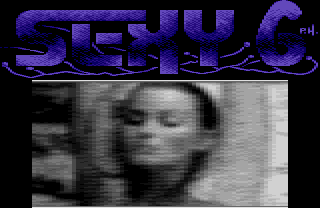

#

## Jak zwiększyć ilość kolorów w trybie 15?

Jurgi

Artykuł ten przeznaczony jest dla osób zainteresowanych tworzeniem grafiki na Atari XL/XE, czyli, jak sądzę, dla każdego. Zdradzę Wam opis pewnej bardzo prostej sztuczki, która pozwoli Wam na uzyskanie większej liczby kolorów w trybie GR. 15+16, zamiast standardowych czterech. Ma ona oczywiście zarówno wady, jak i zalety. Oto one:

___ZALETY:___

- możliwość uzyskania 6, 10, lub 16-tu kolorów zamiast 4-rech;

- nie używa się przerwań, ani żadnych sztuczek programowych;

- używa się zwykłego programu graficznego;

- wszystkie kolory mogą być bez problemu umieszczone w jednej linii, (przy wykorzystaniu przerwań nie);

- sztuczkę tę można bez obaw łączyć z wykorzystaniem przerwań;

	
___WADY:___

- na obszarach, gdzie używa się dodatkowych kolorów, rozdzielczość pionowa zmniejsza się o połowę;

- wybór kolorów nie jest zupełnie dowolny;

___Jak tego dokonać?___

Tajemnica tkwi w zręcznym użyciu funkcji miksowania kolorów. 
Bez obaw, na ekranie nie będzie tego widać! 
Miksowane kolory muszą być koniecznie o tej samej jasności, oraz należy je mieszać zmieniając kolor co jedną, poziomą linię ekranu. 

Oba kolory zleją się w jeden, a zmieniając kolory podstawowe miejscami, otrzymamy inny odcień. 

Tak więc z kombinacji 2-ch kolorów otrzymamy 2 dodatkowe, z 3-ech - 6, z 4-ech - 12 (+4 normalne). Tabelka możliwych kombinacji wygląda tak:

___miksujemy 2 kolory (0 i 1):___

|1   |2*  |3*  |4   |5   |6   |                                
|----|----|----|----|----|----|
|0000|0000|1111|1111|2222|3333|
|0000|1111|0000|1111|2222|3333|
|0000|0000|1111|1111|2222|3333|
|0000|1111|0000|1111|2222|3333|

___* - kolor dodatkowy___

___miksujemy 3 kolory (0, 1 i 2):___

|1   |2*  |3*  |4*  |5   |6*  |7*  |8*  |9   |10  |
|----|----|----|----|----|----|----|----|----|----|
|0000|0000|0000|1111|1111|1111|2222|2222|2222|3333|
|0000|1111|2222|0000|1111|2222|0000|1111|2222|3333|
|0000|0000|0000|1111|1111|1111|2222|2222|2222|3333|
|0000|1111|2222|0000|1111|2222|0000|1111|2222|3333|

___* - kolor dodatkowy___

___miksujemy wszystkie 4 kolory (0, 1, 2 i 3):___

|1   |2*  |3*  |4*  |5*  |6   |7*  |8*  |9*  |10* |11  |12* |13* |14* |15* |16  |
|----|----|----|----|----|----|----|----|----|----|----|----|----|----|----|----|
|0000|0000|0000|0000|1111|1111|1111|1111|2222|2222|2222|2222|3333|3333|3333|3333|
|0000|1111|2222|3333|0000|1111|2222|3333|0000|1111|2222|3333|0000|1111|2222|3333|
|0000|0000|0000|0000|1111|1111|1111|1111|2222|2222|2222|2222|3333|3333|3333|3333|
|0000|1111|2222|3333|0000|1111|2222|3333|0000|1111|2222|3333|0000|1111|2222|3333|

___* - kolor dodatkowy___

Oczywiście mieszanie koloru z samym sobą, to kolor normalny. 

Niestety, ze znanych mi programów, jedynie "Blazing Paddles" (36kB) umożliwia właśnie takie mieszanie. 

I jeszcze rada: najlepsze efekty uzyskacie używając 6, lub 10 kolorów, bowiem przy 16 trudno jest otrzymać wyraźne kontury, ale to już sami sobie wypróbujcie. Można też tę sztuczkę połączyć z przerwaniami i "zatkać" znajomego komodorowca.

Sztuczkę tę odkryłem przypadkiem kilka lat temu, a w lipcowym "Top Secret" znaleźć można opis gry "Sexy Six" (196kB) na Atarka, w której autor wykorzystał identyczny trick, mieszając tryby 9 i 11, uzyskując nagie panienki w 256-ciu kolorach. 

Namawiam do kupna tej gry (oczywiście oryginału!!!) i przekonania się na własne oczy.

## Assembler tricks

Murzyn

Na samym początku tego artykułu pragnę powiedzieć, że nie będzie w tym cyklu nauki assemblera od podstaw. 

Jeśli ktoś chce się go nauczyć niech sięgnie np. po "Tajemnice ATARI", lub inną literaturę tego typu. 
Nie będzie także skomplikowanych procedur wykonujących zniewalające efekty. 

Będą natomiast proste procedurki (=krótkie), które można zwięźle nazwać trickami. 

Wszystkie procedury drukowane w tym cyklu będą oczywiście w **QA**, ale na pewno każdy programujący w innym assemblerze będzie mógł bez problemu przełożyć je na posiadany przez siebie assembler.

Na początek pokażę jak uzyskać efekt odwróconego "do góry nogami" obrazu. W zasadzie odwracane są tylko znaki poprzez odpowiednią zmianę zmwartości komórki CHACT ($02F3). Wbrew pozorom jest to zadanie bardzo proste, trzeba tylko wiedzieć co, gdzie, jak umieścić w pamięci. A więc zaczynamy. Efekt odwracania liter uzyskuje przez ustawienie drugiego bitu CHACT. Nasza procedurka najpierw odwróci obraz "do góry nogami", następnie poczeka na naciśnięcie dowolnego klawisza i powróci do DOS'u. Na początek zadeklarujmy etykiety używane przez procedurę:

        chact   equ     $02F3
        start   equ     $0700
        klawisz equ     764
        nic     equ     #255
        bit2    equ     %00000100

Teraz trochę wyjaśnień. Znaczenia etykiety CHACT nie trzeba chyba wyjaśniać. Etykieta START to rejestr zawierający początkowy adres DOS'u w pamięci. Etykieta KLAWISZ to oczywiście rejestr zawierający kod ostatnio naciśniętego klawisza. Etykieta NIC to zwyczjna liczba dziesiętna. Etykieta BIT2 po załadowaniu do komórki CHACT ustawi nam drugi bit tego bajtu, a tym sposobem spowoduje odwrócenie wszystkich znaków. A więc zacznijmy nasz program.

                org     $0600

Kolejna ważna sprawa, a mianowicie umieszczenie programu w pamięci. W tym przypadku na szóstej stronie pamięci. Teraz obróćmy znaki:

        main    lda     bit2
                sta     chact

Dzieje się tak po ustawieniu bitu drugiego komórki CHACT. Teraz trzeba poczekać na naciśnięcie dowolnego klawisza.

        czekaj  lda     klawisz
                cmp     nic
                beq     czekaj

Pozostaje tylko powrócić do DOS'u wykonując skok na adres $0700:

                jmp     start

Po powrocie do DOS'u ekran pozostanie odwrócony (i o to nam chodziło). Można temu zaradzić ładując liczbę 0 do komórki 755 ($02F3), ale trzeba pamiętać, że musi to być przed skokiem do $700. Na koniec trzeba podać DOS'owi adres i miejsce, od którego ma uruchomić naszą procedurę. A robi się to tak:

                run     main

Oczywiście każdy program powinien kończyć się rozkazem END, aby assembler wiedział kiedy zakończyć assemblację.

                end     of nasz programik

Po uruchomieniu w/w programiku obraz powinien się odwrócić, a po naciśnięciu klawisza powinien powrócić do DOS'u.
